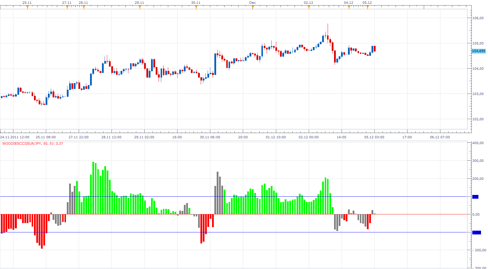
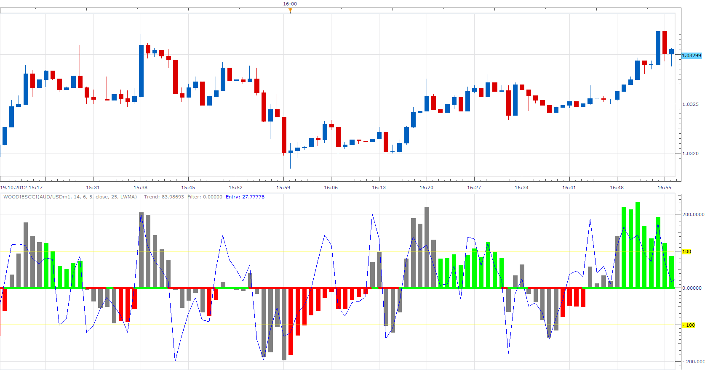

# WoodiesCCI (CCI Histogram)

> Source: https://fxcodebase.com/code/viewtopic.php?f=17&t=8964  
> Forum: 17 · Topic 8964 · 38 post(s)

---

## WoodiesCCI (CCI Histogram)

**Apprentice** · Mon Dec 05, 2011 3:34 am

Basically this is CCI indicator.
You can define the number of periods after the zero line cross,
after which Bar will be painted.

 [WoodiesCCI.lua](files/19624/WoodiesCCI.lua)

---

## Re: WoodiesCCI (CCI Histogram)

**transformer** · Mon Dec 05, 2011 4:55 am

hi apprendice,

thanks for this nice indicator. can you create mtf strategy based on this indicator. entry when h1 signals to buy or sell and h4 h8 d1 are in same ditection.

---

## Re: WoodiesCCI (CCI Histogram)

**transformer** · Wed Dec 07, 2011 7:45 am

hi apprendice,

my request as follows

**buying conditions:**
cci h1 cross over buy level (0) and woodies cci of h4 h8d1 are green in color

**selling condition:**
cci h1 cross under sell level (0) and woodies cci of h4 h8d1 are red in color

**exit buy:**

cci h1 cross under sell level(0) [or]
woodies cci of h4 or h8 or d1 changes from green to neutal

**exit sell:**

cci h1 cross over buy level (o) [or]
woodies cci of h4 or h8 or d1 changes from red to neutral

thank you .

---

## Re: WoodiesCCI (CCI Histogram)

**ikeehawes** · Fri Dec 23, 2011 6:06 am

Hi Apprentice. Love your woodies CCI. However I would like to have your SADUKY indicator overlay the Woodies CCI along the zero line. Is this possible ?? Thank you

---

## Re: WoodiesCCI (CCI Histogram)

**ikeehawes** · Fri Dec 23, 2011 7:16 pm

PS: What I am really looking for is a 25 LSMA color change zero line on your Woodies CCI.
This would be the same as the MT4 CCI_Woodies_Lnx_v6. Thanks again.

---

## Re: WoodiesCCI (CCI Histogram)

**Apprentice** · Fri Jan 06, 2012 3:43 am

If I understood well.
Depending on WoodiesCCI position toward LSMA of WoodiesCCI ( above or below),
you want to change the color of WoodiesCCI.

---

## Re: WoodiesCCI (CCI Histogram)

**ikeehawes** · Wed Jan 11, 2012 2:58 am

Yes. The zero line is a LSMA which changes colour red to green to red etc. The same as it does in the MT4 Woodies_CCI_Lnx_v6.mq4......It would be great if you can add it to your Woodies CCI

Thanks

---

## Re: WoodiesCCI (CCI Histogram)

**ikeehawes** · Wed Jan 11, 2012 2:59 am

MT4 woodies

---

## Re: WoodiesCCI (CCI Histogram)

**bonnevie** · Wed Oct 17, 2012 4:35 pm

Hi Apprentice,
 I'd be really interested in the WoodiesCCI with the modification ikeehawes requested. Yes? Please?

Thx,
bonnevie

---

## Re: WoodiesCCI (CCI Histogram)

**Apprentice** · Wed Oct 17, 2012 5:35 pm

You want Something like this.

 

This indicator paint CCI Bar differently depending on whether it is below or above, signal lines.
The signal line is a moving average of the CCI.

 [CCI with Signal Line.lua](files/42249/CCI%20with%20Signal%20Line.lua)

---

## Re: WoodiesCCI (CCI Histogram)

**ikeehawes** · Wed Oct 17, 2012 7:15 pm

You want Something like this.

No. But this looks interesting. What I asked for was the same as the Woodies CCI on the MT4 chart I posted.
Thanks for this one anyway.

---

## Re: WoodiesCCI (CCI Histogram)

**Apprentice** · Thu Oct 18, 2012 1:30 am

Can you post/send MT4 Code.

---

## Re: WoodiesCCI (CCI Histogram)

**Apprentice** · Thu Oct 18, 2012 5:02 am

Here you can find two strategies based on this indicator.
[viewtopic.php?f=31&t=24592&p=42298#p42298](https://fxcodebase.com/code/viewtopic.php?f=31&t=24592&p=42298#p42298)

---

## Re: WoodiesCCI (CCI Histogram)

**bonnevie** · Fri Oct 19, 2012 7:13 am

Hi Apprentice,

Here's a .mq4 version of the indi from which you can access the code. It's called by a different name but it's the same as the cci woodies lnx v6 ikeehawes mentioned - though it might be an older version.

Glad to know you're working on this for us. Really appreciate it

Thx,
bonnevie

---

## Re: WoodiesCCI (CCI Histogram)

**ikeehawes** · Fri Oct 19, 2012 5:19 pm

Thanks Bonnevie. That reminds me where I got it from.
Hi Apprentice. Click on this site & scroll to V6.......
[http://www.forex-tsd.com/indicators-met ... -like.html](http://www.forex-tsd.com/indicators-metatrader-4/6315-cci-woodie-like.html)
Hope this works for you. Cheers.

---

## Re: WoodiesCCI (CCI Histogram)

**Apprentice** · Sat Oct 20, 2012 1:26 pm

Please Try this version.
In this version we have two CCI Lines, Trend and Entry.
Also we added Price Filter.
It is Presented By Central (Zero) Line.
Positive
Price> MA
Negative
Price <MA

 [WoodiesCCI.lua](files/42452/WoodiesCCI.lua)

If you want to use LSMA Price filter, install LSMA Indicator.

 [LSMA.lua](files/42452/LSMA.lua)

---

## Re: WoodiesCCI (CCI Histogram)

**transformer** · Sun Oct 21, 2012 2:59 am

thank you very much for developing mtf woodies cci strategy

---

## Re: WoodiesCCI (CCI Histogram)

**bonnevie** · Sun Oct 21, 2012 3:10 am

Thanks Apprentice,

Thing is, it *looks* the same as the mt4 indi but the bar in the middle is different: it changes color at different times than the mt4 indi, which is a big deal since the color change is an entry signal for a strategy I use.

(Might this be because you use the LWMA instead of the LSMA?) Is there any way to fix that?

Thx,
bonnevie

---

## Re: WoodiesCCI (CCI Histogram)

**Apprentice** · Sun Oct 21, 2012 4:47 am

LSMA Option Added.
Please install LSMA Indicator, If you want to use it.

 [LSMA.lua](files/42484/LSMA.lua)

---

## Re: WoodiesCCI (CCI Histogram)

**ikeehawes** · Mon Oct 22, 2012 7:11 am

Brilliant Apprentice. You are a genius. Thank you

---

## Re: WoodiesCCI (CCI Histogram)

**ikeehawes** · Mon Oct 22, 2012 6:54 pm

Hi Bonnevie. Apprentice has given a choice of MAs for the middle line. You're right, the LSMA is best. Cheers.

---

## Re: WoodiesCCI (CCI Histogram)

**bonnevie** · Mon Oct 22, 2012 9:06 pm

Thanks, Apprentice. Adding the LSMA did it. Really appreciate this.

bonnevie

---

## Re: WoodiesCCI (CCI Histogram)

**ericagnes** · Sat Mar 16, 2013 4:07 am

> **ikeehawes wrote:**
> Thanks Bonnevie. That reminds me where I got it from.
> Hi Apprentice. Click on this site & scroll to V6.......
> [http://www.forex-tsd.com/indicators-met ... -like.html](http://www.forex-tsd.com/indicators-metatrader-4/6315-cci-woodie-like.html)
> Hope this works for you. Cheers.

hi apprentice,

you have a big difference with the mt4 indi and your indi.

first, in the middle line the color doesn't change at the good time so the signal is false. sometimes the middle line doesn't have a color because it's a range zone and it's very important part of this indi.can you please fix this problem?

it's impossible to disable the histogram parts, can you please add this option?

your job is very appreciate!
eric

fxcm indi

mt4 indi

please right click on the picture to see the entire picture

---

## Re: WoodiesCCI (CCI Histogram)

**cersoz** · Sun Aug 25, 2013 12:16 am

dear apprentice

can u add 50 and 200 levels of indicator permamently!..thanks

---

## Re: WoodiesCCI (CCI Histogram)

**Apprentice** · Sun Aug 25, 2013 6:36 am

Version with second OB/OS levels added.

 [WoodiesCCI.lua](files/88888/WoodiesCCI.lua)

---

## Re: WoodiesCCI (CCI Histogram)

**jay1994** · Sun Aug 25, 2013 1:37 pm

Is there a MT4 version of Apprentice's WoodiesCCI (CCI Histogram) indicator?

---

## Re: WoodiesCCI (CCI Histogram)

**Apprentice** · Mon Aug 26, 2013 5:32 am

bonnevie on Fri Oct 19, 2012 have post MQ4 version of WoodiesCCI

---

## Re: WoodiesCCI (CCI Histogram)

**cersoz** · Mon Aug 26, 2013 7:18 am

> **Apprentice wrote:**
> Version with second OB/OS levels added.
>
>
> WoodiesCCI.lua

second cci is missing?

---

## Re: WoodiesCCI (CCI Histogram)

**Apprentice** · Tue Aug 27, 2013 2:31 am

Your request is added to the development list.

---

## Re: WoodiesCCI (CCI Histogram)

**jaricarr** · Sun Jun 26, 2016 6:43 pm

Hi Apprentice,

Please provide a link to the Sadukey indicator. I couldn't download it.

Thanks
JariCarr

---

## Re: WoodiesCCI (CCI Histogram)

**Apprentice** · Mon Jun 27, 2016 2:28 am

You can find it here.
[viewtopic.php?f=17&t=2525](https://fxcodebase.com/code/viewtopic.php?f=17&t=2525)

---

## Re: WoodiesCCI (CCI Histogram)

**jaricarr** · Mon Jun 27, 2016 8:15 pm

Hi Apprentice,

The link did not allow the file to be downloaded. Can you attach the file to your reply please ?

Thanks

---

## Re: WoodiesCCI (CCI Histogram)

**Apprentice** · Fri Jul 01, 2016 6:01 am

Try the above link now.

---

## Re: WoodiesCCI (CCI Histogram)

**jaricarr** · Tue Jul 05, 2016 12:15 am

Thanks Apprentice,

I was able to download the indicator. Can you also make the strategy downloadable please.

This is the link posted...

Requested can be found here.
viewtopic.php?f=17&t=23404

JariCarr

---

## Re: WoodiesCCI (CCI Histogram)

**Apprentice** · Tue Jul 05, 2016 2:37 pm

Try this link.
[viewtopic.php?f=17&t=2525](https://fxcodebase.com/code/viewtopic.php?f=17&t=2525)

Please specify strategy rules.

---

## Re: WoodiesCCI (CCI Histogram)

**jaricarr** · Tue Jul 05, 2016 8:35 pm

hi,
nevermind, i thought there was already a strategy for the Sadukey indicator.

thanks

---

## Re: WoodiesCCI (CCI Histogram)

**Apprentice** · Wed Jul 06, 2016 2:34 am

Please specify strategy rules, will write one for you.

---

## Re: WoodiesCCI (CCI Histogram)

**Apprentice** · Sat Jun 30, 2018 3:51 am

The indicator was revised and updated.
