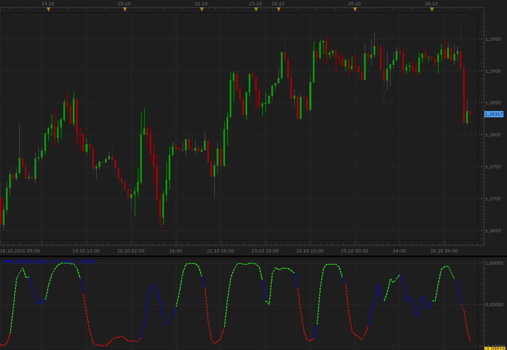

# WPR_FO indicator

> Source: https://fxcodebase.com/code/viewtopic.php?f=17&t=7633  
> Forum: 17 · Topic 7633 · 9 post(s)

---

## WPR_FO indicator

**Alexander.Gettinger** · Wed Oct 26, 2011 11:50 am

Formula:
WPR_FO=(Exp(2*MA)-1)/(Exp(2*MA)+1), where
MA is a moving average of [0.1*(RLW+50)],
RLW - Williams Percent Range.

 

Download:

 [WPR_FO.lua](files/16928/WPR_FO.lua)

For this indicator must be installed AVERAGES indicator ([http://fxcodebase.com/code/viewtopic.php?f=17&t=2430](https://fxcodebase.com/code/viewtopic.php?f=17&t=2430)).

---

## Re: WPR_FO indicator

**cruiser** · Sun Nov 06, 2011 6:19 am

Please can we get strategy for this indicator?

---

## Re: WPR_FO indicator

**Apprentice** · Sun Nov 06, 2011 6:43 am

The algorithm for this strategy is?
Buy on Green, Exit on Blue, Sell on Red?

I would ask you and other members.
That when they post their requests,
Describe a rule that should be respected.
Not just, "Write me a strategy for this indicator"
I have a pretty, wild imagination.

---

## Re: WPR_FO indicator

**mykkee** · Wed Mar 30, 2016 2:27 pm

Is there an alert when the wpr line crosses zero? And if there is, can the time frame be adjusted, say like you want to set it to a 2 or 3 minute chart.

---

## Re: WPR_FO indicator

**Apprentice** · Fri Apr 01, 2016 3:35 am

Try this version.
[viewtopic.php?f=29&t=63334](https://fxcodebase.com/code/viewtopic.php?f=29&t=63334)

---

## Re: WPR_FO indicator

**Apprentice** · Fri Apr 01, 2016 4:01 am

Strategy is available here.
[viewtopic.php?f=31&t=63335](https://fxcodebase.com/code/viewtopic.php?f=31&t=63335)

---

## Re: WPR_FO indicator

**mykkee** · Fri Apr 01, 2016 12:35 pm

> **Apprentice wrote:**
> Strategy is available here.
> [viewtopic.php?f=31&t=63335](https://fxcodebase.com/code/viewtopic.php?f=31&t=63335)

Thanks, I will try that. Is there a way to make the timeframe adjustable. What I mean is I use the 1 minute chart to scalp but may use signals from a 2 or 3 minute chart for confirmation. I would like to be able to put the alert on a 2,3 or 4 minute chart where as now it only has the regular time options available.....thank you.

---

## Re: WPR_FO indicator

**Apprentice** · Tue Apr 05, 2016 5:45 am

Try WPR_FO indicator Strategy Manual Time Frame Entry.lua

---

## Re: WPR_FO indicator

**Apprentice** · Wed Aug 15, 2018 6:54 am

The indicator was revised and updated.
