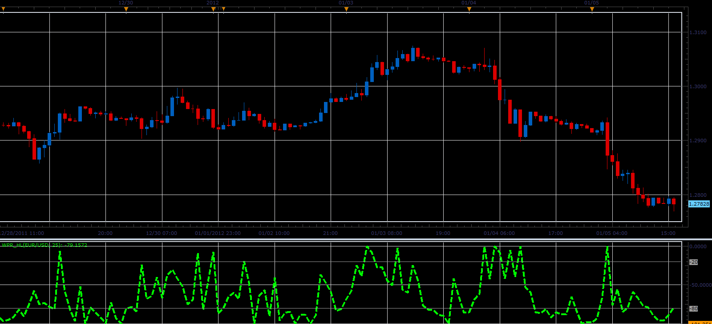

# WPR_HL oscillator

> Source: https://fxcodebase.com/code/viewtopic.php?f=17&t=11068  
> Forum: 17 · Topic 11068 · 2 post(s)

---

## WPR_HL oscillator

**Alexander.Gettinger** · Fri Jan 06, 2012 3:52 am

The oscillator represents the Williams’ Percent Range calculated on the (High-Low).

Formula:
WPR_HL[i]=-100*(Max-HL[i])/(Max-Min), where
HL[i]=High[i]-Low[i],
Max and Min - maximum and minimum prices at range from (i-Period) to (i).

 

Download:

 [WPR_HL.lua](files/22587/WPR_HL.lua)

---

## Re: WPR_HL oscillator

**Apprentice** · Tue Mar 13, 2018 11:13 am

The Indicator was revised and updated.
