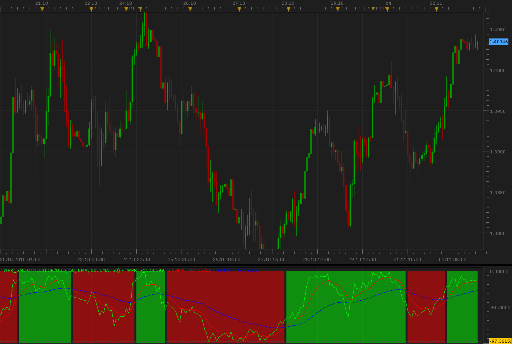

# WPR Smoothed

> Source: https://fxcodebase.com/code/viewtopic.php?f=17&t=2579  
> Forum: 17 · Topic 2579 · 23 post(s)

---

## WPR Smoothed

**Alexander.Gettinger** · Tue Nov 02, 2010 7:31 pm

Formulas:

If Slow MA of Williams Percent Range (WPR)>Fast MA of Williams Percent Range (WPR): Up trend,
If Slow MA of Williams Percent Range (WPR)<Fast MA of Williams Percent Range (WPR): Down trend.

 

Code: [Select all](https://fxcodebase.com/code/)
`function Init()
    indicator:name("WPR Smoothed indicator");
    indicator:description("WPR Smoothed indicator");
    indicator:requiredSource(core.Bar);
    indicator:type(core.Oscillator);

    indicator.parameters:addGroup("Calculation");
    indicator.parameters:addInteger("WPR_Period", "Period of WPR", "", 50);
    indicator.parameters:addString("MA_Slow_Method", "Slow MA Method", "", "EMA");
    indicator.parameters:addStringAlternative("MA_Slow_Method", "MVA", "", "MVA");
    indicator.parameters:addStringAlternative("MA_Slow_Method", "EMA", "", "EMA");
    indicator.parameters:addStringAlternative("MA_Slow_Method", "Wilder", "", "Wilder");
    indicator.parameters:addStringAlternative("MA_Slow_Method", "LWMA", "", "LWMA");
    indicator.parameters:addStringAlternative("MA_Slow_Method", "SineWMA", "", "SineWMA");
    indicator.parameters:addStringAlternative("MA_Slow_Method", "TriMA", "", "TriMA");
    indicator.parameters:addStringAlternative("MA_Slow_Method", "LSMA", "", "LSMA");
    indicator.parameters:addStringAlternative("MA_Slow_Method", "SMMA", "", "SMMA");
    indicator.parameters:addStringAlternative("MA_Slow_Method", "HMA", "", "HMA");
    indicator.parameters:addStringAlternative("MA_Slow_Method", "ZeroLagEMA", "", "ZeroLagEMA");
    indicator.parameters:addStringAlternative("MA_Slow_Method", "DEMA", "", "DEMA");
    indicator.parameters:addStringAlternative("MA_Slow_Method", "T3", "", "T3");
    indicator.parameters:addStringAlternative("MA_Slow_Method", "ITrend", "", "ITrend");
    indicator.parameters:addStringAlternative("MA_Slow_Method", "Median", "", "Median");
    indicator.parameters:addStringAlternative("MA_Slow_Method", "GeoMean", "", "GeoMean");
    indicator.parameters:addStringAlternative("MA_Slow_Method", "REMA", "", "REMA");
    indicator.parameters:addStringAlternative("MA_Slow_Method", "ILRS", "", "ILRS");
    indicator.parameters:addStringAlternative("MA_Slow_Method", "IE/2", "", "IE/2");
    indicator.parameters:addStringAlternative("MA_Slow_Method", "TriMAgen", "", "TriMAgen");
    indicator.parameters:addStringAlternative("MA_Slow_Method", "JSmooth", "", "JSmooth");
    indicator.parameters:addInteger("MA_Slow_Period", "Period of slow MA", "", 10);
    indicator.parameters:addString("MA_Fast_Method", "Fast MA Method", "", "EMA");
    indicator.parameters:addStringAlternative("MA_Fast_Method", "MVA", "", "MVA");
    indicator.parameters:addStringAlternative("MA_Fast_Method", "EMA", "", "EMA");
    indicator.parameters:addStringAlternative("MA_Fast_Method", "Wilder", "", "Wilder");
    indicator.parameters:addStringAlternative("MA_Fast_Method", "LWMA", "", "LWMA");
    indicator.parameters:addStringAlternative("MA_Fast_Method", "SineWMA", "", "SineWMA");
    indicator.parameters:addStringAlternative("MA_Fast_Method", "TriMA", "", "TriMA");
    indicator.parameters:addStringAlternative("MA_Fast_Method", "LSMA", "", "LSMA");
    indicator.parameters:addStringAlternative("MA_Fast_Method", "SMMA", "", "SMMA");
    indicator.parameters:addStringAlternative("MA_Fast_Method", "HMA", "", "HMA");
    indicator.parameters:addStringAlternative("MA_Fast_Method", "ZeroLagEMA", "", "ZeroLagEMA");
    indicator.parameters:addStringAlternative("MA_Fast_Method", "DEMA", "", "DEMA");
    indicator.parameters:addStringAlternative("MA_Fast_Method", "T3", "", "T3");
    indicator.parameters:addStringAlternative("MA_Fast_Method", "ITrend", "", "ITrend");
    indicator.parameters:addStringAlternative("MA_Fast_Method", "Median", "", "Median");
    indicator.parameters:addStringAlternative("MA_Fast_Method", "GeoMean", "", "GeoMean");
    indicator.parameters:addStringAlternative("MA_Fast_Method", "REMA", "", "REMA");
    indicator.parameters:addStringAlternative("MA_Fast_Method", "ILRS", "", "ILRS");
    indicator.parameters:addStringAlternative("MA_Fast_Method", "IE/2", "", "IE/2");
    indicator.parameters:addStringAlternative("MA_Fast_Method", "TriMAgen", "", "TriMAgen");
    indicator.parameters:addStringAlternative("MA_Fast_Method", "JSmooth", "", "JSmooth");
    indicator.parameters:addInteger("MA_Fast_Period", "Period of fast MA", "", 50);

    indicator.parameters:addGroup("Style");
    indicator.parameters:addColor("WPRclr", "Color of WPR", "Color of WPR", core.rgb(0, 255, 0));
    indicator.parameters:addColor("MASlowclr", "Color of slow MA", "Color of slow MA", core.rgb(255, 0, 0));
    indicator.parameters:addColor("MAFastclr", "Color of fast MA", "Color of fast MA", core.rgb(0, 0, 255));
    indicator.parameters:addInteger("widthLinReg", "Line width", "Line width", 1, 1, 5);
    indicator.parameters:addInteger("styleLinReg", "Line style", "Line style", core.LINE_SOLID);
    indicator.parameters:setFlag("styleLinReg", core.FLAG_LINE_STYLE);
    indicator.parameters:addColor("UP", "Color for UP", "Color for UP", core.rgb(0,255,0));
    indicator.parameters:addColor("DOWN", "Color for DOWN", "Color for DOWN", core.rgb(255,0,0));
    indicator.parameters:addInteger("Transparency", "Transparency", "", 50,0,100);
end

local first;
local source = nil;
local WPR_Period;
local MA_Slow_Method;
local MA_Slow_Period;
local MA_Fast_Method;
local MA_Fast_Period;
local SlowMA;
local FastMA;
local WPR;
local WPR_Buff=nil;
local SlowMA_Buff=nil;
local FastMA_Buff=nil;
local hUP;
local hDN;
local lUP;
local lDN;

function Prepare()
    source = instance.source;
    WPR_Period=instance.parameters.WPR_Period;
    MA_Slow_Method=instance.parameters.MA_Slow_Method;
    MA_Slow_Period=instance.parameters.MA_Slow_Period;
    MA_Fast_Method=instance.parameters.MA_Fast_Method;
    MA_Fast_Period=instance.parameters.MA_Fast_Period;
    WPR = core.indicators:create("WILLIAMSPERCENTRANGE", source, WPR_Period);
    SlowMA = core.indicators:create("AVERAGES", WPR.DATA, MA_Slow_Method, MA_Slow_Period, false);
    FastMA = core.indicators:create("AVERAGES", WPR.DATA, MA_Fast_Method, MA_Fast_Period, false);
   
    first = math.max(SlowMA.DATA:first(),FastMA.DATA:first())+2;
    local name = profile:id() .. "(" .. source:name() .. ", " .. instance.parameters.WPR_Period .. ", " .. instance.parameters.MA_Slow_Method .. ", " .. instance.parameters.MA_Slow_Period .. ", " .. instance.parameters.MA_Fast_Method .. ", " .. instance.parameters.MA_Fast_Period .. ")";
    instance:name(name);
    WPR_Buff = instance:addStream("WPR_Buff", core.Line, name .. ".WPR", "WPR", instance.parameters.WPRclr, first);
    SlowMA_Buff = instance:addStream("SlowMA_Buff", core.Line, name .. ".SlowMA", "SlowMA", instance.parameters.MASlowclr, first);
    FastMA_Buff = instance:addStream("FastMA_Buff", core.Line, name .. ".FastMA", "FastMA", instance.parameters.MAFastclr, first);
    WPR_Buff:setWidth(instance.parameters.widthLinReg);
    WPR_Buff:setStyle(instance.parameters.styleLinReg);
    SlowMA_Buff:setWidth(instance.parameters.widthLinReg);
    SlowMA_Buff:setStyle(instance.parameters.styleLinReg);
    FastMA_Buff:setWidth(instance.parameters.widthLinReg);
    FastMA_Buff:setStyle(instance.parameters.styleLinReg);
    hUP=instance:addInternalStream(0, 0);
    hDN=instance:addInternalStream(0, 0);
    lUP=instance:addInternalStream(0, 0);
    lDN=instance:addInternalStream(0, 0);
    instance:createChannelGroup("UpGroup","Up" , hUP, hDN, instance.parameters.UP, 100-instance.parameters.Transparency);
    instance:createChannelGroup("DnGroup","Dn" , lUP, lDN, instance.parameters.DOWN, 100-instance.parameters.Transparency);
   
end

function Update(period, mode)
   if (period>first) then
    WPR:update(mode);
    SlowMA:update(mode);
    FastMA:update(mode);
    WPR_Buff[period]=WPR.DATA[period];
    SlowMA_Buff[period]=SlowMA.DATA[period];
    FastMA_Buff[period]=FastMA.DATA[period];
    if SlowMA.DATA[period]>FastMA.DATA[period] then
     hUP[period]=0;
     hDN[period]=-100;
     lUP[period]=nil;
     lDN[period]=nil;
    elseif SlowMA.DATA[period]<FastMA.DATA[period] then
     lUP[period]=0;
     lDN[period]=-100;
     hUP[period]=nil;
     hDN[period]=nil;
    else
     hUP[period]=nil;
     hDN[period]=nil;
     lUP[period]=nil;
     lDN[period]=nil;
    end
   end
   
end`

For successful work must be installed two indicators:
1. Williams Percent Range (WPR): [viewtopic.php?f=17&t=898](https://fxcodebase.com/code/viewtopic.php?f=17&t=898)
2. Moving Average Indicator: 20 in 1: [viewtopic.php?f=17&t=2430](https://fxcodebase.com/code/viewtopic.php?f=17&t=2430)

---

## Re: WPR Smoothed

**DWetherell** · Tue Nov 02, 2010 10:01 pm

Excellent job on this requested indicator...It was much more than expected. For those who are short term traders, use the following settings on this indicator..

WPR = 50
MA = EMA
Slow MA = 10
Fast EMA = 25
Transparency 85

---

## Re: WPR Smoothed

**cminvest** · Wed Nov 03, 2010 12:39 am

Hi,
is a strategy avalaible in nex future for this Indicator?

best regards
cminvest

---

## Re: WPR Smoothed

**Apprentice** · Wed Nov 03, 2010 5:35 am

Added to developmental cue.

---

## Re: WPR Smoothed

**DWetherell** · Wed Nov 03, 2010 4:31 pm

Alexander,

You created a very good indicator here. Could you please make a slightly different version for me...

It would have the same look and design as the original, but instead of sharing a common WPR value, could you create 2 separate moving averages based on 2 WPR values?

For example...

Moving Average of Williams % R (50) Versus > or < Moving Average of Williams % R (250)

With this version of the indicator, I don't think you would need to show the Williams % R Value. It would simply be a comparison of 2 Moving Averages.

---

## Re: WPR Smoothed

**Alexander.Gettinger** · Fri Nov 05, 2010 12:14 am

Added second WPR indicator.

Code: [Select all](https://fxcodebase.com/code/)
`function Init()
    indicator:name("WPR Smoothed2 indicator");
    indicator:description("WPR Smoothed2 indicator");
    indicator:requiredSource(core.Bar);
    indicator:type(core.Oscillator);

    indicator.parameters:addGroup("Calculation");
    indicator.parameters:addInteger("WPR1_Period", "Period of WPR1", "", 50);
    indicator.parameters:addInteger("WPR2_Period", "Period of WPR2", "", 250);
    indicator.parameters:addString("MA_Slow_Method", "Slow MA Method", "", "EMA");
    indicator.parameters:addStringAlternative("MA_Slow_Method", "MVA", "", "MVA");
    indicator.parameters:addStringAlternative("MA_Slow_Method", "EMA", "", "EMA");
    indicator.parameters:addStringAlternative("MA_Slow_Method", "Wilder", "", "Wilder");
    indicator.parameters:addStringAlternative("MA_Slow_Method", "LWMA", "", "LWMA");
    indicator.parameters:addStringAlternative("MA_Slow_Method", "SineWMA", "", "SineWMA");
    indicator.parameters:addStringAlternative("MA_Slow_Method", "TriMA", "", "TriMA");
    indicator.parameters:addStringAlternative("MA_Slow_Method", "LSMA", "", "LSMA");
    indicator.parameters:addStringAlternative("MA_Slow_Method", "SMMA", "", "SMMA");
    indicator.parameters:addStringAlternative("MA_Slow_Method", "HMA", "", "HMA");
    indicator.parameters:addStringAlternative("MA_Slow_Method", "ZeroLagEMA", "", "ZeroLagEMA");
    indicator.parameters:addStringAlternative("MA_Slow_Method", "DEMA", "", "DEMA");
    indicator.parameters:addStringAlternative("MA_Slow_Method", "T3", "", "T3");
    indicator.parameters:addStringAlternative("MA_Slow_Method", "ITrend", "", "ITrend");
    indicator.parameters:addStringAlternative("MA_Slow_Method", "Median", "", "Median");
    indicator.parameters:addStringAlternative("MA_Slow_Method", "GeoMean", "", "GeoMean");
    indicator.parameters:addStringAlternative("MA_Slow_Method", "REMA", "", "REMA");
    indicator.parameters:addStringAlternative("MA_Slow_Method", "ILRS", "", "ILRS");
    indicator.parameters:addStringAlternative("MA_Slow_Method", "IE/2", "", "IE/2");
    indicator.parameters:addStringAlternative("MA_Slow_Method", "TriMAgen", "", "TriMAgen");
    indicator.parameters:addStringAlternative("MA_Slow_Method", "JSmooth", "", "JSmooth");
    indicator.parameters:addInteger("MA_Slow_Period", "Period of slow MA", "", 10);
    indicator.parameters:addString("MA_Fast_Method", "Fast MA Method", "", "EMA");
    indicator.parameters:addStringAlternative("MA_Fast_Method", "MVA", "", "MVA");
    indicator.parameters:addStringAlternative("MA_Fast_Method", "EMA", "", "EMA");
    indicator.parameters:addStringAlternative("MA_Fast_Method", "Wilder", "", "Wilder");
    indicator.parameters:addStringAlternative("MA_Fast_Method", "LWMA", "", "LWMA");
    indicator.parameters:addStringAlternative("MA_Fast_Method", "SineWMA", "", "SineWMA");
    indicator.parameters:addStringAlternative("MA_Fast_Method", "TriMA", "", "TriMA");
    indicator.parameters:addStringAlternative("MA_Fast_Method", "LSMA", "", "LSMA");
    indicator.parameters:addStringAlternative("MA_Fast_Method", "SMMA", "", "SMMA");
    indicator.parameters:addStringAlternative("MA_Fast_Method", "HMA", "", "HMA");
    indicator.parameters:addStringAlternative("MA_Fast_Method", "ZeroLagEMA", "", "ZeroLagEMA");
    indicator.parameters:addStringAlternative("MA_Fast_Method", "DEMA", "", "DEMA");
    indicator.parameters:addStringAlternative("MA_Fast_Method", "T3", "", "T3");
    indicator.parameters:addStringAlternative("MA_Fast_Method", "ITrend", "", "ITrend");
    indicator.parameters:addStringAlternative("MA_Fast_Method", "Median", "", "Median");
    indicator.parameters:addStringAlternative("MA_Fast_Method", "GeoMean", "", "GeoMean");
    indicator.parameters:addStringAlternative("MA_Fast_Method", "REMA", "", "REMA");
    indicator.parameters:addStringAlternative("MA_Fast_Method", "ILRS", "", "ILRS");
    indicator.parameters:addStringAlternative("MA_Fast_Method", "IE/2", "", "IE/2");
    indicator.parameters:addStringAlternative("MA_Fast_Method", "TriMAgen", "", "TriMAgen");
    indicator.parameters:addStringAlternative("MA_Fast_Method", "JSmooth", "", "JSmooth");
    indicator.parameters:addInteger("MA_Fast_Period", "Period of fast MA", "", 50);

    indicator.parameters:addGroup("Style");
    indicator.parameters:addColor("WPR1clr", "Color of WPR1", "Color of WPR1", core.rgb(0, 255, 0));
    indicator.parameters:addColor("WPR2clr", "Color of WPR2", "Color of WPR2", core.rgb(255, 255, 0));
    indicator.parameters:addColor("MASlowclr", "Color of slow MA", "Color of slow MA", core.rgb(255, 0, 0));
    indicator.parameters:addColor("MAFastclr", "Color of fast MA", "Color of fast MA", core.rgb(0, 0, 255));
    indicator.parameters:addInteger("widthLinReg", "Line width", "Line width", 1, 1, 5);
    indicator.parameters:addInteger("styleLinReg", "Line style", "Line style", core.LINE_SOLID);
    indicator.parameters:setFlag("styleLinReg", core.FLAG_LINE_STYLE);
    indicator.parameters:addColor("UP", "Color for UP", "Color for UP", core.rgb(0,255,0));
    indicator.parameters:addColor("DOWN", "Color for DOWN", "Color for DOWN", core.rgb(255,0,0));
    indicator.parameters:addInteger("Transparency", "Transparency", "", 50,0,100);
end

local first;
local source = nil;
local WPR1_Period;
local WPR2_Period;
local MA_Slow_Method;
local MA_Slow_Period;
local MA_Fast_Method;
local MA_Fast_Period;
local SlowMA;
local FastMA;
local WPR1;
local WPR2;
local WPR1_Buff=nil;
local WPR2_Buff=nil;
local SlowMA_Buff=nil;
local FastMA_Buff=nil;
local hUP;
local hDN;
local lUP;
local lDN;

function Prepare()
    source = instance.source;
    WPR1_Period=instance.parameters.WPR1_Period;
    WPR2_Period=instance.parameters.WPR2_Period;
    MA_Slow_Method=instance.parameters.MA_Slow_Method;
    MA_Slow_Period=instance.parameters.MA_Slow_Period;
    MA_Fast_Method=instance.parameters.MA_Fast_Method;
    MA_Fast_Period=instance.parameters.MA_Fast_Period;
    WPR1 = core.indicators:create("WILLIAMSPERCENTRANGE", source, WPR1_Period);
    WPR2 = core.indicators:create("WILLIAMSPERCENTRANGE", source, WPR2_Period);
    SlowMA = core.indicators:create("AVERAGES", WPR1.DATA, MA_Slow_Method, MA_Slow_Period, false);
    FastMA = core.indicators:create("AVERAGES", WPR2.DATA, MA_Fast_Method, MA_Fast_Period, false);
   
    first = math.max(WPR1_Period,WPR2_Period)+2;
    local name = profile:id() .. "(" .. source:name() .. ", " .. instance.parameters.WPR1_Period .. ", " .. instance.parameters.WPR2_Period .. ", " .. instance.parameters.MA_Slow_Method .. ", " .. instance.parameters.MA_Slow_Period .. ", " .. instance.parameters.MA_Fast_Method .. ", " .. instance.parameters.MA_Fast_Period .. ")";
    instance:name(name);
    WPR1_Buff = instance:addStream("WPR1_Buff", core.Line, name .. ".WPR1", "WPR1", instance.parameters.WPR1clr, first);
    WPR2_Buff = instance:addStream("WPR2_Buff", core.Line, name .. ".WPR2", "WPR2", instance.parameters.WPR2clr, first);
    SlowMA_Buff = instance:addStream("SlowMA_Buff", core.Line, name .. ".SlowMA", "SlowMA", instance.parameters.MASlowclr, first);
    FastMA_Buff = instance:addStream("FastMA_Buff", core.Line, name .. ".FastMA", "FastMA", instance.parameters.MAFastclr, first);
    WPR1_Buff:setWidth(instance.parameters.widthLinReg);
    WPR1_Buff:setStyle(instance.parameters.styleLinReg);
    WPR2_Buff:setWidth(instance.parameters.widthLinReg);
    WPR2_Buff:setStyle(instance.parameters.styleLinReg);
    SlowMA_Buff:setWidth(instance.parameters.widthLinReg);
    SlowMA_Buff:setStyle(instance.parameters.styleLinReg);
    FastMA_Buff:setWidth(instance.parameters.widthLinReg);
    FastMA_Buff:setStyle(instance.parameters.styleLinReg);
    hUP=instance:addInternalStream(0, 0);
    hDN=instance:addInternalStream(0, 0);
    lUP=instance:addInternalStream(0, 0);
    lDN=instance:addInternalStream(0, 0);
    instance:createChannelGroup("UpGroup","Up" , hUP, hDN, instance.parameters.UP, 100-instance.parameters.Transparency);
    instance:createChannelGroup("DnGroup","Dn" , lUP, lDN, instance.parameters.DOWN, 100-instance.parameters.Transparency);
   
end

function Update(period, mode)
   if (period>first) then
    WPR1:update(mode);
    WPR2:update(mode);
    SlowMA:update(mode);
    FastMA:update(mode);
    WPR1_Buff[period]=WPR1.DATA[period];
    WPR2_Buff[period]=WPR2.DATA[period];
    SlowMA_Buff[period]=SlowMA.DATA[period];
    FastMA_Buff[period]=FastMA.DATA[period];
    if SlowMA.DATA[period]>FastMA.DATA[period] then
     hUP[period]=0;
     hDN[period]=-100;
     lUP[period]=nil;
     lDN[period]=nil;
    elseif SlowMA.DATA[period]<FastMA.DATA[period] then
     lUP[period]=0;
     lDN[period]=-100;
     hUP[period]=nil;
     hDN[period]=nil;
    else
     hUP[period]=nil;
     hDN[period]=nil;
     lUP[period]=nil;
     lDN[period]=nil;
    end
   end
   
end`

---

## Re: WPR Smoothed

**Alexander.Gettinger** · Mon Nov 08, 2010 2:36 am

Strategy on this indicator may be find here: [viewtopic.php?f=31&t=2618](https://fxcodebase.com/code/viewtopic.php?f=31&t=2618)

---

## Re: WPR Smoothed

**jackfx09** · Wed Nov 30, 2011 9:20 am

Great indicator! I would like to suggest to any trader to consider using the "ZeroLagEMA" as your moving average methods (use same for both the Slow and the Fast). Zero Lag shows to be just as smooth as EMA...BUT...will help pinpoint entries and exit more quickly. Pretty simple to see, just add all the indicators on the same page changing no parameter settings other than the SLOW and Fast to see for yourself. Great indicator for those who like using WPR%, it offers a very simple visual summary.

sjc

---

## Re: WPR Smoothed

**Coondawg71** · Wed Nov 30, 2011 11:28 am

Great work by Alexander and DWetherell !!!

sjc

---

## Re: WPR Smoothed

**cersoz** · Wed Nov 30, 2011 12:31 pm

can u add strategy for wprsmoothed not wprsmoothed2 ?

---

## Re: WPR Smoothed

**Apprentice** · Thu Dec 01, 2011 9:27 am

Your request is added to the developmental cue.

---

## Re: WPR Smoothed

**Alexander.Gettinger** · Wed Dec 21, 2011 8:59 pm

> **cersoz wrote:**
> can u add strategy for wprsmoothed not wprsmoothed2 ?

Please, see this strategy.
Download:

 [WPR_Smoothed_Strategy.lua](files/21393/WPR_Smoothed_Strategy.lua)

---

## Re: WPR Smoothed

**Apprentice** · Thu Dec 22, 2011 8:34 am

Your request is added to the developmental cue.

---

## Re: WPR Smoothed

**cersoz** · Fri Jul 26, 2013 7:01 am

Sir,

This indicator is excellent but only 1 improvments is needed.
already ma10 >ma50 then background is green ..at this point +condition wpr > 50 then background darker green else light green ...

same conditions for red zone..

---

## Re: WPR Smoothed

**Apprentice** · Sat Jul 27, 2013 3:25 am

Your request is added to the development list.

---

## Re: WPR Smoothed

**Apprentice** · Sun Jul 28, 2013 3:20 am

Topmost version is updated accordingly.

---

## Re: WPR Smoothed

**cersoz** · Fri Feb 21, 2014 9:29 am

anyone can add overbought and oversold levels?

---

## Re: WPR Smoothed

**Apprentice** · Sat Feb 22, 2014 6:07 am

OB/OS Levels Added.

---

## Re: WPR Smoothed

**Apprentice** · Fri Jun 02, 2017 6:13 am

Indicator was revised and updated.

---

## Re: WPR Smoothed Strategy

**mulligan** · Thu Mar 29, 2018 11:31 pm

This concerns the WPR Smoothed Strategy, not WPR Smoothed2 strategy. I'm getting the error message -1:nil and the strategy pauses. Thanks for any help.

---

## Re: WPR Smoothed

**Apprentice** · Tue Apr 03, 2018 4:51 am

Try it now.

---

## Re: WPR Smoothed Strategy

**mulligan** · Wed Apr 04, 2018 10:30 am

I removed the old strategy and downloaded the new (WPR_Smoothed_Strategy.lua). Still getting the -1:nil code. Thanks for your help.

---

## Re: WPR Smoothed

**Apprentice** · Thu Apr 05, 2018 4:20 am

Was not able to reproduce in simulator mode or backtester.
Try this file, please re-download all indicator required.

 [WPR_Smoothed_Strategy.lua](files/118475/WPR_Smoothed_Strategy.lua)
