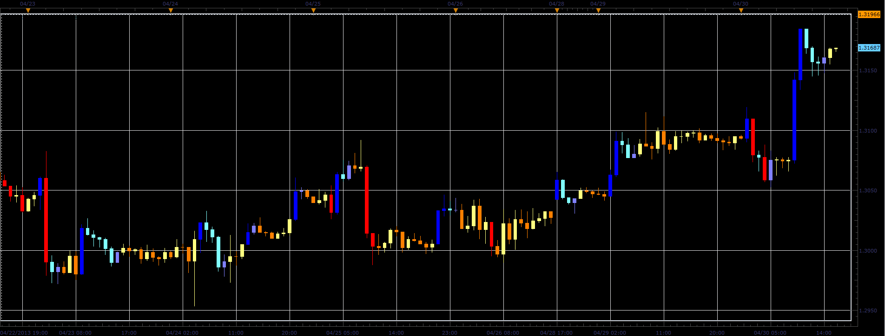

# X Bar Clear Close Trend indicator

> Source: https://fxcodebase.com/code/viewtopic.php?f=17&t=36109  
> Forum: 17 · Topic 36109 · 3 post(s)

---

## X Bar Clear Close Trend indicator

**Alexander.Gettinger** · Tue Apr 30, 2013 4:34 pm

This indicator is ported MQL5 indicator from [http://www.mql5.com/en/code/1622](http://www.mql5.com/en/code/1622)

 

Download:

 [XBarClearCloseTrend.lua](files/60724/XBarClearCloseTrend.lua)

The indicator was revised and updated

---

## Re: X Bar Clear Close Trend indicator

**Alexander.Gettinger** · Thu May 02, 2013 10:07 am

MQL4 version of this indicator: [viewtopic.php?f=38&t=36257](https://fxcodebase.com/code/viewtopic.php?f=38&t=36257)

---

## Re: X Bar Clear Close Trend indicator

**Apprentice** · Thu May 11, 2017 1:37 pm

Indicator was revised and updated.
