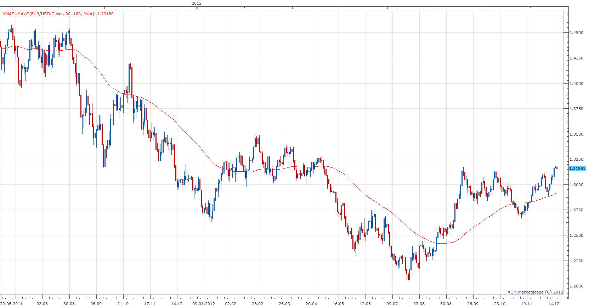

# X MA Sum Average

> Source: https://fxcodebase.com/code/viewtopic.php?f=17&t=27765  
> Forum: 17 · Topic 27765 · 3 post(s)

---

## X MA Sum Average

**Apprentice** · Mon Dec 17, 2012 9:29 am

XMaSumAvgSum or XMA Averages calculated Average as the average of All moving averages from Start-End Range.

 [xMaSumAvg.lua](files/48632/xMaSumAvg.lua)

XMA = (MA[Start] + MA[Start+1] + .... + MA[End] )/ (End-Start+1)

The indicator was revised and updated

---

## Re: X MA Sum Average

**Alexander.Gettinger** · Tue Sep 23, 2014 10:47 am

MQL4 version of X MA Sum Average: [viewtopic.php?f=38&t=61235](https://fxcodebase.com/code/viewtopic.php?f=38&t=61235).

---

## Re: X MA Sum Average

**Apprentice** · Fri Jun 23, 2017 7:10 am

The indicator was revised and updated.
