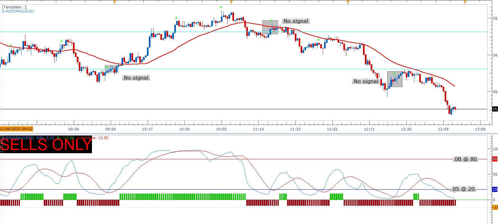

# X-RSIOMA / X-XARDg-RSI

> Source: https://fxcodebase.com/code/viewtopic.php?f=17&t=69965  
> Forum: 17 · Topic 69965 · 17 post(s)

---

## X-RSIOMA / X-XARDg-RSI

**Apprentice** · Fri Jun 05, 2020 6:40 am

Based on request.
[viewtopic.php?f=27&t=69958](https://fxcodebase.com/code/viewtopic.php?f=27&t=69958)

 [X-RSIOMA.lua](files/134603/X-RSIOMA.lua)

 [X-XARDg-RSI.lua](files/134603/X-XARDg-RSI.lua)

TS2/Lua strategy
[viewtopic.php?f=31&t=70738](https://fxcodebase.com/code/viewtopic.php?f=31&t=70738)

---

## Re: X-RSIOMA / X-XARDg-RSI

**bartwas1** · Fri Jun 05, 2020 9:14 am

Hi Apprentice

Thanks for xard RSI, but the other indi isn't the one I've requested, isn't it?
I mean I didn't request RSIOMA - you did one a while ago.

kind regards
Bart

---

## Re: X-RSIOMA / X-XARDg-RSI

**papynou34** · Fri Jun 05, 2020 12:56 pm

Hello,
It seems that the Down alert don't work.

---

## Re: X-RSIOMA / X-XARDg-RSI

**Apprentice** · Sat Jun 06, 2020 3:36 pm

Your request is added to the development list.
Development reference 1425.

---

## Re: X-RSIOMA / X-XARDg-RSI

**Apprentice** · Tue Jun 09, 2020 7:33 am

[X-RSIOMA.lua](files/134731/X-RSIOMA.lua)

---

## Re: X-RSIOMA / X-XARDg-RSI

**susan61** · Wed Jun 10, 2020 3:53 am

Hi Apprentice
Can you add a 80 overbought horizontal line and 20 oversold line to to the topic link below
[viewtopic.php?f=27&t=69958](https://fxcodebase.com/code/viewtopic.php?f=27&t=69958)
thanks susan

---

## Re: X-RSIOMA / X-XARDg-RSI

**Apprentice** · Wed Jun 10, 2020 4:59 am

Add OB/OS line to the MT4 version?

---

## Re: X-RSIOMA / X-XARDg-RSI

**susan61** · Wed Jun 10, 2020 8:54 am

> **Apprentice wrote:**
> Add OB/OS line to the MT4 version?

Hi Apprentice
For the LUA version please
thanks Susan

---

## Re: X-RSIOMA / X-XARDg-RSI

**Apprentice** · Thu Jun 11, 2020 5:17 am

OB OS option added to X-XARDg-RSI

---

## Re: X-RSIOMA / X-XARDg-RSI

**susan61** · Thu Jun 11, 2020 9:06 am

Hi Apprentice
Have re downloaded and cant see the horizontal lines for the 0B /0S this is the indicator i was using and re downloaded X-RSIOMA.lua
(27.16 KiB) Downloaded 41 times
have attached screenshot of the current indicator i am using. Can you also add a base line LWMA so the buy only signal come RSI crosses above the Marsimma and price is above the base line and vice versa for sell only.If RSI crosses the Marsimma and base line not biased signal to wait for close past the base line than signal
ps: can you post the link if i have downloaded wrong link while you do new request
hope you can help
Thanks Susan

 

---

## Re: X-RSIOMA / X-XARDg-RSI

**bartwas1** · Sat Jun 13, 2020 2:51 am

Hello Apprentice

Just to ask about my request referring to this indicator !!!-MT4 X-XARDg-MONSTERv3.mq4 posted on 2nd of June.
In your post on 5th of June you gave the link to 2 indicators and only xard RSI has been requested by me, the other one X-RSIOMA is not based on !!!-MT4 X-XARDg-MONSTERv3.mq4 at all. I know that you are busy, I don't want to rush you, but I'd like to know if there is a chance developing it for marketscope.

Kind regs
Bart

---

## Re: X-RSIOMA

**Kelly123** · Thu Dec 17, 2020 3:10 am

Hi Apprentice,
Can you code a strategy on the X-RSIOMA when RSI crosses the MA it signals a buy and sell signals 
BUY
RSI crosses  above MA  buy signal
SELL
RSI crosses below MA sell signal

Add option to turn on & off not to enter or exit trades in overbought or oversold signals only to signal trades in between the overbought and the oversold add ATR for stop loss and take profit  
thanks
K

---

## Re: X-RSIOMA / X-XARDg-RSI

**Apprentice** · Fri Dec 18, 2020 5:09 am

Your request is added to the development list.
Development reference 2487.

---

## Re: X-RSIOMA / X-XARDg-RSI

**Apprentice** · Sun Dec 20, 2020 9:24 am

TS2/Lua strategy
[viewtopic.php?f=31&t=70738](https://fxcodebase.com/code/viewtopic.php?f=31&t=70738)

---

## Re: X-RSIOMA / X-XARDg-RSI

**Kelly123** · Sun Dec 20, 2020 12:49 pm

Hey Apprentice,
There's no option to adjust the setting to the RSI or MA in the in parameter, the strategy is based on the two lines crossing at overbought & oversold must be able to adjust the parameters on both RSI & MA

thanks,
 K

---

## Re: X-RSIOMA / X-XARDg-RSI

**Apprentice** · Mon Dec 21, 2020 2:41 am

Your request is added to the development list.
Development reference 2513.

---

## Re: X-RSIOMA / X-XARDg-RSI

**Apprentice** · Thu Dec 24, 2020 8:29 am

Try it now.
