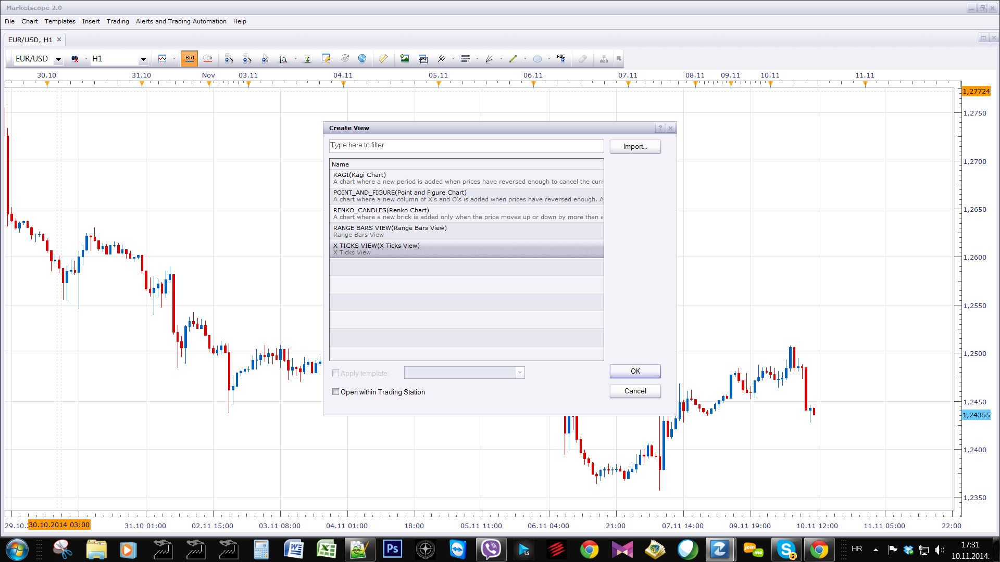
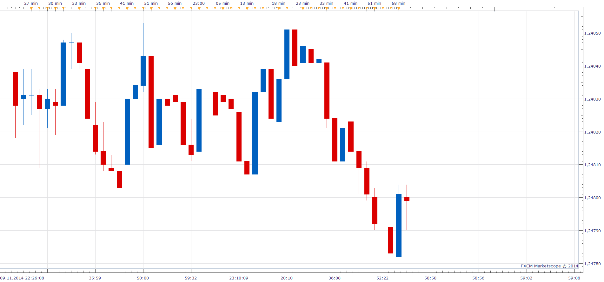

# X ticks view

> Source: https://fxcodebase.com/code/viewtopic.php?f=17&t=61422  
> Forum: 17 · Topic 61422 · 2 post(s)

---

## X ticks view

**Apprentice** · Mon Nov 10, 2014 11:30 am

 

Based on request.
[viewtopic.php?f=27&t=61362](https://fxcodebase.com/code/viewtopic.php?f=27&t=61362)

What is the X ticks (a.k.a. Range Bar) view?
A tick represents a transaction between a buyer and a seller at a given price and volume.
In the (x) ticks chart each candlestick shows the price variation of x consecutive ticks.

To consider.
Native time frame for this Indicator is "t1".
Unfortunately the availability of tick data is a limiting factor.

With a great loss of information, Other time frames can be used.
The reason, only closing price is used.
Active candle data will not be used.

 [X Ticks View.lua](files/96982/X%20Ticks%20View.lua)

The indicator was revised and updated

---

## Re: X ticks view

**takisd** · Sun Nov 20, 2016 2:24 pm

Dear Apprentice,

Is it possible to modify this code to make it work with real volume instead of tick volume on TFs
