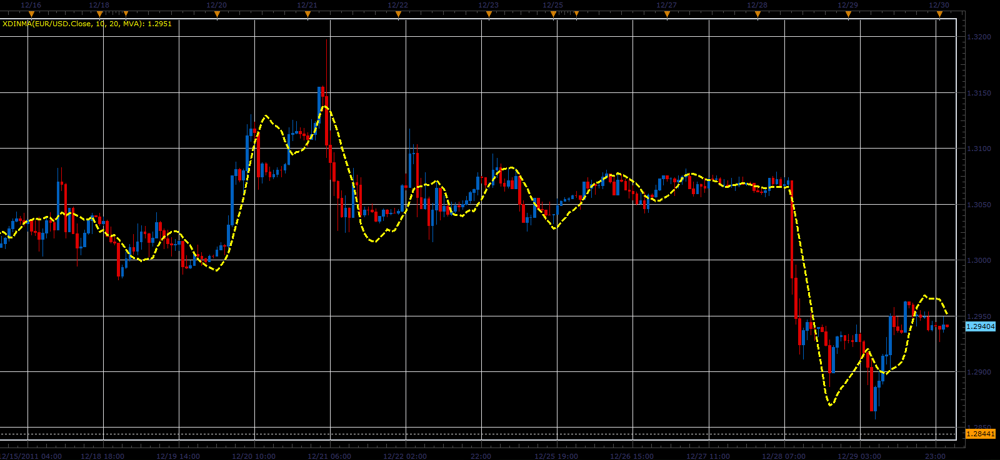

# XdinMA indicator

> Source: https://fxcodebase.com/code/viewtopic.php?f=17&t=10688  
> Forum: 17 · Topic 10688 · 2 post(s)

---

## XdinMA indicator

**Alexander.Gettinger** · Fri Dec 30, 2011 2:20 am

This indicator is a ported MQL5 indicator from [http://www.mql5.com/en/code/700](http://www.mql5.com/en/code/700).

Formula:
XdinMA=K*MA(MainPeriod)-(K-1)*MA(PlusPeriod).

 

Download:

 [XdinMA.lua](files/22020/XdinMA.lua)

For this indicator must be installed Averages indicator ([viewtopic.php?f=17&t=2430](https://fxcodebase.com/code/viewtopic.php?f=17&t=2430)).

The indicator was revised and updated

---

## Re: XdinMA indicator

**Apprentice** · Mon Mar 20, 2017 8:08 am

Indicator was revised and updated.
