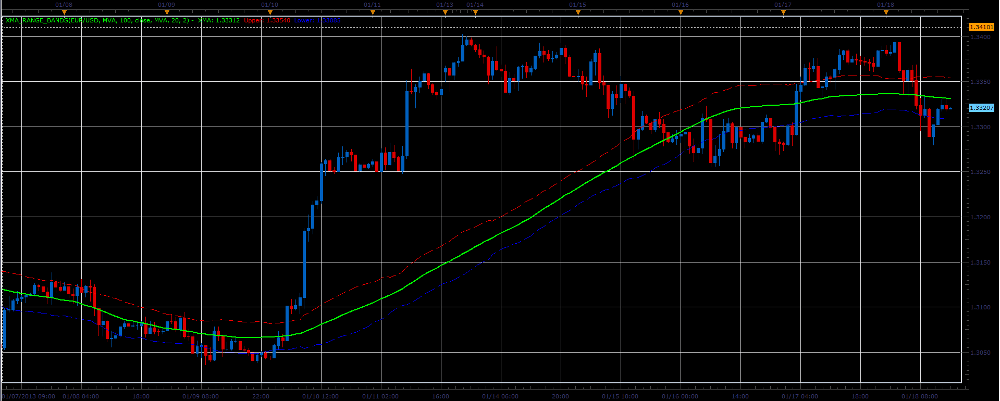

# XMA Range Bands

> Source: https://fxcodebase.com/code/viewtopic.php?f=17&t=31125  
> Forum: 17 · Topic 31125 · 4 post(s)

---

## XMA Range Bands

**Alexander.Gettinger** · Fri Jan 18, 2013 5:50 pm

This indicator is a ported MQL5 indicators from [viewtopic.php?f=27&t=27919](https://fxcodebase.com/code/viewtopic.php?f=27&t=27919)

Formulas:
XMA=MA(Price),
Upper=XMA+MA(Range),
Lower=XMA-MA(Range), where
Range=High-Low.

 

Download:

 [XMA_Range_Bands.lua](files/53121/XMA_Range_Bands.lua)

For this indicator must be installed Averages indicator ([viewtopic.php?f=17&t=2430](https://fxcodebase.com/code/viewtopic.php?f=17&t=2430)).

The indicator was revised and updated

---

## Re: XMA Range Bands

**plkdtm** · Sat May 18, 2013 7:41 am

HI,

is it possible as on the mq5 version to add vidya with cmo oscillator period?

thanks a lot

---

## Re: XMA Range Bands

**Apprentice** · Tue May 21, 2013 5:21 am

Your request is added to the development list.

---

## Re: XMA Range Bands

**Apprentice** · Tue May 23, 2017 6:13 am

Indicator was revised and updated.
