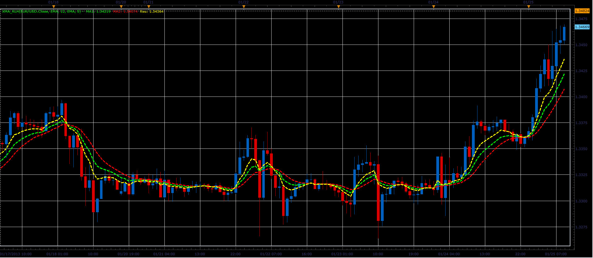

# XMA_RLH indicator

> Source: https://fxcodebase.com/code/viewtopic.php?f=17&t=31487  
> Forum: 17 · Topic 31487 · 2 post(s)

---

## XMA_RLH indicator

**Alexander.Gettinger** · Mon Jan 28, 2013 4:41 pm

This indicator is a ported MQL5 indicators from [http://www.mql5.com/en/code/1447](http://www.mql5.com/en/code/1447)

Formula:
XMA_RLH=2*MA1(Price)-MA2(Price).

 

Download:

 [XMA_RLH.lua](files/53718/XMA_RLH.lua)

For this indicator must be installed Averages indicator ([viewtopic.php?f=17&t=2430](https://fxcodebase.com/code/viewtopic.php?f=17&t=2430)).

The indicator was revised and updated

---

## Re: XMA_RLH indicator

**Apprentice** · Mon May 01, 2017 5:44 am

Indicator was revised and updated.
