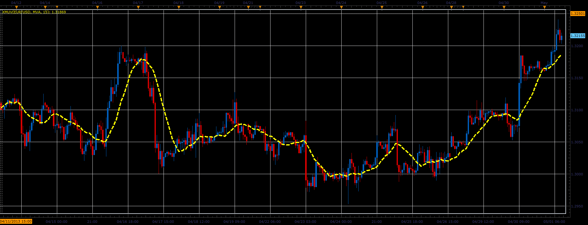

# XMUV indicator

> Source: https://fxcodebase.com/code/viewtopic.php?f=17&t=36267  
> Forum: 17 · Topic 36267 · 2 post(s)

---

## XMUV indicator

**Alexander.Gettinger** · Thu May 02, 2013 11:01 am

This indicator is a ported MQL5 indicator from [http://www.mql5.com/en/code/1339](http://www.mql5.com/en/code/1339)

Formulas:
XMUV = MA(P), where
P = (2*x-Low-High)/2,
x = (High+Close+2*Low)/2, if Close<Open,
x = (Low+Close+2*High)/2, if Close>Open,
x = (High+Low+2*Close)/2, if Close=Open.

 

Download:

 [XMUV.lua](files/60894/XMUV.lua)

For this indicator must be installed Averages indicator ([viewtopic.php?f=17&t=2430](https://fxcodebase.com/code/viewtopic.php?f=17&t=2430)).

The indicator was revised and updated

---

## Re: XMUV indicator

**Apprentice** · Thu May 11, 2017 1:17 pm

Indicator was revised and updated.
