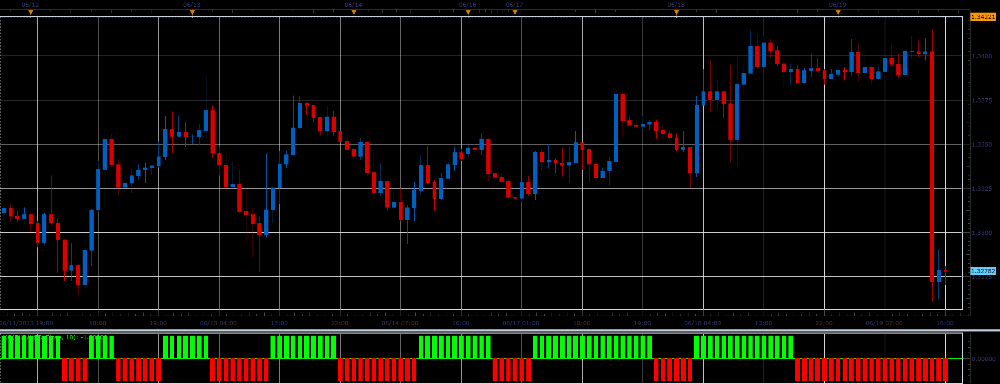

# XO oscillator

> Source: https://fxcodebase.com/code/viewtopic.php?f=17&t=41461  
> Forum: 17 · Topic 41461 · 2 post(s)

---

## XO oscillator

**Alexander.Gettinger** · Wed Jun 19, 2013 3:14 pm

This indicator is a ported MQL5 indicator from [http://www.mql5.com/ru/code/1745](http://www.mql5.com/ru/code/1745) (in Russian).

 

Download:

 [XO.lua](files/67712/XO.lua)

The indicator was revised and updated

---

## Re: XO oscillator

**Apprentice** · Tue May 23, 2017 6:28 am

Indicator was revised and updated.
