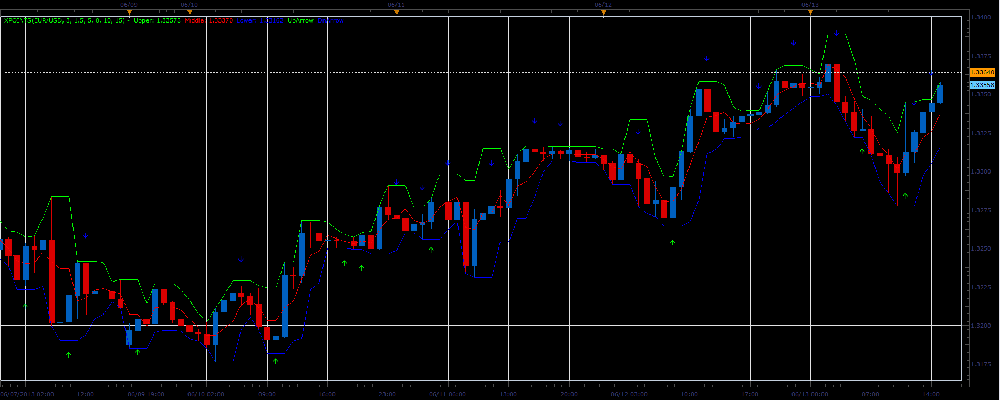

# XPoints indicator

> Source: https://fxcodebase.com/code/viewtopic.php?f=17&t=41307  
> Forum: 17 · Topic 41307 · 2 post(s)

---

## XPoints indicator

**Alexander.Gettinger** · Tue Jun 18, 2013 2:41 pm

This indicator is a ported MQL5 indicator from [http://www.mql5.com/ru/code/1716](http://www.mql5.com/ru/code/1716) (in Russian).

Formulas:
Upper[i] - maximum price at range from (i-Period+1) to i,
Lower[i] - minimum price at range from (i-Period+1) to i,
Middle[i] = (Upper[i]+Lower[i])/2,
if Low[i-1]<=Lower[i-1] and High[i-1]<Upper[i-1] and Low[i]>=Low[i-1]+xslope and [(Open[i-1]+Close[i-1])/2<=Middle[i-1] or (Open[i]+Close[i])/2>=(Open[i-1]+Close[i-1])/2+xslope or (High[i]+Low[i])/2>=(High[i-1]+Low[i-1])/2+xslope then UpArrow,
if High[i-1]>=Upper[i-1] and Low[i-1]>Lower[i-1] and High[i]<=High[i-1]-xslope and [(Open[i-1]+Close[i-1])/2>=Middle[i-1] or (Open[i]+Close[i])/2<=(Open[i-1]+Close[i-1])/2-xslope or (High[i]+Low[i])/2<=(High[i-1]+Low[i-1])/2-xslope then DnArrow.

 

The indicator was revised and updated

Download:

 [XPoints.lua](files/67535/XPoints.lua)

---

## Re: XPoints indicator

**Apprentice** · Sat May 27, 2017 11:49 am

Indicator was revised and updated.
