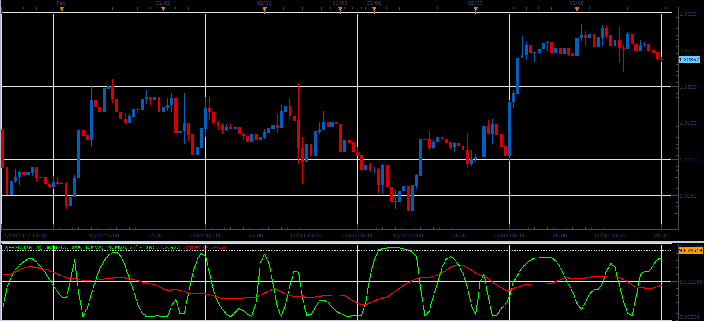

# XR-squared oscillator

> Source: https://fxcodebase.com/code/viewtopic.php?f=17&t=13035  
> Forum: 17 · Topic 13035 · 2 post(s)

---

## XR-squared oscillator

**Alexander.Gettinger** · Wed Feb 08, 2012 9:38 pm

This indicator is a ported MQL5 indicator from [http://www.mql5.com/en/code/752](http://www.mql5.com/en/code/752)

 

Download:

 [XR-squared.lua](files/25484/XR-squared.lua)

For this indicator must be installed Averages indicator ([viewtopic.php?f=17&t=2430](https://fxcodebase.com/code/viewtopic.php?f=17&t=2430)).

The indicator was revised and updated

---

## Re: XR-squared oscillator

**Apprentice** · Mon Mar 27, 2017 3:14 pm

Indicator was revised and updated.
