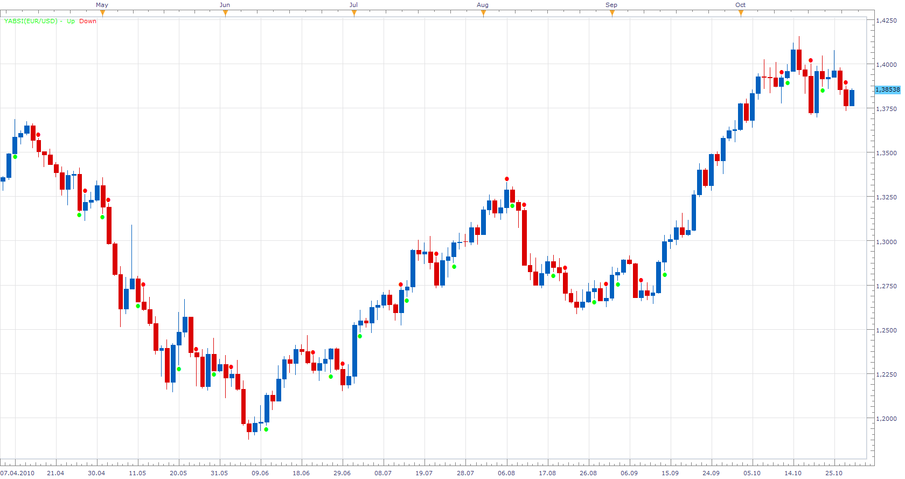

# YABSI

> Source: https://fxcodebase.com/code/viewtopic.php?f=17&t=2543  
> Forum: 17 · Topic 2543 · 3 post(s)

---

## YABSI

**Apprentice** · Thu Oct 28, 2010 7:14 am

Sell
 if(if(close[-1] < high) and (typical[-2] < close[-1] or typical[-3] < close[-1]));

Buy
 if(if(close[-1] > low) and (typical[-2] > close[-1] or typical[-3] > close[-1]));

 [YABSI.lua](files/5633/YABSI.lua)

The indicator was revised and updated

---

## Re: YABSI

**Alexander.Gettinger** · Tue Dec 23, 2014 8:43 am

MQL4 version of indicator: [viewtopic.php?f=38&t=61637](https://fxcodebase.com/code/viewtopic.php?f=38&t=61637).

---

## Re: YABSI

**Apprentice** · Thu Jun 29, 2017 6:26 am

The indicator was revised and updated.
