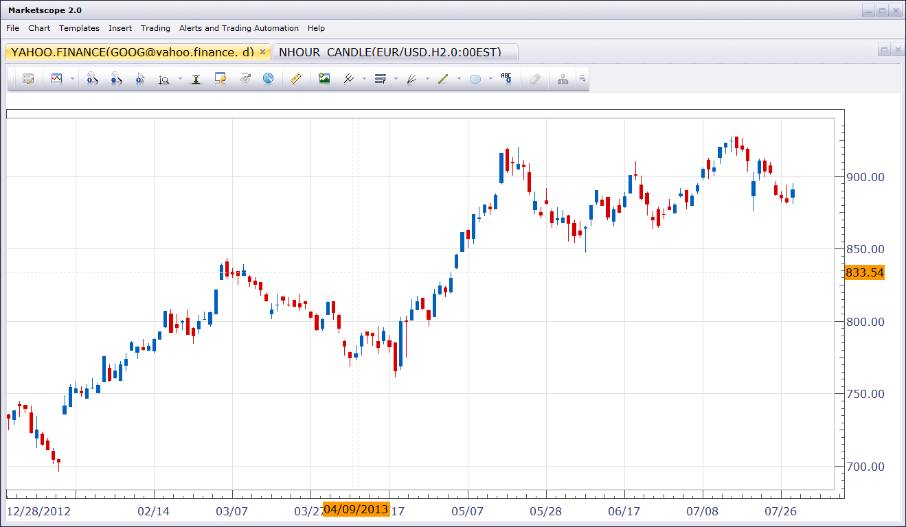
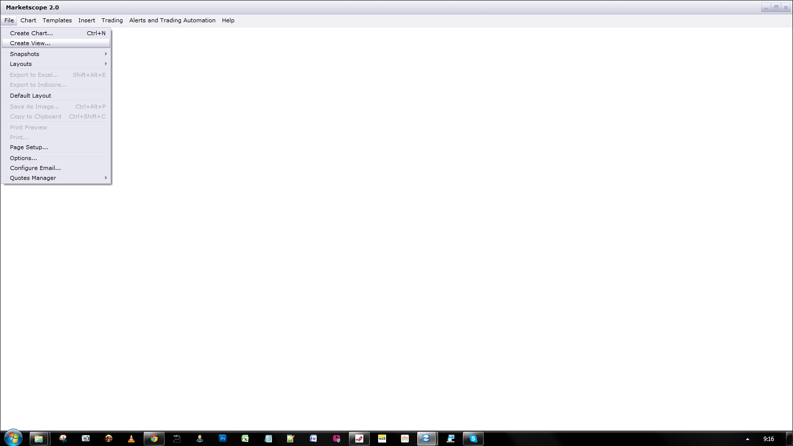

# Yahoo Finance Chart View

> Source: https://fxcodebase.com/code/viewtopic.php?f=17&t=58421  
> Forum: 17 · Topic 58421 · 16 post(s)

---

## Yahoo Finance Chart View

**Nikolay.Gekht** · Wed Jul 31, 2013 12:07 pm

The custom view which displays a symbol from Yahoo Finance as a chart.

Please note that Yahoo Finance doesn't provide some symbols, for example, Dow for 3rd parties.

The view uses CSV interface of yahoo finance.

Unlike earlier published indicators which can show Yahoo Finance data in oscillator area below the chart, the view creates a new chart, so you can handle this data the same manner as FXCM charts.

 

Download:

 [yahoo.finance.lua](files/87579/yahoo.finance.lua)

 [Custom Time Frame Yahoo Finance View.lua](files/87579/Custom%20Time%20Frame%20Yahoo%20Finance%20View.lua)

Please add this ddl to your TS folder.

 [http_lua.dll](files/87579/http_lua.dll)

Try Google Finance View Alternative
[viewtopic.php?f=27&t=64672&p=112628#p112628](https://fxcodebase.com/code/viewtopic.php?f=27&t=64672&p=112628#p112628)

The indicator was revised and updated

---

## Re: 2013-II Beta: Yahoo Finance Chart View

**mjf1288** · Mon Aug 26, 2013 10:08 pm

This indicator does not appear when you load it into the indicators.

---

## Re: 2013-II Beta: Yahoo Finance Chart View

**Apprentice** · Tue Aug 27, 2013 2:19 am

U can Import View as any other Indicator.
Unfortunately u can not add it as a regular indicator,
will not be visible in the list of available indicators.

 

Here is shown How U can add View to Chart.

---

## Re: Yahoo Finance Chart View

**Apprentice** · Wed Oct 01, 2014 11:12 am

Bump Up

---

## Re: Yahoo Finance Chart View

**Zizzle** · Thu Jul 23, 2015 8:27 pm

This is a wonderful tool!

Is there a reason why I cannot view the following symbol?

YMU15.CBT

That is the exact symbol from Yahoo Finance.

Thank you

---

## Re: Yahoo Finance Chart View

**Apprentice** · Wed Feb 01, 2017 3:40 am

Custom Time Frame Yahoo Finance View.lua added.

---

## Re: Yahoo Finance Chart View

**Apprentice** · Thu Jun 08, 2017 3:59 pm

Indicator was revised and updated.

---

## Re: Yahoo Finance Chart View

**SANTOSH** · Sat Apr 11, 2020 12:26 pm

> **Apprentice wrote:**
> Custom Time Frame Yahoo Finance View.lua added.

Can it made for All Time frames , like the most imp as below :
1 Minute
5 minutes ,
Hourly
Daily

Regards ,
Santosh Sahu.

---

## Re: Yahoo Finance Chart View

**SANTOSH** · Sat Apr 11, 2020 12:36 pm

> **Apprentice wrote:**
> Custom Time Frame Yahoo Finance View.lua added.

Can it support all Time frames ?

Regards,
Santosh Sahu .

---

## Re: Yahoo Finance Chart View

**Apprentice** · Sat Apr 11, 2020 3:41 pm

Yahoo do not support other time frames.

---

## Re: Yahoo Finance Chart View

**SANTOSH** · Sat Apr 11, 2020 11:08 pm

> **Apprentice wrote:**
> Yahoo do not support other time frames.

And what about Google finance , do they support all time frames?

---

## Re: Yahoo Finance Chart View

**Apprentice** · Sun Apr 12, 2020 4:34 am

[viewtopic.php?f=17&t=64694](https://fxcodebase.com/code/viewtopic.php?f=17&t=64694)
Unfortunately, google only provide End of day data.

---

## Re: Yahoo Finance Chart View

**SANTOSH** · Mon Apr 13, 2020 12:00 am

> **Apprentice wrote:**
> Yahoo do not support other time frames.

Dear Apprentice ,
Can you make it MTF MCP MI DDE?

MTF - HOUR , DAY. ,WEEK , MONTH
MCP- ALL YAHOO FINANCE. STOCKS
MI - AS USUAL FXCM TS INDICATOR

It will be a great help though if it's achievable!

Regards ,
Santosh Sahu.

---

## Re: Yahoo Finance Chart View

**Apprentice** · Mon Apr 13, 2020 3:41 am

We can only have a one-time frame.

Your request is added to the development list.
Development reference 1060.

---

## Re: Yahoo Finance Chart View

**Apprentice** · Thu Nov 19, 2020 3:20 pm

yahoo.finance.lua was updated and fixed.

---

## Re: Yahoo Finance Chart View

**Apprentice** · Thu Nov 25, 2021 10:43 am

Updated.
