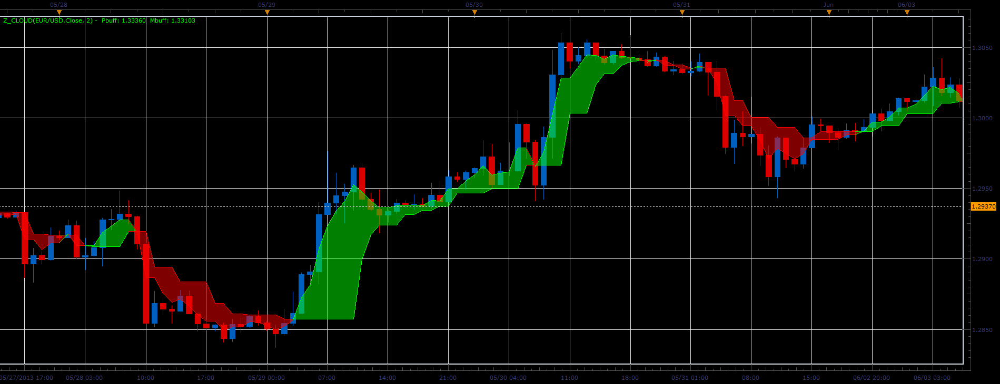

# Z cloud indicator

> Source: https://fxcodebase.com/code/viewtopic.php?f=17&t=41464  
> Forum: 17 · Topic 41464 · 2 post(s)

---

## Z cloud indicator

**Alexander.Gettinger** · Wed Jun 19, 2013 3:26 pm

This indicator is a ported MQL5 indicator from [http://www.mql5.com/ru/code/1754](http://www.mql5.com/ru/code/1754) (in Russian).

Formulas:
Pbuff[i] = Pbuff[i-1]+(Price[i]-Pbuff[i-1])/ki,
Mbuff[i] = Mbuff[i-1]+(Price[i]-Mbuff[i-1])/ki.

 

Download:

 [Z_Cloud.lua](files/67716/Z_Cloud.lua)

The indicator was revised and updated

---

## Re: Z cloud indicator

**Apprentice** · Sat May 27, 2017 12:12 pm

Indicator was revised and updated.
