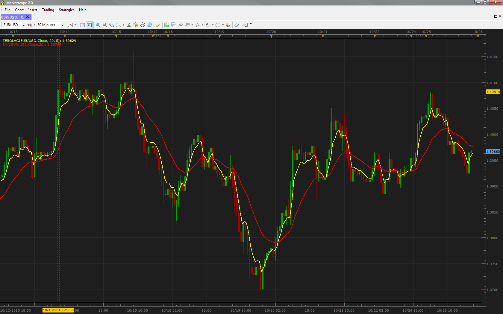

# Zero Lag indicator

> Source: https://fxcodebase.com/code/viewtopic.php?f=17&t=2511  
> Forum: 17 · Topic 2511 · 29 post(s)

---

## Zero Lag indicator

**vstrelnikov** · Mon Oct 25, 2010 8:15 pm

Zero Lag indicator is described in November 2010 issue of Stocks & Commodities.

The formula of the indicator is:
ZL = α * (EMA + Gain * (Close - ZL[1])) + (1 - α) * ZL[1]

The formula is similar to EMA, except that new term Gain * (Close - ZL[1]) is introduced.
'Gain' represents the value which is chosen from [-GainLimit, GainLimit] interval to minimize
the error for current data sample, (Close - ZL) → min

 

Download the indicator:

 [ZeroLag.lua](files/5534/ZeroLag.lua)

 [ZeroLag With Alert.lua](files/5534/ZeroLag%20With%20Alert.lua)

This indicator provides Audio / Email Alerts on Price / MA cross (Real Time)
or/and MA slope changes (end of turn)
Dec 15, 2015: Compatibility issue Fix. _Alert helper is not longer needed.

 [Zero Lag Indicator.lua](files/5534/Zero%20Lag%20Indicator.lua)

---

## Re: Zero Lag indicator

**Blackcat2** · Thu Oct 28, 2010 1:35 am

Hi,

Could you please provide an option to change line type (dash, dot, or dash-dot, etc) and thickness

Thanks..

---

## Re: Zero Lag indicator

**Apprentice** · Thu Oct 28, 2010 3:06 am

Style options Added.

---

## Re: Zero Lag indicator

**Jigit Jigit** · Sat Oct 30, 2010 5:12 pm

Again - thanks a lot for this one.
Could you also make it change colour depending on the trend?
e.g. green on an up trend, red on a down trend
It would be great if there was an option to choose the colours according to one's liking.

---

## Re: Zero Lag indicator

**Apprentice** · Sun Oct 31, 2010 6:42 am

Added to developmental cue.

---

## Re: Zero Lag indicator

**hhbraz** · Thu Dec 23, 2010 8:58 am

Hi,
Thanks for this excellent indicator. Is it possible to code a signal for this indicator, and also code a signal for the zero-lag MACD?
hhb

---

## Re: Zero Lag indicator

**Apprentice** · Thu Dec 23, 2010 10:30 am

Happy to.
But before you start working on signals.
Can you tell me what type of signal you want.
(Describe the signal with a bit more detail.)
Like, I need Zero Lag / Price to Cross Signal
Signal when the Zero Lag trend changes...
In each case.

---

## Re: Zero Lag indicator

**hhbraz** · Thu Dec 30, 2010 6:29 pm

Hi,
I would like to get a trend change signal (up or down) at earliest candle close and at varying chart times (I'm mostly interested in 1 hr, 4 hr and daily). I plan to use this signal along with current price level, candle stick formation and an ocillator to facilitate early entry into a trend.
Thanks, hhb

---

## Re: Zero Lag indicator

**Apprentice** · Fri Dec 31, 2010 9:39 am

Added to developmental cue.

---

## Re: Zero Lag indicator

**Alexander.Gettinger** · Thu Jul 05, 2012 4:40 pm

MQL4 version of Zero Lag indicator: [viewtopic.php?f=38&t=20871](https://fxcodebase.com/code/viewtopic.php?f=38&t=20871)

---

## Re: Zero Lag indicator

**siulee88** · Sun Jul 08, 2012 8:28 pm

Hi,

Thanks for this excellent indicator, I love it very much

siulee

---

## Re: Zero Lag indicator vs Fast SMA

**Patrick Sweet** · Wed May 29, 2013 2:31 am

Hi,
I really appreciate ALL everyone is doing here, Apprentice and others!

An alternative to the zero lag EMA is a simple fast MA.

The yellow trend line here is SMA at 2periods, 1hr chart like the zero lag above which is at 20 periods, 1hr chart. I present this NOT to be critical. I ask because I do not see the difference and really would like to know if there is one and what I am missing....because if I am missing something, I really need to understand it.

Still GREAT WORK everyone! I hope this is not taken poorly! I get so much from these forums and all the work everyone puts in.
Patrick

---

## Re: Zero Lag indicator

**Soniania** · Fri Jun 07, 2013 1:23 am

Hi all,

Could you create the corresponding alert ?

Thanks

---

## Re: Zero Lag indicator

**Apprentice** · Fri Jun 07, 2013 6:31 am

Which trigger will be used.

---

## Re: Zero Lag indicator

**Soniania** · Fri Jun 07, 2013 6:44 am

direction change (up or down closed UT) please

---

## Re: Zero Lag indicator

**Soniania** · Fri Jun 07, 2013 6:49 am

All direction changes, automatically, without user's choice. Please

---

## Re: Zero Lag indicator

**Soniania** · Tue Jun 11, 2013 1:13 am

Could you program it please ?

---

## Re: Zero Lag indicator

**Apprentice** · Wed Jun 12, 2013 5:31 am

Your request is added to the development list.

---

## Re: Zero Lag indicator

**Soniania** · Wed Jun 12, 2013 6:06 am

Thanks

---

## Re: Zero Lag indicator

**Soniania** · Sat Jun 29, 2013 1:52 am

Hello Apprentice,
I know you're very much in demand, but have you any news about my request ?
Thanks.

---

## Re: Zero Lag indicator

**Soniania** · Mon Jul 15, 2013 1:46 pm

Any news please ?

---

## Re: Zero Lag indicator

**Apprentice** · Wed Jul 17, 2013 6:52 am

Alert Added.
See Topmost post.

---

## Re: Zero Lag indicator

**Soniania** · Wed Jul 17, 2013 2:34 pm

Thank you very much

---

## Re: Zero Lag indicator vs Fast SMA

**Soniania** · Sun Jul 28, 2013 9:33 am

I agree with Patrick, I think the simple fast MA is as effective.

> **Patrick Sweet wrote:**
> Hi,
> I really appreciate ALL everyone is doing here, Apprentice and others!
>
> An alternative to the zero lag EMA is a simple fast MA.
>
> The yellow trend line here is SMA at 2periods, 1hr chart like the zero lag above which is at 20 periods, 1hr chart. I present this NOT to be critical. I ask because I do not see the difference and really would like to know if there is one and what I am missing....because if I am missing something, I really need to understand it.
>
> Still GREAT WORK everyone! I hope this is not taken poorly! I get so much from these forums and all the work everyone puts in.
> Patrick

---

## Re: Zero Lag indicator

**Apprentice** · Wed Dec 16, 2015 4:39 am

Compatibility issue Fixed. _Alert helper is not longer needed.

If you want to use updated version of this indicator,
please make sure to use TS Version 01.14.101415. or higher.

---

## Re: Zero Lag indicator

**LeTigre30** · Wed Apr 06, 2016 12:56 pm

hello to Apprentice,

Using the version with 2 colors,
Is it possible to build a strategy ...
Example : when the indicator is in an up trend, set an internal variable as +1, and when
the indicator is in a down trend, set this internal variable to -1...

Rules :
When color change from green to red : close BUY position and open SELL position
When color change from Red to Green : close SELL position and open BUY position

As this indicator works with ticks, is it a good way to take in consideration a number of ticks to confirm the action ?
: example :
suppose when color is green, an internal stream = 1 and when the color is red, the internal stream = -1
Action is triggered when a determinate number of ticks has the same value 1 or -1, OR
can be this strategy applied to bars from this indi ?

Bst Rgds,

LeTigre30

---

## Re: Zero Lag indicator

**Apprentice** · Wed Apr 06, 2016 1:21 pm

Zero Lag Indicator.lua added,
Will add strategy later.

---

## Re: Zero Lag indicator

**Apprentice** · Wed Apr 06, 2016 1:36 pm

Requested can be found here.
[viewtopic.php?f=31&t=63350](https://fxcodebase.com/code/viewtopic.php?f=31&t=63350)

---

## Re: Zero Lag indicator

**Apprentice** · Wed Aug 15, 2018 6:58 am

The indicator was revised and updated.
