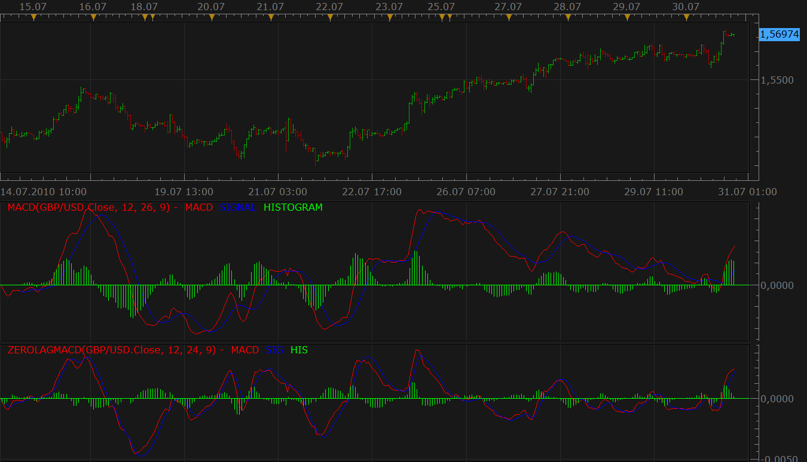
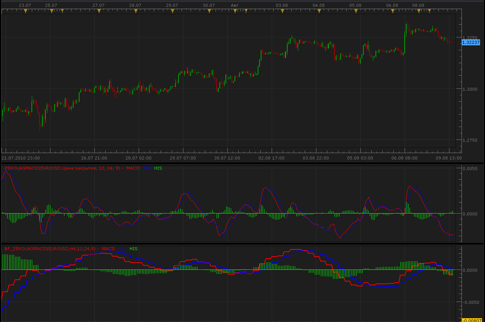
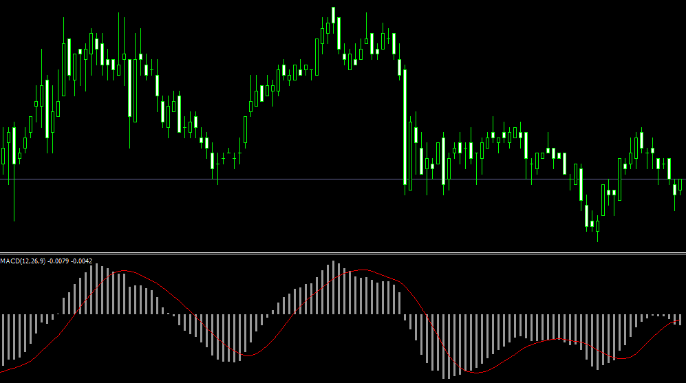
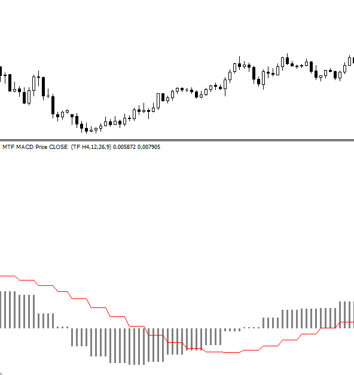
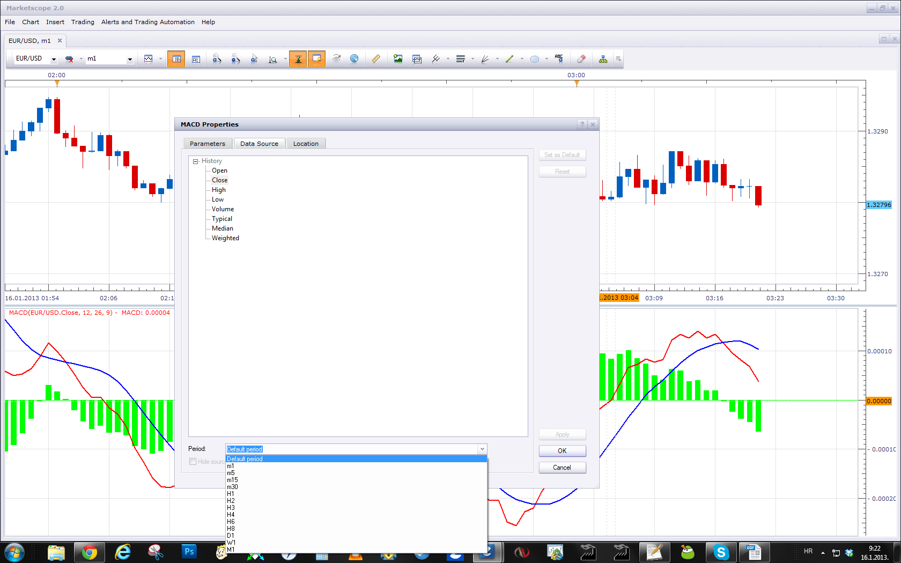

# Zero Lag MACD

> Source: https://fxcodebase.com/code/viewtopic.php?f=17&t=1623  
> Forum: 17 · Topic 1623 · 71 post(s)

---

## Zero Lag MACD

**Nikolay.Gekht** · Fri Jul 30, 2010 2:17 pm

Zero Lag MACD is initially introduced in the Stock & Commodities in 2000.

This version of MACD has much smaller delay in comparison with classic MACD.

Formula:
MACD = (2 * EMA(price, FAST) - EMA(EMA(price, FAST), FAST)) - (2 * EMA(price, SLOW) - EMA(EMA(price, SLOW), SLOW))
SIGNAL = 2 * EMA(MACD, SIG) - EMA(EMA(MACD, SIG), SIG))
HISTOGRAM = MACD - SIGNAL

 



Download:

 [ZeroLagMACD.lua](files/3217/ZeroLagMACD.lua)

 [ZeroLagMACD With Alert.lua](files/3217/ZeroLagMACD%20With%20Alert.lua)

 


 [On Screen ZeroLagMACD.lua](files/3217/On%20Screen%20ZeroLagMACD.lua)

Indicator-based strategy.
[viewtopic.php?f=31&t=66908](https://fxcodebase.com/code/viewtopic.php?f=31&t=66908)

Reverse Engineered ZeroLagMACD
[https://fxcodebase.com/code/viewtopic.php?f=17&t=71262](https://fxcodebase.com/code/viewtopic.php?f=17&t=71262)

---

## Re: Zero Lag MACD

**abcdefg** · Thu Aug 05, 2010 11:32 am

Thank you Nikolay for this indicator . A higher time frame of this indicator would be highly appreciated (to place on my tick chart).

---

## Re: Zero Lag MACD

**Alexander.Gettinger** · Mon Aug 09, 2010 2:17 pm

This indicator for higher timeframe.

 



```lua
function Init()
    indicator:name("Bigger timeframe ZeroLagMACD");
    indicator:description("");
    indicator:requiredSource(core.Bar);
    indicator:type(core.Oscillator);

    indicator.parameters:addGroup("Calculation");
    indicator.parameters:addString("BS", "Time frame to calculate indicator", "", "D1");
    indicator.parameters:setFlag("BS", core.FLAG_PERIODS);
    indicator.parameters:addInteger("FMA", "Fast EMA periods", "", 12, 1, 1000);
    indicator.parameters:addInteger("SMA", "Slow EMA Periods", "", 24, 1, 1000);
    indicator.parameters:addInteger("SigMA", "Signal EMA periods", "", 9, 1, 1000);
    indicator.parameters:addGroup("Display");
    indicator.parameters:addColor("MACD_color", "Color of MACD", "", core.rgb(255, 0, 0));
    indicator.parameters:addColor("SIG_color", "Color of Signal", "", core.rgb(0, 0, 255));
    indicator.parameters:addColor("HIS_color", "Color of Historgram", "", core.rgb(0, 255, 0));
end

local source;                   -- the source
local bf_data = nil;          -- the high/low data
local FMA;
local SMA;
local SigMA;
local BS;
local bf_length;                 -- length of the bigger frame in seconds
local dates;                    -- candle dates
local host;
local MACD;
local SIG;
local HIS;
local ZLMACD;
local day_offset;
local week_offset;
local extent;

function Prepare()
    source = instance.source;
    host = core.host;

    day_offset = host:execute("getTradingDayOffset");
    week_offset = host:execute("getTradingWeekOffset");

    BS = instance.parameters.BS;
    FMA = instance.parameters.FMA;
    SMA = instance.parameters.SMA;
    SigMA = instance.parameters.SigMA;
    extent = SMA*2;

    local s, e, s1, e1;

    s, e = core.getcandle(source:barSize(), core.now(), 0, 0);
    s1, e1 = core.getcandle(BS, core.now(), 0, 0);
    assert ((e - s) <= (e1 - s1), "The chosen time frame must be bigger than the chart time frame!");
    bf_length = math.floor((e1 - s1) * 86400 + 0.5);

    local name = profile:id() .. "(" .. source:name() .. "," .. BS .. "," .. FMA .. "," .. SMA .. "," .. SigMA .. ")";
    instance:name(name);
    MACD = instance:addStream("MACD", core.Line, name .. ".MACD", "MACD", instance.parameters.MACD_color, 0);
    SIG = instance:addStream("SIG", core.Line, name .. ".SIG", "SIG", instance.parameters.SIG_color, 0);
    HIS = instance:addStream("HISTOGRAM", core.Bar, name .. ".HIS", "HIS", instance.parameters.HIS_color, 0);

end

local loading = false;
local loadingFrom, loadingTo;
local pday = nil;

-- the function which is called to calculate the period
function Update(period, mode)
    -- get date and time of the hi/lo candle in the reference data
    local bf_candle;
    bf_candle = core.getcandle(BS, source:date(period), day_offset, week_offset);

    -- if data for the specific candle are still loading
    -- then do nothing
    if loading and bf_candle >= loadingFrom and (loadingTo == 0 or bf_candle <= loadingTo) then
        return ;
    end

    -- if the period is before the source start
    -- the do nothing
    if period < source:first() then
        return ;
    end

    -- if data is not loaded yet at all
    -- load the data
    if bf_data == nil then
        -- there is no data at all, load initial data
        local to, t;
        local from;

        if (source:isAlive()) then
            -- if the source is subscribed for updates
            -- then subscribe the current collection as well
            to = 0;
        else
            -- else load up to the last currently available date
            t, to = core.getcandle(BS, source:date(period), day_offset, week_offset);
        end

        from = core.getcandle(BS, source:date(source:first()), day_offset, week_offset);
        MACD:setBookmark(1, period);
        -- shift so the bigger frame data is able to provide us with the stoch data at the first period
        from = math.floor(from * 86400 - (bf_length * extent) + 0.5) / 86400;
        local nontrading, nontradingend;
        nontrading, nontradingend = core.isnontrading(from, day_offset);
        if nontrading then
            -- if it is non-trading, shift for two days to skip the non-trading periods
            from = math.floor((from - 2) * 86400 - (bf_length * extent) + 0.5) / 86400;
        end
        loading = true;
        loadingFrom = from;
        loadingTo = to;
        bf_data = host:execute("getHistory", 1, source:instrument(), BS, loadingFrom, to, source:isBid());
        ZLMACD = core.indicators:create("ZEROLAGMACD", bf_data.close, FMA, SMA, SigMA);
        return ;
    end

    -- check whether the requested candle is before
    -- the reference collection start
    if (bf_candle < bf_data:date(0)) then
        MACD:setBookmark(1, period);
        if loading then
            return ;
        end
        -- shift so the bigger frame data is able to provide us with the stoch data at the first period
        from = math.floor(bf_candle * 86400 - (bf_length * extent) + 0.5) / 86400;
        local nontrading, nontradingend;
        nontrading, nontradingend = core.isnontrading(from, day_offset);
        if nontrading then
            -- if it is non-trading, shift for two days to skip the non-trading periods
            from = math.floor((from - 2) * 86400 - (bf_length * extent) + 0.5) / 86400;
        end
        loading = true;
        loadingFrom = from;
        loadingTo = bf_data:date(0);
        host:execute("extendHistory", 1, bf_data, loadingFrom, loadingTo);
        return ;
    end

    -- check whether the requested candle is after
    -- the reference collection end
    if (not(source:isAlive()) and bf_candle > bf_data:date(bf_data:size() - 1)) then
        MACD:setBookmark(1, period);
        if loading then
            return ;
        end
        loading = true;
        loadingFrom = bf_data:date(bf_data:size() - 1);
        loadingTo = bf_candle;
        host:execute("extendHistory", 1, bf_data, loadingFrom, loadingTo);
        return ;
    end

    ZLMACD:update(mode);
    local p;
    p = findDateFast(bf_data, bf_candle, true);
    if p == -1 then
        return ;
    end
    if ZLMACD:getStream(0):hasData(p) then
        MACD[period] = ZLMACD:getStream(0)[p];
    end
    if ZLMACD:getStream(1):hasData(p) then
        SIG[period] = ZLMACD:getStream(1)[p];
    end
    if ZLMACD:getStream(2):hasData(p) then
        HIS[period] = ZLMACD:getStream(2)[p];
    end
end

-- the function is called when the async operation is finished
function AsyncOperationFinished(cookie)
    local period;

    pday = nil;
    period = MACD:getBookmark(1);

    if (period < 0) then
        period = 0;
    end
    loading = false;
    instance:updateFrom(period);
end

function findDateFast(stream, date, precise)
    local datesec = nil;
    local periodsec = nil;
    local min, max, mid;

    datesec = math.floor(date * 86400 + 0.5)

    min = 0;
    max = stream:size() - 1;

    while true do
        mid = math.floor((min + max) / 2);
        periodsec = math.floor(stream:date(mid) * 86400 + 0.5);
        if datesec == periodsec then
            return mid;
        elseif datesec > periodsec then
            min = mid + 1;
        else
            max = mid - 1;
        end
        if min > max then
            if precise then
                return -1;
            else
                return min - 1;
            end
        end
    end
end
```

---

## Re: Zero Lag MACD

**abcdefg** · Mon Aug 09, 2010 10:37 pm

Thank you kindly. You guys are super
Time to take over the world

---

## Re: Zero Lag MACD

**Alexander.Gettinger** · Thu Jul 05, 2012 4:43 pm

MQL4 version of Zero Lag MACD: [viewtopic.php?f=38&t=20872](https://fxcodebase.com/code/viewtopic.php?f=38&t=20872)

---

## Re: Zero Lag MACD

**juju1024** · Thu Jan 03, 2013 5:43 pm

Hi,

Please, Can you create simple strategy for zerolagmacd, with alert when signal cross macd ?

thanks

---

## Re: Zero Lag MACD

**Apprentice** · Sat Jan 05, 2013 7:08 am

Your request is added to the development list.

---

## Re: Zero Lag MACD

**Apprentice** · Sun Jan 06, 2013 7:01 am

Requested can be found here.
[viewtopic.php?f=31&t=28156](https://fxcodebase.com/code/viewtopic.php?f=31&t=28156)

---

## Re: Zero Lag MACD

**juju1024** · Mon Jan 14, 2013 10:40 pm

hi team,

Can you create a MTF zerolagmacd from this posted code for Mt4 platform

I would be most grateful to you for this

source code :

```
//+------------------------------------------------------------------+
//|                                                 ZeroLag MACD.mq4 |
//|                                                               RD |
//|                                                 [[email protected]](https://fxcodebase.com/cdn-cgi/l/email-protection) |
//+------------------------------------------------------------------+
#property copyright "RD"
#property link      "[[email protected]](https://fxcodebase.com/cdn-cgi/l/email-protection)"
//----
#property indicator_separate_window
#property  indicator_buffers 2
#property indicator_color1 Blue
#property indicator_color2 Red
//---- input parameters
extern int FastEMA = 12;
extern int SlowEMA = 24;
extern int SignalEMA = 9;
//---- buffers
double MACDBuffer[];
double SignalBuffer[];
double FastEMABuffer[];
double SlowEMABuffer[];
double SignalEMABuffer[];
//+------------------------------------------------------------------+
//| Custom indicator initialization function                         |
//+------------------------------------------------------------------+
int init()
  {
//---- indicators
   IndicatorBuffers(5);
   SetIndexBuffer(0, MACDBuffer);
   SetIndexBuffer(1, SignalBuffer);
   SetIndexBuffer(2, FastEMABuffer);
   SetIndexBuffer(3, SlowEMABuffer);
   SetIndexBuffer(4, SignalEMABuffer);
   SetIndexStyle(0, DRAW_HISTOGRAM);
   SetIndexStyle(1, DRAW_LINE,EMPTY);
   SetIndexDrawBegin(0, SlowEMA);
   SetIndexDrawBegin(1, SlowEMA);
   IndicatorShortName("ZeroLag MACD(" + FastEMA + "," + SlowEMA + "," + SignalEMA + ")");
   SetIndexLabel(0, "MACD");
   SetIndexLabel(1, "Signal");
//----
   return(0);
  }
//+------------------------------------------------------------------+
//| Custor indicator deinitialization function                       |
//+------------------------------------------------------------------+
int deinit()
  {
//----
   return(0);
  }
//+------------------------------------------------------------------+
//| Custom indicator iteration function                              |
//+------------------------------------------------------------------+
int start()
  {
   int limit;
   int counted_bars = IndicatorCounted();
   if(counted_bars < 0)
       return(-1);
   if(counted_bars > 0)
       counted_bars--;
   limit = Bars - counted_bars;
   double EMA, ZeroLagEMAp, ZeroLagEMAq;
   for(int i = 0; i < limit; i++)
     {
       FastEMABuffer[i] = iMA(NULL, 0, FastEMA, 0, MODE_EMA, PRICE_CLOSE, i);
       SlowEMABuffer[i] = iMA(NULL, 0, SlowEMA, 0, MODE_EMA, PRICE_CLOSE, i);
     }
   for(i = 0; i < limit; i++)
     {
        EMA = iMAOnArray(FastEMABuffer, Bars, FastEMA, 0, MODE_EMA, i);
        ZeroLagEMAp = FastEMABuffer[i] + FastEMABuffer[i] - EMA;
        EMA = iMAOnArray(SlowEMABuffer, Bars, SlowEMA, 0, MODE_EMA, i);
        ZeroLagEMAq = SlowEMABuffer[i] + SlowEMABuffer[i] - EMA;
        MACDBuffer[i] = ZeroLagEMAp - ZeroLagEMAq;
     }
   for(i = 0; i < limit; i++)
       SignalEMABuffer[i] = iMAOnArray(MACDBuffer, Bars, SignalEMA, 0, MODE_EMA, i);
   for(i = 0; i < limit; i++)
     {
       EMA = iMAOnArray(SignalEMABuffer, Bars, SignalEMA, 0, MODE_EMA, i);
       SignalBuffer[i] = SignalEMABuffer[i] + SignalEMABuffer[i] - EMA;
     }
   return(0);
  }
//+------------------------------------------------------------------+
```

---

## Re: Zero Lag MACD

**Apprentice** · Tue Jan 15, 2013 5:31 am

I'm not sure what is your intention.
Something like this MTF HA.
[viewtopic.php?f=17&t=3934&p=9727&hilit=MTF#p9727](https://fxcodebase.com/code/viewtopic.php?f=17&t=3934&p=9727&hilit=MTF#p9727)
Written for MT4.

And The basis for the calculation is attached MT4 code.

---

## Re: Zero Lag MACD

**juju1024** · Tue Jan 15, 2013 8:03 am

hello,

it is not it, For example "macd",

macd :

 



MTF macd :

 



---

## Re: Zero Lag MACD

**Apprentice** · Wed Jan 16, 2013 4:43 am

We call this Biger Time Indicators.
You can have this functionality already.

 



Simply choose your desired time frame Source.

My boss has asked me not to write Biger time frame version,
as TS is supported this.
It is possible as a private task, although I think it is not needed.

---

## Re: Zero Lag MACD

**Steven Smith** · Fri Jan 18, 2013 2:01 am

Thank you Nikolay for this indicator.
A higher time frame of this indicator would be highly appreciated (to place on my tick chart).

---

## Re: Zero Lag MACD

**Apprentice** · Sat Jan 19, 2013 5:44 pm

juju1024 try to use BTF version of indicator posted by Alexander Gettinger on Mon Aug 09, 2010 9:17 pm. The formula used is identical to MT4 indicator.

---

## Re: Zero Lag MACD

**GideonHanekom** · Tue Feb 26, 2013 5:14 am

Hi Guys

You know what would be nice. An ALERT on the zero lag MACD. Similar to MACD with alert.

Kind regards

Gideon

---

## Re: Zero Lag MACD

**Apprentice** · Thu Oct 22, 2015 5:11 am

ZeroLagMACD With Alert Added.

---

## Re: Zero Lag MACD

**Apprentice** · Mon Dec 14, 2015 7:11 am

Dec 14, 2015: Compatibility issue Fixed. _Alert helper is not longer needed.

If you want to use updated version of this indicator,
please make sure to use TS Version 01.14.101415. or higher.

---

## Re: Zero Lag MACD

**Apprentice** · Mon Nov 28, 2016 6:43 am

On Screen ZeroLagMACD.lua added.

---

## Re: Zero Lag MACD

**leppozdrav** · Wed Apr 26, 2017 2:10 am

...

---

## Re: Zero Lag MACD

**Apprentice** · Wed Apr 26, 2017 6:15 am

Try it now.
Pozdrav iz Zagreba.

---

## Re: Zero Lag MACD

**leppozdrav** · Wed Apr 26, 2017 8:23 am

...

---

## Re: Zero Lag MACD

**Apprentice** · Wed Apr 26, 2017 10:12 am

Yes, First post it this topic.

---

## Re: Zero Lag MACD

**leppozdrav** · Wed Apr 26, 2017 12:35 pm

...

---

## Re: Zero Lag MACD

**JerryFunky** · Sun Jul 29, 2018 11:05 am

Hello, thanks for this indicator.
How can I see the lines in different colors when it moves up/down ?
Thanks for your help !

---

## Re: Zero Lag MACD

**Apprentice** · Mon Jul 30, 2018 10:05 am

To which indicator this applies?

---

## Re: Zero Lag MACD

**JerryFunky** · Tue Jul 31, 2018 2:13 pm

Thanks for your reply.
In the same way as the "Zero lag MACD with alert" (down arrow when it goes down, and up arrow when it goes up), I wish that the space between the signal and the mac fills with green when it goes up and red when it goes down, or that the lines change color.

Do you think that it's possible ?

(my apologies for my english)

---

## Re: Zero Lag MACD

**Apprentice** · Wed Aug 01, 2018 9:21 am

To which indicator this applies?

---

## Re: Zero Lag MACD

**JerryFunky** · Wed Aug 01, 2018 11:08 am

ZeroLagMACD With Alert.lua
Thanks

---

## Re: Zero Lag MACD

**Apprentice** · Fri Aug 03, 2018 3:47 am

Your request is added to the development list under Id Number 4209

---

## Re: Zero Lag MACD

**Apprentice** · Sat Aug 04, 2018 5:12 am

[ZeroLagMACD With Alert.lua](files/120310/ZeroLagMACD%20With%20Alert.lua)

Try this version.

---

## Re: Zero Lag MACD

**JerryFunky** · Sun Aug 12, 2018 9:21 am

You are a boss, it's exactly what I wanted, thanks a lot ! =)
The best version of the MAC 0 lag.

---

## Re: Zero Lag MACD

**Daveatt** · Thu Jan 31, 2019 10:41 am

Hi Apprentice

Thanks for this strategy
Seems it's not working when I select short EMA 40/Long EMA 60/Signal 60 - as it doesn't capture when values are greater than 50 somehow

Is it coming from the indicator itself ?

Thanks for your feedback
Daveatt

---

## Re: Zero Lag MACD

**Apprentice** · Fri Feb 01, 2019 7:20 am


Trades opened with this parameters.

---

## Re: Zero Lag MACD

**Daveatt** · Fri Feb 01, 2019 7:33 am

Hi Apprentice

Yes it's working with the backtest but NOT with real-time trades
Anyway, using the on-screen-macd, it works. I assume, the oscillators in strategies don't accept high inputs for real-time trading

Daveatt

---

## Re: Zero Lag MACD

**Apprentice** · Mon Feb 04, 2019 7:24 am

Try this version.
[viewtopic.php?f=31&t=28156&p](https://fxcodebase.com/code/viewtopic.php?f=31&t=28156&p)

---

## Re: Zero Lag MACD

**Daveatt** · Tue Feb 05, 2019 7:31 am

Thanks Apprentice

Seems you only changed the ExtSubscribe by ExtSubscribe1 and I confirm it works after testing it
ExtSubscribe1 is to load historical data and to subscribe to a price source. I'm not sure I understand why it's solving my issue to use the MACD Zero Lag strategy with "high" numbers here

I would love an explanation if possible. If not, you already have all my gratitude as you solved my issue

Thanks
Daveatt

---

## Re: Zero Lag MACD

**Cuchulain** · Sun Dec 13, 2020 1:39 pm

Hello, i see that you have ever works on the MCAD reverse,
it is possible to have the same result with the MACD ZL ?
Regards

---

## Re: Zero Lag MACD

**Apprentice** · Sun Dec 13, 2020 1:54 pm

Can you provide the link to this post?

---

## Re: Zero Lag MACD

**Cuchulain** · Sun Dec 13, 2020 1:58 pm

[viewtopic.php?f=17&t=59742&p=113275&hilit=macd+reverse#p113275](https://fxcodebase.com/code/viewtopic.php?f=17&t=59742&p=113275&hilit=macd+reverse#p113275)

---

## Re: Zero Lag MACD

**Apprentice** · Mon Dec 14, 2020 6:44 am

Your request is added to the development list.
Development reference 2459.

---

## Re: Zero Lag MACD

**swnlobo** · Tue Apr 20, 2021 6:58 pm

> **Apprentice wrote:**
> Your request is added to the development list.
> Development reference 2459.

Hi,

Could you please change the indicator so thet the input is in seconds instead of period for the tick chart

Thanks in advance

---

## Re: Zero Lag MACD

**Apprentice** · Wed Apr 21, 2021 11:41 am

Something like this?
[https://fxcodebase.com/code/viewtopic.php?f=17&t=62160](https://fxcodebase.com/code/viewtopic.php?f=17&t=62160)

---

## Re: Zero Lag MACD

**swnlobo** · Wed Apr 21, 2021 12:54 pm

Yes but the influx doesn't seem to work....

Besides I need the distance between the two moving averages in terms of value not in pips

Regards

Swnlobo

---

## Re: Zero Lag MACD

**Apprentice** · Fri Apr 23, 2021 3:22 am


1. Use the m1 time frame.
2. Make sure enough data has been loaded.
3. Try to use Tick Time Frame Timed MACD

---

## Re: Zero Lag MACD

**swnlobo** · Fri Apr 23, 2021 6:38 am

I will try

Thanks

---

## Re: Zero Lag MACD

**swnlobo** · Sun Apr 25, 2021 7:59 pm

I tried and it repaints.

I want to be able to use it on the tick chart

Would you be kind to set it in order to receive inputs from the tick instead of m1?

Thanks in advance

---

## Re: Zero Lag MACD

**Apprentice** · Mon Apr 26, 2021 2:13 am

Try "Tick Timed MACD.lua"

---

## Re: Zero Lag MACD

**swnlobo** · Mon Apr 26, 2021 1:34 pm

It doesn't work - gives me error

Thanks anyway

Regards

---

## Re: Zero Lag MACD

**Apprentice** · Tue Apr 27, 2021 6:44 am

Can you please write this error here?

---

## Re: Zero Lag MACD

**swnlobo** · Tue Apr 27, 2021 2:35 pm

> **Apprentice wrote:**
> Can you please write this error here?

It doesn't give me error signal. Nothing appears on the sub window in my tick chart

---

## Re: Zero Lag MACD

**Apprentice** · Wed Apr 28, 2021 3:10 am

Timed MACD.lua was rewritten.
If not a problem, can you test the rest of the Timed indicators?

---

## Re: Zero Lag MACD

**swnlobo** · Wed Apr 28, 2021 6:37 pm

> **Apprentice wrote:**
> Timed MACD.lua was rewritten.
> If not a problem, can you test the rest of the Timed indicators?

Sure.

In Tickchart

1. Tick Timed MACD works
2. Tick influx doesn't work (straight lines that look like vectors)
3. Tick time frame timed MACD works fine
4. Tick time frame influx doesn't work (straight lines that look like vectors)
5. Period Tick Time Frame Influx doesn't work (straight lines that look like vectors)

Many thanks for your help

---

## Re: Zero Lag MACD

**Apprentice** · Sun May 09, 2021 10:38 am

Try it now.
All should work now.

---

## Re: Zero Lag MACD

**swnlobo** · Thu May 13, 2021 10:03 am

Thank You so Much

All the best

Swnlobo

---

## Re: Zero Lag MACD

**Apprentice** · Tue Jun 08, 2021 10:19 am

Reverse Engineered ZeroLagMACD
[https://fxcodebase.com/code/viewtopic.php?f=17&t=71262](https://fxcodebase.com/code/viewtopic.php?f=17&t=71262)

---

## Re: Zero Lag MACD

**wise_jedi** · Sun Oct 03, 2021 12:23 pm

Hi, may I ask why this zero-lag macd is not calculated simply by subtracting 2 zero-lag moving averages?

---

## Re: Zero Lag MACD

**Apprentice** · Mon Oct 04, 2021 2:49 am

The Idea is to show the price point of the MACD/Signal line cross.

---

## Re: Zero Lag MACD

**wise_jedi** · Mon Oct 04, 2021 9:34 am

Hi, thenk's for reply.
Could you be more clear? I mean, what's the difference between using the formula you used and doing:

MACD= Zema(source,fast_period) - Zema(source,slow_period)
Signal = Zema(MACD, period)

Thank's for your time.

---

## Re: Zero Lag MACD

**Apprentice** · Tue Oct 05, 2021 1:57 am

MACD= Zema(source,fast_period) - Zema(source,slow_period)
Signal = Zema(MACD, period)
will be an oscillator.

Reverse Engineered ZeroLagMACD in indicator placed on the chart.
While math is a bit different, will show the same signal.

---

## Re: Zero Lag MACD

**wise_jedi** · Tue Oct 05, 2021 2:13 am

Yes but we are on zero lag macd thread not on reverse engineered zero lag macd thread.
This calculation
MACD = (2 * EMA(price, FAST) - EMA(EMA(price, FAST), FAST)) - (2 * EMA(price, SLOW) - EMA(EMA(price, SLOW), SLOW))
SIGNAL = 2 * EMA(MACD, SIG) - EMA(EMA(MACD, SIG), SIG))
HISTOGRAM = MACD - SIGNAL

And the one I typed above don’t get the same results. My question is why you used this instead of the one I typed.

---

## Re: Zero Lag MACD

**fx1954** · Sun Dec 11, 2022 4:17 pm

Hi,

is there a version of this indicator, that provides the option to switch between the zerolag calculation and the stadard caluculation?

Best regards

---

## Re: Zero Lag MACD

**Apprentice** · Tue Dec 13, 2022 3:23 am

We have added your request to the development list.
Development reference 826.

---

## Re: Zero Lag MACD

**Apprentice** · Tue Dec 13, 2022 3:52 am

Try this version.
[https://fxcodebase.com/code/viewtopic.php?f=17&t=73039](https://fxcodebase.com/code/viewtopic.php?f=17&t=73039)

---

## Re: Zero Lag MACD

**stayingpower** · Wed Jan 11, 2023 2:56 pm

Could you add an option to hide the histogram on "Tick Timed MACD.lua"

---

## Re: Zero Lag MACD

**Apprentice** · Thu Jan 12, 2023 4:23 am

We have added your request to the development list.
Development reference 31.

---

## Re: Zero Lag MACD

**Apprentice** · Thu Jan 12, 2023 5:03 am

Try it now.
[https://fxcodebase.com/code/viewtopic.p ... 0&start=30](https://fxcodebase.com/code/viewtopic.php?f=17&t=62160&start=30)

---

## Re: Zero Lag MACD

**stayingpower** · Thu Jan 12, 2023 10:53 am

As always, thanks Apprentice!

---

## Re: Zero Lag MACD

**swnlobo** · Mon May 01, 2023 6:50 pm

Hi,

Could it be possible to add the following option on the ZlagMACD?:

MACD = (2 * EMA(price, FAST) - EMA*(EMA(price, FAST), FAST)) - (2 * EMA(price, SLOW) - EMA*(EMA(price, SLOW), SLOW))

* means we get to choose the time period of the EMA of the EMA (one for the shorter EMA and the other for the longer EMA?

Thanks in advance

S.

---

## Re: Zero Lag MACD

**Apprentice** · Wed May 03, 2023 7:37 pm

We have added your request to the development list.
Development reference 397.

---

## Re: Zero Lag MACD

**Apprentice** · Tue May 09, 2023 3:41 am

Try this version.
[https://fxcodebase.com/code/viewtopic.php?f=17&t=73700](https://fxcodebase.com/code/viewtopic.php?f=17&t=73700)

---

## Re: Zero Lag MACD

**swnlobo** · Tue May 09, 2023 8:42 am

> **Apprentice wrote:**
> Try this version.
> [https://fxcodebase.com/code/viewtopic.php?f=17&t=73700](https://fxcodebase.com/code/viewtopic.php?f=17&t=73700)

Thank You very much

I will try it

All the Best
S.
