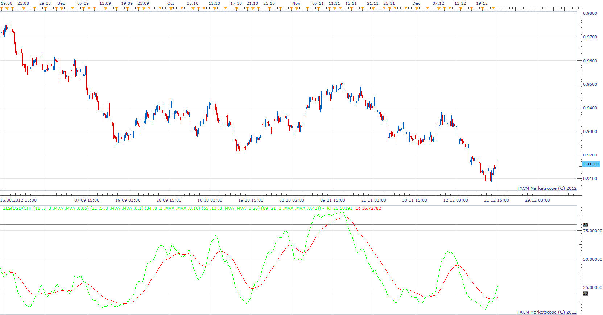

# Zero Lag Stochastic

> Source: https://fxcodebase.com/code/viewtopic.php?f=17&t=27932  
> Forum: 17 · Topic 27932 · 3 post(s)

---

## Zero Lag Stochastic

**Apprentice** · Sun Dec 23, 2012 6:52 am

 [ZLS.lua](files/49012/ZLS.lua)

The indicator was revised and updated

---

## Re: Zero Lag Stochastic

**Alexander.Gettinger** · Mon Sep 22, 2014 10:58 am

MQL4 version of Zero Lag Stochastic: [viewtopic.php?f=38&t=61218](https://fxcodebase.com/code/viewtopic.php?f=38&t=61218).

---

## Re: Zero Lag Stochastic

**Apprentice** · Sat Jun 24, 2017 5:21 am

The indicator was revised and updated.
