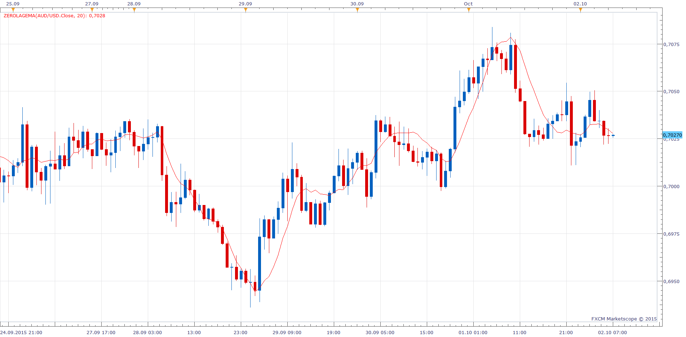

# ZeroLagEMA

> Source: https://fxcodebase.com/code/viewtopic.php?f=17&t=62746  
> Forum: 17 · Topic 62746 · 4 post(s)

---

## ZeroLagEMA

**Apprentice** · Fri Oct 02, 2015 6:40 am

MT4 version can be found here.
[viewtopic.php?f=38&t=59634&p=89926&hilit=ZeroLagEMA#p89926](https://fxcodebase.com/code/viewtopic.php?f=38&t=59634&p=89926&hilit=ZeroLagEMA#p89926)
Formulas:
ZeroLagEMA[i] = Alpha*(2*Price[i]-Price[i-lag])+(1-Alpha)* ZeroLagEMA[i-1], where
Alpha = 2/(Length+1),
Lag = (Length-1)/2.

 [ZeroLagEMA.lua](files/102650/ZeroLagEMA.lua)

The indicator was revised and updated

---

## Re: ZeroLagEMA

**Renkocafe** · Sat Oct 03, 2015 8:44 am

Great indicator. Like to implement it in a MA/EMA cloud indicator.

Is there a possibility?

---

## Re: ZeroLagEMA

**Apprentice** · Thu Oct 08, 2015 4:27 am

Your request is added to the development list.

---

## Re: ZeroLagEMA

**Apprentice** · Tue Jul 25, 2017 11:19 am

The indicator was revised and updated.
