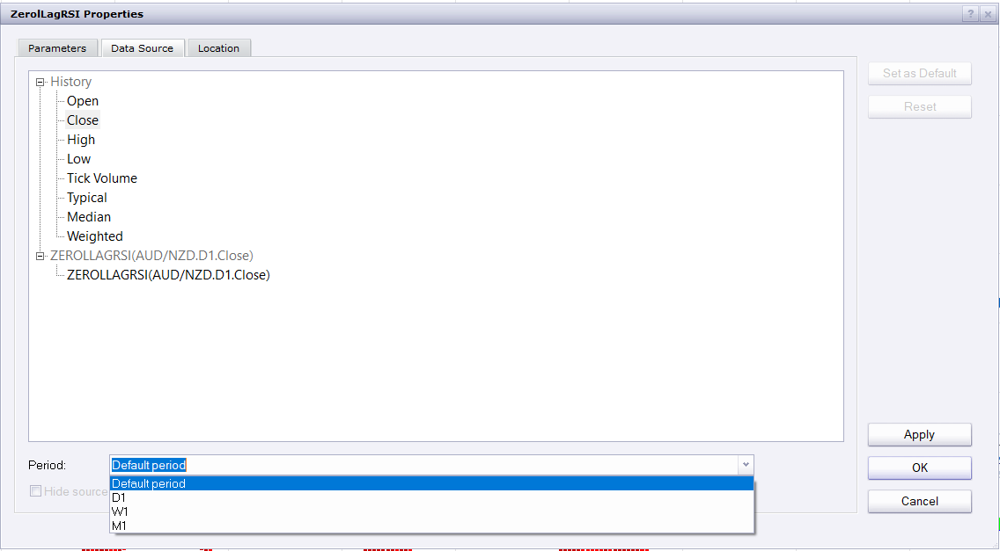

# ZerolLagRSI

> Source: https://fxcodebase.com/code/viewtopic.php?f=17&t=62495  
> Forum: 17 · Topic 62495 · 15 post(s)

---

## ZerolLagRSI

**Apprentice** · Tue Aug 04, 2015 3:01 am

 [ZerolLagRSI.lua](files/101639/ZerolLagRSI.lua)

 [ZerolLagRSI with Alert.lua](files/101639/ZerolLagRSI%20with%20Alert.lua)

Compatibility issue fixed.
_Alert Helper is not longer needed.

 [MTF MCP Zerol Lag RSI Heat Map.lua](files/101639/MTF%20MCP%20Zerol%20Lag%20RSI%20Heat%20Map.lua)

---

## Re: ZerolLagRSI

**Alexander.Gettinger** · Mon Aug 31, 2015 11:32 am

MQL4 version of Zero Lag RSI: [viewtopic.php?f=38&t=62610](https://fxcodebase.com/code/viewtopic.php?f=38&t=62610).

---

## Re: ZerolLagRSI

**mulligan** · Mon Oct 26, 2015 11:01 am

Very accurate and helpful indicator. A zero lag rsi with alert would be much appreciated. Alert based on above or below the zero line.

Thanks

---

## Re: ZerolLagRSI

**Apprentice** · Tue Oct 27, 2015 3:29 am

ZerolLagRSI with Alert.lua Added.

---

## Re: ZerolLagRSI

**Apprentice** · Fri Dec 04, 2015 5:53 am

Compatibility issue fixed.
_Alert Helper is not longer needed.

---

## Re: ZerolLagRSI

**Apprentice** · Mon Aug 21, 2017 8:05 am

The indicator was revised and updated.

---

## Re: ZerolLagRSI

**bartwas1** · Tue Aug 22, 2017 2:28 am

Is it possible to make this indicator display price movements from a higher time frame, for example on 15 min. chart prices from 1 hour chart or on 1 hour from 4 hour chart.

---

## Re: ZerolLagRSI

**Apprentice** · Wed Aug 23, 2017 5:08 am

Heat Map would be one of the options.
What you had in mind?
ZerolLagRSI with Alert.lua added.

---

## Re: ZerolLagRSI

**bartwas1** · Wed Aug 23, 2017 6:25 am

Thanks for your effort Apprentice.
What I meant was ZerolagRSI with an option to change a displayed time frame in settings. For example when you trade on 15 min. chart you could have ZerolagRSI oscillator from 1 hour chart, shown on your 15 min chart. In other words it is about having this oscillator on smaller time frame but showing higher time frame price movements.

---

## Re: ZerolLagRSI

**jaricarr** · Wed Aug 23, 2017 10:15 pm

Hi Apprentice,

Where can i find the zerol lag rsi heat map ?

---

## Re: ZerolLagRSI

**Apprentice** · Thu Aug 24, 2017 3:48 am

MTF MCP Zerol Lag RSI Heat Map.lua added.
(First/Top post in topic)

---

## Re: ZerolLagRSI

**Apprentice** · Thu Aug 24, 2017 6:17 am

 

bartwas1, u can select higher time frame source for most of indicator via Data Source -> Period

---

## Re: ZerolLagRSI

**bartwas1** · Thu Aug 24, 2017 6:28 am

Heat map seems to work fine for me.
I did wonder if by any chance you may add 12h slot and explain the difference in override method between: chart instrument, independent and chart time frame?
And thanks for pointing out for me that I can change time period via data source. I didn't think about I usually rely on metatrader. You are very helpful.

---

## Re: ZerolLagRSI

**Apprentice** · Thu Aug 24, 2017 8:48 am

Will try to add it, when I find time.

---

## Re: ZerolLagRSI

**Apprentice** · Wed Sep 12, 2018 5:46 am

The Indicator was revised and updated.
