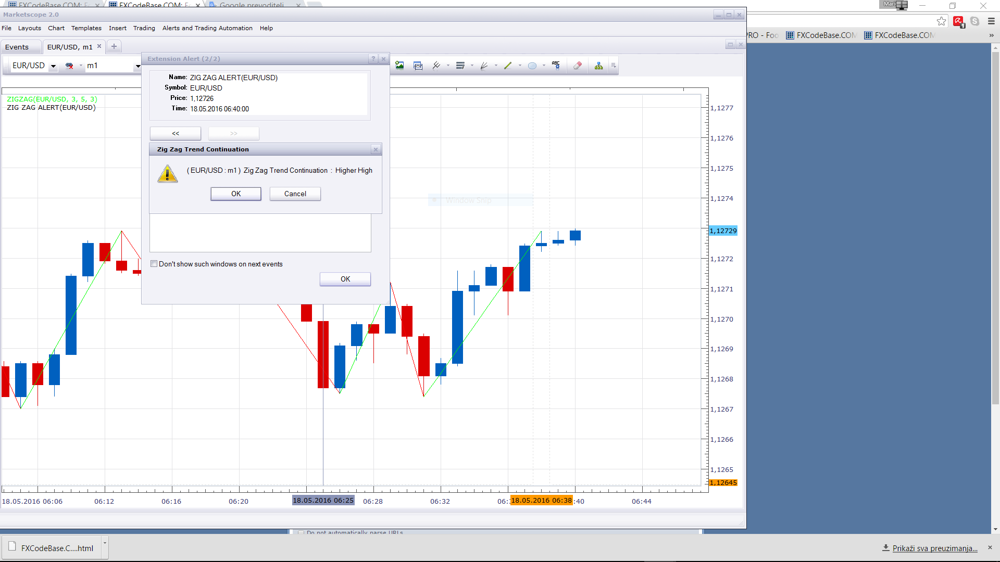

# Zig Zag Alert Indicator

> Source: https://fxcodebase.com/code/viewtopic.php?f=17&t=63496  
> Forum: 17 · Topic 63496 · 2 post(s)

---

## Zig Zag Alert Indicator

**Apprentice** · Wed May 18, 2016 6:14 am

Will give
1. Up/Down Alerts
2. Higher High/Lower Low Alerts
3. Lower High/Higher Low Alerts

 [Zig Zag Alert.lua](files/106329/Zig%20Zag%20Alert.lua)

---

## Re: Zig Zag Alert Indicator

**Apprentice** · Wed Oct 03, 2018 5:34 am

The indicator was revised and updated.
