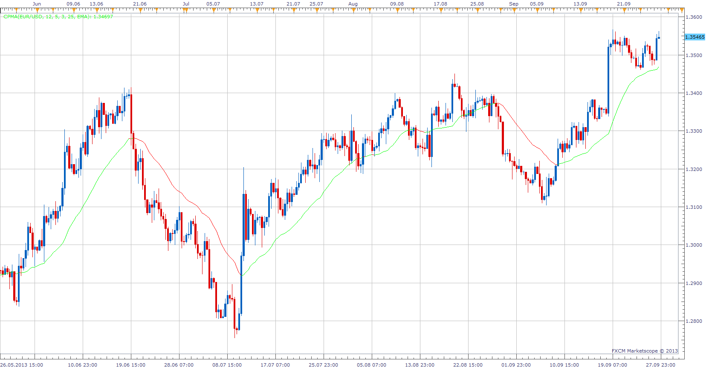

# Zig Zag Moving Average

> Source: https://fxcodebase.com/code/viewtopic.php?f=17&t=59593  
> Forum: 17 · Topic 59593 · 2 post(s)

---

## Zig Zag Moving Average

**Apprentice** · Fri Sep 27, 2013 9:22 am

The basic algorithm for this indicator is Zig Zag indicator.
For Zig we donate Candle High and for Zag we donate Candle Low value.
Such data stream is then averaged.

 [Zig Zag Moving Average.lua](files/89747/Zig%20Zag%20Moving%20Average.lua)

The indicator was revised and updated

---

## Re: Zig Zag Moving Average

**Apprentice** · Thu Jun 22, 2017 6:30 am

The indicator was revised and updated.
