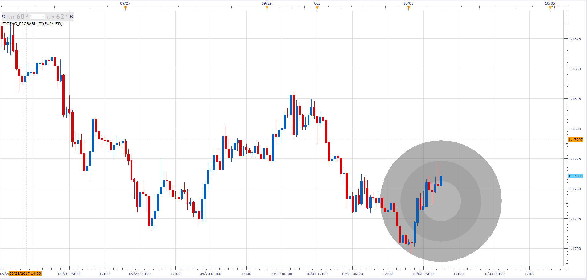

# Zig Zag Probability indicator

> Source: https://fxcodebase.com/code/viewtopic.php?f=17&t=65150  
> Forum: 17 · Topic 65150 · 4 post(s)

---

## Zig Zag Probability indicator

**Alexander.Gettinger** · Tue Oct 03, 2017 3:06 pm

Based on request [viewtopic.php?f=27&t=65053](https://fxcodebase.com/code/viewtopic.php?f=27&t=65053)

 

Download:

 [ZigZag_Probability.lua](files/115254/ZigZag_Probability.lua)

The StdDev.lua must be also installed.
[viewtopic.php?f=17&t=870](https://fxcodebase.com/code/viewtopic.php?f=17&t=870)

---

## Re: Zig Zag Probability indicator

**Apprentice** · Mon Sep 24, 2018 10:02 am

The Indicator was revised and updated.

---

## Re: Zig Zag Probability indicator

**easytrading** · Sun Sep 30, 2018 7:16 pm

Hello Apprentice,
there is an error when installing the indicator :

An error occurred during the calculation of the indicator 'ZIGZAG_PROBABILITY(EUR/USD)'. ZigZag_Probability.lua:125: attempt to index upvalue 'StdDev' (a nil value).

could you check it please ? thanks

---

## Re: Zig Zag Probability indicator

**Apprentice** · Mon Oct 01, 2018 3:02 am

The StdDev.lua must be also installed.
[viewtopic.php?f=17&t=870](https://fxcodebase.com/code/viewtopic.php?f=17&t=870)
