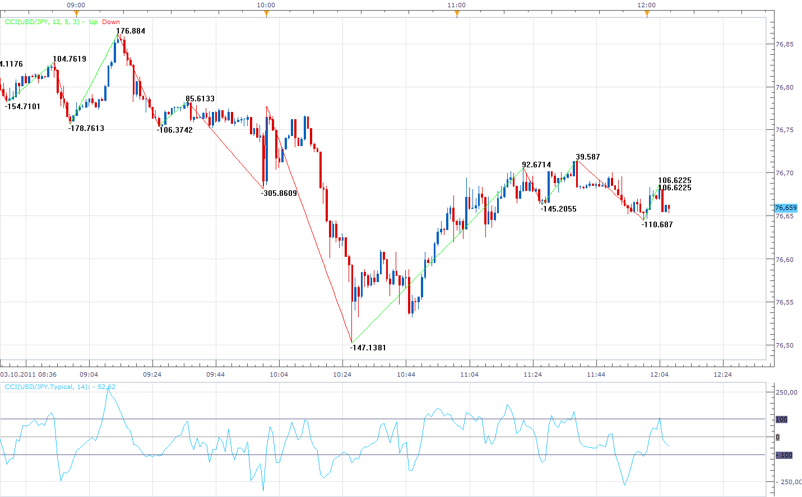

# Zig Zag with Indicator Value Overlay

> Source: https://fxcodebase.com/code/viewtopic.php?f=17&t=7009  
> Forum: 17 · Topic 7009 · 5 post(s)

---

## Zig Zag with Indicator Value Overlay

**Apprentice** · Mon Oct 03, 2011 11:07 am

This indicator allows you to print the values ​​of any indicators on the top / bottom of Zig Zag pattern.
Including the Zig Zag values.

 [ZigZagIndicatorOverlay.lua](files/15750/ZigZagIndicatorOverlay.lua)

The indicator was revised and updated

MT4/MQ4 version.
[viewtopic.php?f=38&t=67277](https://fxcodebase.com/code/viewtopic.php?f=38&t=67277)

---

## Re: Zig Zag with Indicator Value Overlay

**cpaivas27** · Mon Oct 03, 2011 2:05 pm

Thanks a lot Apprentice! it will help me a lot! you have one more fan!

---

## Re: Zig Zag with Indicator Value Overlay

**rod178** · Wed Dec 21, 2011 6:38 am

Causes Marketscope to crash

error report sent

---

## Re: Zig Zag with Indicator Value Overlay

**sunshine** · Tue Dec 27, 2011 12:41 am

Thanks for reporting the issue. It has been fixed. The fix will be available after the next update of the platform.

---

## Re: Zig Zag with Indicator Value Overlay

**Apprentice** · Sun Mar 26, 2017 3:36 pm

Indicator was revised and updated.
