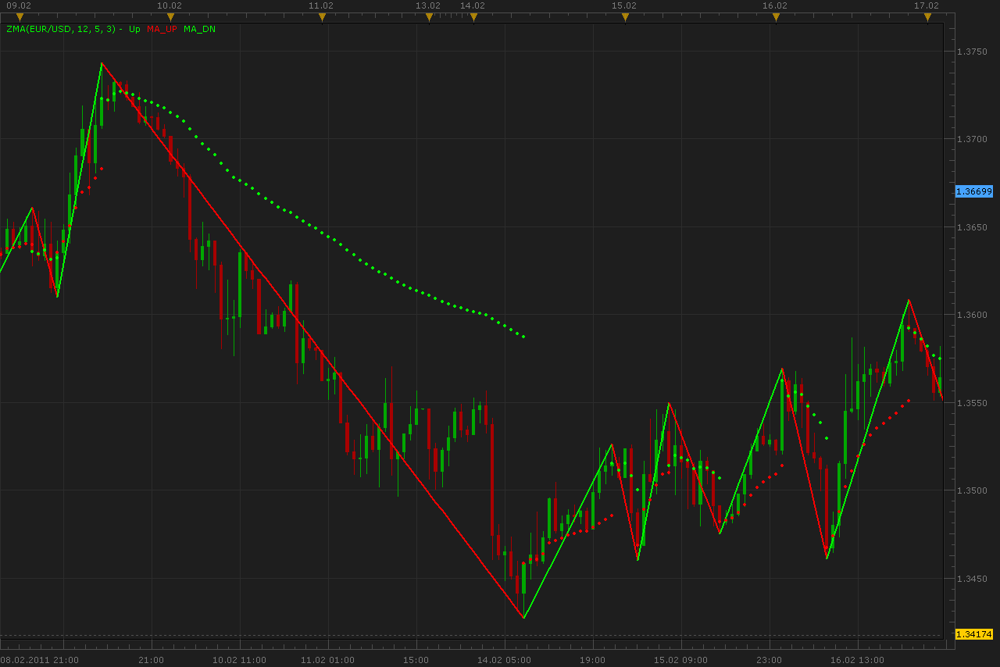

# ZigZag and Moving Average (ZMA)

> Source: https://fxcodebase.com/code/viewtopic.php?f=17&t=3485  
> Forum: 17 · Topic 3485 · 2 post(s)

---

## ZigZag and Moving Average (ZMA)

**Alexander.Gettinger** · Mon Feb 21, 2011 5:34 am

Standard realization of ZigZag is taken for base of the indicator.
From each node is drawn MA with increasing period.
For example:
"A" is a node of ZigZag.
ZMA[A]=Price_close[A],
ZMA[A+1]=(Price_close[A]+Price_close[A+1])/2,
ZMA[A+2]=(Price_close[A]+Price_close[A+1]+Price_close[A+2])/3 and etc.

 

Download:

 [ZMA.lua](files/8296/ZMA.lua)

MQ4/MT4 version.
[viewtopic.php?f=17&t=3485](https://fxcodebase.com/code/viewtopic.php?f=17&t=3485)

The indicator was revised and updated

---

## Re: ZigZag and Moving Average (ZMA)

**Apprentice** · Fri Feb 17, 2017 10:24 am

Indicator was revised and updated.
