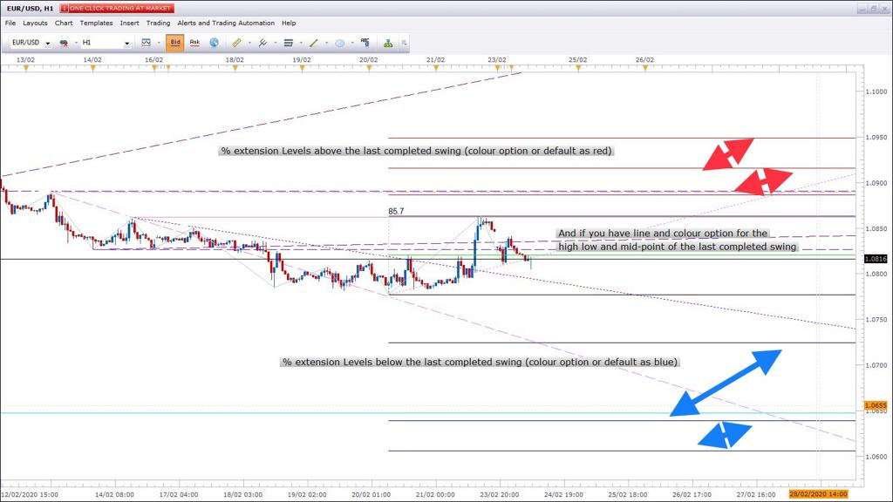
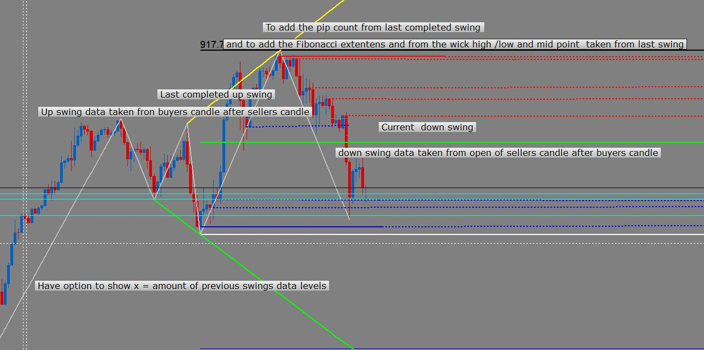

# ZigZag Channel

> Source: https://fxcodebase.com/code/viewtopic.php?f=17&t=60727  
> Forum: 17 · Topic 60727 · 109 post(s)

---

## ZigZag Channel

**Apprentice** · Mon May 26, 2014 5:16 am

 [ZigZag Channel.lua](files/94145/ZigZag%20Channel.lua)

 [ZigZag Channel with Output.lua](files/94145/ZigZag%20Channel%20with%20Output.lua)

 [Tick ZigZag Channel with Output.lua](files/94145/Tick%20ZigZag%20Channel%20with%20Output.lua)

---

## Re: ZigZag Channel

**Cactus** · Tue Feb 21, 2017 8:43 pm

Great find. Can you please check why lines disappear sometimes when moving the chart around with many instances of the same indicator applied?
When zooming in/out or scrolling back, the lines simply disappear, until I go into indicator settings and click apply/ok again.

---

## Re: ZigZag Channel

**Apprentice** · Wed Feb 22, 2017 3:32 am

Objects are drawn via Draw() function.
I believe this is the reason.

---

## Re: ZigZag Channel

**Cactus** · Wed Feb 22, 2017 4:50 pm

> **Apprentice wrote:**
> Objects are drawn via Draw() function.
> I believe this is the reason.

I see. In this case, what is the solution? Is it possible to make this behavior go away? Can you re-write this indicator using same principle as "trend line helper" or something? Can this draw() function be fixed? This would make for a very good channel indicator if lines would not disappear

---

## Re: ZigZag Channel

**Apprentice** · Fri Feb 24, 2017 5:56 am

We can rewrite, use ouput core.drawLine and two output streams,
or core.host:execute ("drawLine"...

---

## Re: ZigZag Channel

**Cactus** · Fri Feb 24, 2017 3:37 pm

> **Apprentice wrote:**
> We can rewrite, use ouput core.drawLine and two output streams,
> or core.host:execute ("drawLine"...

That's great, can you please provide this indicator with two output streams for the lines as you mention?

---

## Re: ZigZag Channel

**Apprentice** · Sat Feb 25, 2017 4:17 pm

ZigZag Channel with Output added.

---

## Re: ZigZag Channel

**Cactus** · Sat Feb 25, 2017 7:48 pm

This is perfect, thank you Apprentice, very good indicator
I have a problem after adding it to a strategy, the following in the backtester:

C:/Program Files (x86)/Candleworks/FXTS2/Strategies/Custom/my_strat.lua:239:
C:/Program Files (x86)/Candleworks/FXTS2/Indicators/Custom/ZigZag Channel with Output.lua (409, -1) : E19 - The first parameter must be a number

Strategy line code

Code: [Select all](https://fxcodebase.com/code/)
`ZIGZAG_CHANNEL_WITH_OUTPUT:update(core.UpdateLast);`
However this does not happen in Simulation Mode so I guess it shoudn't be a problem live either
I am guessing it is to do with no candle history being available in backtester to draw the zigzag

Thank you

---

## Re: ZigZag Channel

**Apprentice** · Sun Feb 26, 2017 4:58 am

I can not help you without access to underlying strategy.

---

## Re: ZigZag Channel

**Cactus** · Sun Feb 26, 2017 8:23 am

Ok! Here's a sample strategy to demonstrate this problem I created using FX Wizard:

I have added a screenshot of the settings
Running it on EUR/USD on the past week (13.02.2017 - 17.02.2017), I get the following error:

Code: [Select all](https://fxcodebase.com/code/)
`C:/Program Files (x86)/Candleworks/FXTS2/Strategies/Custom/zig_output_channel_strat.lua:230:  C:/Program Files (x86)/Candleworks/FXTS2/Indicators/Custom/ZigZag Channel with Output.lua (409, -1) : E19 -  The first parameter must be a number`

But when I do the same in "simualtion mode" (where there is more candle data available, not just the chosen range), the backtesting runs fine, but is very slow, and the equity looks like this: (with settings take_profit 0.1 and max_positions 100)

However, sometimes, with different settings, I get a similar error, just talking about "third parameter"

Also, can you please say what stream is "out" corresponding to? I understand "Top" and "Bottom".
But on chart there's also "Up" and in FX Wizard there's "out". Is this causing the error?
Or is it because I am checking every tick for updates? How can I fix this strategy to work in backtester?

Also, I mostly rely on FX Wizard to create my strategies, would you be so kind to inspect the code and advice on any changes I should perform every time, since it's the same template every time, I want to know if there's a better way of writing strategies, since the project has not been updated in a while. By "better" I mean without unecessary code, more efficient, optimal, etc. For example, I like to use (ask + bid / 2) price = median. In this strategy I use this indicator and BB. I have two BB (1 ask and 1 bid) and perform the median calculation to get one reading. I also have "mid_tick" which is the median price, I am sure I could replace the BB source with mid_tick instead of calculating it twice, one for ask and one for bid and dividing by two... And stuff like that.

All suggestions and comments are welcome please.

This strategy uses 3 timeframes: tick, m1, m15

Thanks

---

## Re: ZigZag Channel

**Cactus** · Mon Feb 27, 2017 12:54 pm

Should I create a new thread to seek help getting this strategy fixed to work in backtester with this indicator or is leaving the post here just fine

---

## Re: ZigZag Channel

**Cactus** · Mon Feb 27, 2017 3:02 pm

Ok I see the "out" / "up" stream is for color, width and style.

---

## Re: ZigZag Channel

**Apprentice** · Tue Feb 28, 2017 4:02 am

I do not use FX Wizard,
If you write strategy rules, I can write strategy for you.

---

## Re: ZigZag Channel

**Cactus** · Thu Mar 16, 2017 8:12 pm

Can you also provide a version of ZigZag with Output, with tick as source, so it can be used on tick charts and indicators

---

## Re: ZigZag Channel

**Apprentice** · Fri Mar 17, 2017 4:49 am

Tick ZigZag Channel with Output.lua added.

---

## Re: ZigZag Channel

**Cactus** · Fri Apr 14, 2017 11:30 am

Code: [Select all](https://fxcodebase.com/code/)
`Symbol   Strategy/Indicator   Message   Time
EUR/GBP   ZIGZAG CHANNEL WITH OUTPUT(midprice, 45, 1, 1, 44)   An error occurred during the calculation of the indicator 'ZIGZAG CHANNEL WITH OUTPUT(midprice, 45, 1, 1, 44)'. The error details: C:/Program Files (x86)/Candleworks/FXTS2/Indicators/Custom/ZigZag Channel with Output.lua:409:  The first parameter must be a number.   14/04/2017 20:33:31`

Do you know how to fix this error? I think this happens when there's not enough candles loaded on the chart

---

## Re: ZigZag Channel

**Apprentice** · Sat Apr 15, 2017 1:39 pm

Try it now.

---

## Re: ZigZag Channel

**Cactus** · Sat Apr 15, 2017 4:56 pm

> **Apprentice wrote:**
> Try it now.

Perfect, the error does not happen anymore, at least on the charts, yet to try it in a strategy, and ZigZag channel with output updates itself as more data is beeing seen on the chart (when I scroll back), thank you, this will help me a lot.

---

## Re: ZigZag Channel

**cash4u** · Mon Apr 17, 2017 7:21 pm

hi apprendice,

can you add show/hide option for zig zag in this indicator

---

## Re: ZigZag Channel

**Apprentice** · Tue Apr 18, 2017 12:09 pm

I can add it.
If you re-download, you can already set a line style option to "no line".

---

## Re: ZigZag Channel

**Cactus** · Sat May 27, 2017 5:55 am

Can you add a version of the "ZigZag Channel with Output" with a see historical option. The same as it is in "AUTOLEV3" indicator (The Lookback) paramter. So that we can draw many zigzag channels without applying the same indicator many times which slows down marketscope when there's a lot. Currently one zigzag indicator instance = 2 trendlines, but can you add a parameter to see historical also where it is possible to have many trendlines with just one indicator instance applied on chart? Thank you

---

## Re: ZigZag Channel

**Apprentice** · Sat May 27, 2017 7:23 am

Your request is added to the development list, Under Id Number 3801
 If someone is interested to do this task, please contact me.

---

## Re: ZigZag Channel

**Alexander.Gettinger** · Fri Sep 22, 2017 1:02 pm

> **Cactus wrote:**
> Can you add a version of the "ZigZag Channel with Output" with a see historical option. The same as it is in "AUTOLEV3" indicator (The Lookback) paramter. So that we can draw many zigzag channels without applying the same indicator many times which slows down marketscope when there's a lot. Currently one zigzag indicator instance = 2 trendlines, but can you add a parameter to see historical also where it is possible to have many trendlines with just one indicator instance applied on chart? Thank you

Please, try this version of indicator:

 [ZigZag Channel with Output_Mult.lua](files/115057/ZigZag%20Channel%20with%20Output_Mult.lua)

---

## Re: ZigZag Channel

**Cactus** · Fri Oct 20, 2017 7:19 pm

That is great!

> **Apprentice wrote:**
> We can rewrite, use ouput core.drawLine and two output streams,
> or core.host:execute ("drawLine"...

Ok. So can the same be done using **core.host:execute ("drawLine"**
So "ZigZag Channel with Output_Mult.lua" version but with no output streams, just lines, for less lag?

I know it may sound like I am asking the reverse of previous request but both of these can be useful, streams version for strategies, and the one I am requesting now as visual help

I know it may be a case of just replacing core.drawLine so I will give it a go and if I can implement it I will post it here

So far trying something like this

Code: [Select all](https://fxcodebase.com/code/)
`core.host:execute("drawLine", Top[index], tx2, ty2, source:date(source:size()-1), Y1, Color, Style, Width);` but no luck

Also if you got the time, can a Tick ZigZag Channel with Output.lua with same multiple lookback see historical option get done, like I explained here:

> **Cactus wrote:**
> a parameter to see historical also where it is possible to have many trendlines with just one indicator instance applied on chart?

Thanks in advance

---

## Re: ZigZag Channel

**Apprentice** · Mon Oct 23, 2017 4:41 am

core.host:execute ("drawLine" product is line as on screen graphic presentation.
NOT as indicator output, which can be referenced.

---

## Re: ZigZag Channel

**Apprentice** · Mon May 07, 2018 12:43 pm

The Indicator was revised and updated.

---

## Re: ZigZag Channel

**Paul W** · Tue Jan 14, 2020 2:48 pm

TICK ZIGZAG CHANNEL WITH OUTPUT

found an issue/bug affecting "Zig Zag Line Style" - specifically "Down swing" (Line) performance

currently both "Up swing" (Line) and "Down swing" (Line) default/focus is on "Bid"

- "Up swing" (Line) works well
- "Down swing" (Line) does not perform as well

can you default/focus "Down swing" (Line) onto "Ask ?

------------- If possible, an Alert Feature [https://youtu.be/hJaT-Zrd9Nk](https://youtu.be/hJaT-Zrd9Nk)

"Up swing" (Line)/"Down swing" (Line) cross - (user-defined) equal or greater than "touch" eg: +0.0, +0.1, .. +1.0 etc

after each "Line Style" Up/Down repaint - counter resets to "0"

after user defined "N" crosses - triggers Alert

additional Alerts with each additional "touch" - until next repaint, and counter resets

Alert Symbol (Wingdings 116 pls) and Sound - no email or dialogue-box Feature needed

Have been using "Up swing" Line cross on a scalping strategy - works well

Thanks

---

## Re: ZigZag Channel

**Apprentice** · Wed Jan 15, 2020 1:55 pm

Your request is added to the development list.
Development reference 548.

---

## Re: ZigZag Channel

**Apprentice** · Thu Jan 16, 2020 4:56 am

[Tick_ZigZag_Channel_with_Output.lua](files/130755/Tick_ZigZag_Channel_with_Output.lua)

Try this version.

---

## Re: ZigZag Channel

**Paul W** · Thu Jan 16, 2020 10:02 am

Tick_ZigZag_Channel_with_Output.lua

loaded, but an output display error occurred

---

## Re: ZigZag Channel

**Apprentice** · Thu Jan 16, 2020 11:34 am

Can you provide error text?

---

## Re: ZigZag Channel

**Paul W** · Thu Jan 16, 2020 3:46 pm

Tick_ZigZag_Channel_with_Output.lua

Loading indicator onto TSII Platform did not generate an error -ok

an error was generated (no detailed text description) - when loading indicator onto a Tick-Chart
errors occurred on both Bid and Ask

loaded onto a 1-minute chart - no error was generated
both Bid and Ask line features appear to function correctly

a quick video illustration [https://youtu.be/96Qnt_Hn1Fo](https://youtu.be/96Qnt_Hn1Fo)

---

## Re: ZigZag Channel

**Apprentice** · Sat Jan 18, 2020 5:35 am

Your request is added to the development list.
Development reference 555.

---

## Re: ZigZag Channel

**Apprentice** · Mon Jan 20, 2020 10:06 am

[Tick_ZigZag_Channel_with_Output.lua](files/130821/Tick_ZigZag_Channel_with_Output.lua)

Try this version.

---

## Re: ZigZag Channel

**Paul W** · Wed Jan 22, 2020 10:53 am

am testing latest version

still some bugs on how Bid / Ask lines are being displayed - and alert feature has issues

am currently testing running old and new versions side by side - there is really good potential for this to be an entry indicator (scalping strategy)

I need to better document - will post as soon as possible

just wanted to give you a heads-up on my progress - and this reply doesn't need to be posted

thanks

---

## Re: ZigZag Channel

**Paul W** · Tue Jan 28, 2020 10:50 pm

Can you pls have a look at the original "Tick ZigZag Channel with Output.lua" indicator - appears there is "Down Line" calculation issue

"Down Line" calculation - does not paint the same (reciprocally) as "UpLine" calculation (an important functionality)

If there is a fix, it would be very much appreciated

Note ----------

the same "Down Line" calculation issue also appears to occur with "Tick_ZigZag_Channel_with_Output.lua"

- "Up Line" alert function does work (some bugs thou)

- "Down Line" alert function does not work at all - price never appears to cross "Down Line" (different calculation ?)

---------------

getting "Tick ZigZag Channel with Output.lua" to work is a more important fix

many Thx

---

## Re: ZigZag Channel

**susan61** · Wed Jan 29, 2020 9:51 am

Hey Apprentice
Can you make some adjustments to ZigZag Channel with Output_Mult.lua

Add a long-term zigzag channel if channel. Long term-trend needs to create a lower high in a downtrend and long-term uptrend would create a higher low. Current price on that timeframe would need to close against zigzag channel the high/low of zigzag channel where trend started. Horizontal line to be added from the candle long-term trend started. if new long term trend zigzag channel was create in same direction to stop lines on chart have option to show last or show all. To have colour and line option for current & long-term and historical zigzag channel, for long- term zigzag channel and historical zigzag channel and current zigzag channel long term would stay until new same direction long term then old long term would become historical. Add Horizontal line to alert on touch and closed against. Add pip swing count and high/low and mid of current swing.This would be for 5min and above not tick
Link below
Thankyou in advance Susan

[download/file.php?id=19092](https://fxcodebase.com/code/download/file.php?id=19092)

 

---

## Re: ZigZag Channel

**Apprentice** · Wed Jan 29, 2020 5:21 pm

Your request is added to the development list.
Development reference 608.

---

## Re: ZigZag Channel

**Apprentice** · Thu Jan 30, 2020 5:11 pm

[Tick ZigZag Channel with Output.lua](files/130993/Tick%20ZigZag%20Channel%20with%20Output.lua)

Tyr this version.

---

## Re: ZigZag Channel

**Apprentice** · Tue Feb 04, 2020 6:10 am

susan61
I have a hard time understanding your request.
Can you provide a bit more structured, a more detailed description?
Maybe provide some sort of drawing.

---

## Re: ZigZag Channel

**susan61** · Tue Feb 04, 2020 9:42 am

> **Apprentice wrote:**
> susan61
> I have a hard time understanding your request.
> Can you provide a bit more structured, a more detailed description?
> Maybe provide some sort of drawing.

Hi Apprentice,
The long term down trend = A swing to the downside with a zigzag pullback data to be taken from the high at point 1 and the 1st zigzag pull back point 2, And add horizontals from the point high point.
The long term up trend = A swing to the upside with a zigzag pullback data to be taken from the low at point 1 and the 1st zigzag pull back point 2, And add horizontals from the point high point.

Current price on that timeframe would need to close against zigzag channel the high/low horizontal of zigzag channel where trend started. Horizontal line to be added from the candle long-term trend started. if new long term trend zigzag channel was create in same direction to stop lines on chart have option to show last or show all. To have colour and line option for current & long-term and historical zigzag channel, for long- term zigzag channel and historical zigzag channel and current zigzag channel long term would stay until new same direction long term then old long term would become historical. Add Horizontal line to alert on touch and closed against. Add pip swing count and high/low and mid of current swing.

 

Hope this helps you understand with more details to the screen shot
thanks in advance
Susan

---

## Re: ZigZag Channel

**Apprentice** · Tue Feb 04, 2020 1:19 pm

Your request is added to the development list.
Development reference 637.

---

## Re: ZigZag Channel

**Apprentice** · Wed Feb 05, 2020 10:12 am

I didn't manage to figure out what "Add pip swing count and high/low and mid of current swing." means.

 [ZigZag Channel with Output_Mult.lua](files/131107/ZigZag%20Channel%20with%20Output_Mult.lua)

---

## Re: ZigZag Channel

**susan61** · Wed Feb 05, 2020 11:52 am

Hi Apprentice,
Just had a look and its printing high & low of different swing. What I want is when price makes a higher low for long from point 1 then has a zigzag printed pullback creating point 2 to draw a trend line from point 1 to point 2 and draw a horizontal till end only draw if this happens. When price makes a lower high for short from point 1 then has a zigzag printed pullback creating point 2 to draw a trend line from point 1 to point 2 and draw a horizontal till end only draw if this happens. as condition repeat would keep drawing trend line from point 1 to point 2 and the horizontal line from point 1 until price closed below the low of point 1 1st low of higher low, and closed above the high of point 1 1st high of higher low also the need the current zigzag channel from the last 2 swings please, the current high low and mid of the current printed swing and pips count id amount of pips in that printed swing can be found ZigZag with Fibonacci.lua
hope this clarifies my request
Susan

 

---

## Re: ZigZag Channel

**Paul W** · Thu Feb 06, 2020 12:57 pm

Re: TICK ZIGZAG CHANNEL WITH OUTPUT

Could you please check the “Down Line” calculation - is it the same as the “Up Line” calculation (reciprocally) ?

They appear not to be - see attachment

-“Up Line” - works great, and is part of a successful Long-scalp Strategy
-“Down Line” - should be reciprocal to “Up Line” performance - it is not (could you pls look at the
 calculation)

Originally I thought it was a “Bid” / “Ask” issue - I now believe this is incorrect (Re: TICK_ZIGZAG_CHANNEL_WITH_OUTPUT) .... my apologies

What is important (to me) is to have TICK ZIGZAG CHANNEL WITH OUTPUT “Up Line” and “Down Line” performance to be identical (reciprocally) - if this is possible ?

------------------------

Re: TICK_ZIGZAG_CHANNEL_WITH_OUTPUT ……. (can wait, has more issues to fix)

Loading issues
Bid/Ask calculation issues
Alert function not working correctly

Many Thx

---

## Re: ZigZag Channel

**Apprentice** · Fri Feb 07, 2020 6:17 am

Your request is added to the development list.
Development reference 691.

---

## Re: ZigZag Channel

**Apprentice** · Fri Feb 07, 2020 7:01 am

[ZigZag Channel with Output_Mult.lua](files/131166/ZigZag%20Channel%20with%20Output_Mult.lua)

 [Tick ZigZag Channel with Output.lua](files/131166/Tick%20ZigZag%20Channel%20with%20Output.lua)

---

## Re: ZigZag Channel

**susan61** · Fri Feb 07, 2020 8:47 am

[quote="Apprentice"]

ZigZag Channel with Output_Mult.lua

Hi Apprentice,
Thanks, you got the idea what I want still need adjustments. Need to have long-term trend lines look for data from the 1st pullback and every time there was a pullback, Thinks we to insist x =amount of pullback in % required otherwise chart would clutter up with irrelevant lines.
To have option to show all or last x = amount of long-term trend to show. The horizontal lines from the long –term trends to be from point 1 every time a long-term trend created with x= amount of % pullback.
I put the lookback to 1000 and still only printed the last 2, No historical either can you also add colour and line option for long term & historical trend up & down ,If you can also put back the original indicator that shows the last 2 swings as my request was to be added to the ZZ Channel. The current swing created for high /low and mid, what I should have explained the previous swing completed for the high/low and mid and the amount of pips from the high/low or low/ high. And there’s a number on the top don’t know what that is
thanks for your work on this topic
Susan

---

## Re: ZigZag Channel

**Paul W** · Fri Feb 07, 2020 1:03 pm

Re: Tick ZigZag Channel with Output.lua - Feb 07, 2020 7:01 am - update

thank you

acts differently than original version - and Price now crosses "Down Line" (no bugs/issues so far)

settings need to be tuned (to selected instrument)

this could be a very good indicator - to a composite Strategy

Thx

---

## Re: ZigZag Channel

**Paul W** · Fri Feb 07, 2020 2:18 pm

Re: Tick ZigZag Channel with Output.lua - Feb 07, 2020 7:01 am - update

found one glitch that needs to be error trapped

occasionally indicator will repaint backwards - to a previously painted line - both "Up Line" and "Down Line"(s)

could you error trap - allowing only forward progress of Line(s)

Thx

---

## Re: ZigZag Channel

**Apprentice** · Mon Feb 10, 2020 6:39 am

[ZigZag Channel with Output_Mult.lua](files/131194/ZigZag%20Channel%20with%20Output_Mult.lua)

Try this version.

---

## Re: ZigZag Channel

**susan61** · Mon Feb 10, 2020 10:16 am

Hi Apprentice,
This looks great with the added pullback %...
Can you just make a few more adjustments
**1.**	For the down swing on long term, historical and current data to be taken from ask price
**2.**	For the down swing line and colour option for long term separate for historical separate for current trend.
**3.**For the up swings on long term trend, historical and current data to be taken from bid price
**4.**	For the up swing line and colour option for long term separate for historical separate for current trend.
**5.**	The pip count to be on the last completed swing and draw a line high ,low and mid points
**6.**	And lastly noticed that a trend line is drawn b4 the zigzag has been drawn on current trend can this be set to once new zigzag created a higher low as per screen shot
Thanks again for all hard work gone into this to getting right for me
Susan

 

---

## Re: ZigZag Channel

**Apprentice** · Tue Feb 11, 2020 5:59 am

Your request is added to the development list.
Development reference 708.

---

## Re: ZigZag Channel

**Apprentice** · Tue Feb 11, 2020 6:58 am

I can't repeat that.

---

## Re: ZigZag Channel

**Paul W** · Tue Feb 11, 2020 12:20 pm

Re: Tick ZigZag Channel with Output.lua - Feb 07, 2020 7:01 am - update

apologies, I should have attached an example

**On Tick-Chart (US30)** - back-to-previous-repaints are frequent - [https://www.youtube.com/watch?v=fXusifC ... e=youtu.be](https://www.youtube.com/watch?v=fXusifCN_Ww&feature=youtu.be)

appears that if "price" retraces (on a tick chart) sufficiently (making the previous calculation "more valid"(?), Then the "Up/Down Line(s)" will backstep and repaint the previous line-paint

btw the indicator is awesome - when used in a scalp-strategy for entry-points

I appreciate your efforts

Thanks

---

## Re: ZigZag Channel

**Apprentice** · Wed Feb 12, 2020 1:35 pm

[ZigZag Channel with Output_Mult.lua](files/131245/ZigZag%20Channel%20with%20Output_Mult.lua)

Try this version.

---

## Re: ZigZag Channel

**susan61** · Wed Feb 12, 2020 3:14 pm

Hi Apprentice,
Thanks so much for doing a great job
Noticed that the data points are taken from are the wrong way round,also need to add the current swing as in the original version of indicator, and sometimes the indicator crashes
**1.**	**Upswing**data to be taken from a bid price source and a **Downswing**data to be taken from a ask price currently other way round please can you change round
**2.**	Thinks the current trend line is created when it has retracted more then % pullback but no ZigZag been created if you can add current swing as in the original version of the indicator (with no pullback required on current swing) this should eliminate this problem and we get the requested current swing in as well
**3.**	The indicator shows (Error) in the legend when you adjust chart to get more chart data
Thanks
Susan

---

## Re: ZigZag Channel

**Apprentice** · Fri Feb 14, 2020 8:54 am

[ZigZag Channel with Output_Mult.lua](files/131281/ZigZag%20Channel%20with%20Output_Mult.lua)

Try this version.

---

## Re: ZigZag Channel

**susan61** · Fri Feb 14, 2020 10:09 am

Hey Apprentice,
You have done a perfect job with the bid and ask data point and pip count and the high /low and mid thank you. Can you still add the original version of the indicator as my version don’t any data for the last 2 swings if price is expanding would need to disable the % pullback or straight add the original version to run alongside with the long term historical and % pullback and would you be able to add multiple time frame option (x3) would just colour option .

 

Thank you so much for taking time to do all the adjustments i think this will be the last adjustments
Susan

---

## Re: ZigZag Channel

**Apprentice** · Sun Feb 16, 2020 5:59 am

Your request is added to the development list.
Development reference 727.

---

## Re: ZigZag Channel

**Apprentice** · Mon Feb 17, 2020 7:22 am

Try this version.

 [ZigZag Channel with Output_Mult.lua](files/131311/ZigZag%20Channel%20with%20Output_Mult.lua)

NOTE: it's better to use 3 indicators instead of coding 3 timeframes into the same indicator.

---

## Re: ZigZag Channel

**susan61** · Mon Feb 17, 2020 9:18 am

NOTE: it's better to use 3 indicators instead of coding 3 timeframes into the same indicator.[/quote]

Hi Apprentice,
Have tried putting x3 indicators using different time frames on but seems to slow the platform down when switching to different currency pairs. And the able/disable of the pullback didn’t make a difference, still didn’t print the last 2 high points or last 2 low point zigzag channel as per previous screen shot. Can you add the original version and its calculations for this part of the indicator note no pull back required on this part of the indicator only pullback % only required on the long term trend and historical trends
Thanks Susan

---

## Re: ZigZag Channel

**Apprentice** · Tue Feb 18, 2020 8:52 am

Your request is added to the development list.
Development reference 736.

---

## Re: ZigZag Channel

**yolerap** · Tue Feb 18, 2020 12:14 pm

Hi,

Is it possible to create a strategy with the last version of the indicator ( Zig Zag Channel With Output ) please ?

Look the picture ;

Sell when the price touch the upper line of the swing line
Buy when the price touch the lower line of the swing line
Close position at the middle of the upper and lower swing line

Thank you,

---

## Re: ZigZag Channel

**Apprentice** · Wed Feb 19, 2020 2:11 pm

Your request is added to the development list.
Development reference 749.

---

## Re: ZigZag Channel

**Apprentice** · Wed Feb 19, 2020 2:21 pm

When you set "Use poolback" to false the old version of the code is used. Coding 3 timeframes into one indicator will not be any faster. It's likely that it'll be even slower. And I don't understand 2high/low part

---

## Re: ZigZag Channel

**susan61** · Thu Feb 20, 2020 4:30 am

Hi Apprentice,
When disable the pullback it disables on the long term and historical long term as well, is there a way can only disable the last 2 swings printed on the zigzag channel have a separate line and colour option. And would you be able to add x 3 % extensions above and below the last competed zigzag swing where we have the high low and mid-point and lastly can you make the label for the pip count of the completed zigzag swing larger and to the decimal point eg; currently sometimes shows 18.4440 to show 18.4
Thanks so much
Susan

---

## Re: ZigZag Channel

**Apprentice** · Fri Feb 21, 2020 6:09 am

[ZigZag Channel with Output_Mult.lua](files/131404/ZigZag%20Channel%20with%20Output_Mult.lua)

---

## Re: ZigZag Channel

**Apprentice** · Fri Feb 21, 2020 6:16 am

Task 749

 [ZigZag Channel with Output_Mult With Arrows.lua](files/131406/ZigZag%20Channel%20with%20Output_Mult%20With%20Arrows.lua)

 [ZigZag Channel with Output_Mult Strategy.lua](files/131406/ZigZag%20Channel%20with%20Output_Mult%20Strategy.lua)

---

## Re: ZigZag Channel

**susan61** · Fri Feb 21, 2020 10:01 am

> **Apprentice wrote:**
>
>
> ZigZag Channel with Output_Mult.lua

Hi Apprentice,
Pip swing count great work, if you can add x3 percentage extensions levels above the high (colour option or default to red), and below the low (colour option or default to blue) from the last zigzag completed swing where we have the high low and mid-point, where the pip count is taken from. Still cannot manage to get the last to swing when I overlay the original version.
Thanks Susan

---

## Re: ZigZag Channel

**Apprentice** · Sun Feb 23, 2020 4:10 am

Your request is added to the development list.
Development reference 764.

---

## Re: ZigZag Channel

**Apprentice** · Mon Feb 24, 2020 4:02 am

I don't understand the logic required. The screenshot will help.

---

## Re: ZigZag Channel

**susan61** · Mon Feb 24, 2020 4:53 am

Hi Apprentice,
As per screen shot % extension levels above the last completed swing (colour option or default as red) and % extension levels below the last completed swing (colour option or default as blue).And have line and colour option for the high low and mid-point of the last completed swing all data taken from the last completed swing

Hope this helps
Susan

 

---

## Re: ZigZag Channel

**Apprentice** · Tue Feb 25, 2020 6:22 am

[ZigZag Channel with Output_Mult.lua](files/131474/ZigZag%20Channel%20with%20Output_Mult.lua)

Try this version.

---

## Re: ZigZag Channel

**susan61** · Tue Feb 25, 2020 9:11 am

Hi Apprentice,
Great work on the line & colour option. With the % extension we need x3 % extensions levels for above the high of the last completed swing eg; 1.272% and 1.50% 1.618% and x3 % extensions levels for below the low of last completed swing -1.272% and -1.50% and -1.618%. As in previous screenshot as when tested this version it put both % extensions at bottom of swing and I used the + & - on the % extensions.
If you make these adjustments
Thanks Susan

---

## Re: ZigZag Channel

**Paul W** · Tue Mar 03, 2020 11:40 am

Here is a simple strategy for **Tick Chart Entrie**s

to be used with - [download/file.php?id=27469](https://fxcodebase.com/code/download/file.php?id=27469)

currently tuned for CFD's - US30 works well, and to be used with other indicators (for confirmation)

Note: there is a bug - Indicator will back-repaint to a previously displayed position - appears to depend on how price advances

here is a short video example of the bug [https://www.youtube.com/watch?v=fXusifC ... e=youtu.be](https://www.youtube.com/watch?v=fXusifCN_Ww&feature=youtu.be)

to duplicate bug - pls use US30 and settings displayed on attached example (tick-chart) during an active period - NY session

if you could take a look, and if possible fix - would make the indicator even better

thanks

---

## Re: ZigZag Channel

**susan61** · Tue Mar 03, 2020 1:37 pm

[quote="susan61"]Hi Apprentice,
Great work on the line & colour option. With the % extension we need x3 % extensions levels for above the high of the last completed swing eg; 1.272% and 1.50% 1.618% and x3 % extensions levels for below the low of last completed swing -1.272% and -1.50% and -1.618%. As in previous screenshot as when tested this version it put both % extensions at bottom of swing and I used the + & - on the % extensions.
If you make these adjustments

never got a development referrence number if you can add the % extension levels and below
thanks Susan

---

## Re: ZigZag Channel

**Apprentice** · Wed Mar 04, 2020 5:35 am

Your request is added to the development list.
Development reference 816.

---

## Re: ZigZag Channel

**Apprentice** · Wed Mar 04, 2020 9:12 am

[ZigZag Channel with Output_Mult.lua](files/131701/ZigZag%20Channel%20with%20Output_Mult.lua)

Something like this?

---

## Re: ZigZag Channel

**Paul W** · Wed Mar 04, 2020 11:55 am

My apologies - my mistake

I attached the incorrect download Link / Version

should be Tick version - [download/file.php?id=27414](https://fxcodebase.com/code/download/file.php?id=27414)

again, I appreciate your efforts

Thx

---

## Re: ZigZag Channel

**susan61** · Wed Mar 04, 2020 12:17 pm

Hi Apprentice,
the percentage extensions are there in the parameters setting but not for above and below (only one set) on the last completed zigzag. When you apply in parameters, nothing is drawn on the chart
Hope u can fix this
Susan

---

## Re: ZigZag Channel

**Apprentice** · Thu Mar 05, 2020 6:07 am

Your request is added to the development list.
Development reference 823.

---

## Re: ZigZag Channel

**Apprentice** · Thu Mar 05, 2020 6:42 am

[ZigZag Channel with Output_Mult.lua](files/131725/ZigZag%20Channel%20with%20Output_Mult.lua)

Try this version.

---

## Re: ZigZag Channel

**susan61** · Thu Mar 05, 2020 12:47 pm

Hi Apprentice ,
The extension levels are there. When I put my levels in they have no relevance to the percentage entered needs to calculated from the last completed swing for example if we entered 150% as a level, the 100% would be in the last completed zigzag and the extension level to be drawn outside the last completed zigzag of 50% of last swing and when calculating the other end of the last completed zigzag might need to use the – so the level to input -1.50%
Thanks in advance
 Susan

---

## Re: ZigZag Channel

**Apprentice** · Fri Mar 06, 2020 6:25 am

Your request is added to the development list.
Development reference 832.

---

## Re: ZigZag Channel

**Apprentice** · Mon Mar 09, 2020 6:57 am

[ZigZag Channel with Output_Mult.lua](files/131810/ZigZag%20Channel%20with%20Output_Mult.lua)

Try this version.

---

## Re: ZigZag Channel

**susan61** · Mon Mar 09, 2020 10:03 am

Hi Apprentice
Perfect looks good thanks so much
Susan

---

## Re: ZigZag Channel

**Paul W** · Thu Apr 09, 2020 1:27 pm

Hello,

have been using ZigZag Channel (line option) to look for possible entries - works well with other confirming indicators

however, there is an undesired feature/bug - the "Line" option of the indicator - occasionally it will repaint to a previously painted position (back-repainting) - eg: [https://youtu.be/pTq6bwpDZX0](https://youtu.be/pTq6bwpDZX0)

to duplicate: I have attached the settings used - try the indicator with these setting on the US30 during an active period - NY open 09:30 ET

appreciate you having a look

Thx

---

## Re: ZigZag Channel

**Apprentice** · Fri Apr 10, 2020 6:30 am

Your request is added to the development list.
Development reference 1041.

---

## Re: ZigZag Channel

**Apprentice** · Wed Apr 15, 2020 1:00 pm

Actually, it's a feature of this indicator. It should do that because the latest leg no longer satisfy for the line to be drawn at that spot. And it jumps at the latest spot where all conditions are satisfied.

---

## Re: ZigZag Channel

**Paul W** · Tue Apr 21, 2020 3:09 pm

re: "Line Style" feature

unfortunately "And it jumps at the latest spot where all conditions are satisfied"
is an undesired feature on tick-charts - jumps frequently during active Mrkts

is it possible (at least on Tick-charts) to defeat this feature ?
or to add a check-box that defeats this feature (on Tick-charts) ?

where the "Line" will not jump (backwards), and holds in place until the next (forward) valid set of conditions are met ?

If you could take a look - that would be great

Thanks

---

## Re: ZigZag Channel

**arfs9090** · Fri Oct 02, 2020 5:51 am

The attachment **ZigZag Channel with Output.lua** is no longer available

Hey Apprentice & Team,
ZigZag Channel with output.lua (Not the tick version)
Can you add some horizontal candle keylevel to this indicator ZigZag Channel with output.lua
(Not the tick version)
Would have top/bottom of swings from the open of the reversal candle and also would mark out were price had a pullback. Show last completed and current swing in the making,
Also if can have an option to show x=amount of historical swings to get data from for levels.
Need line and colour option for buyers /sellers and structure high/low and different for pullback keylevel. And add levels from the last completed swing wick high/low and mid point with pip count and add x3 extention above & below last levels as per the Zigzag channel with output_mult
indicator on the forum.

Downswing (pullback)
Data info defined for biased downward move creating a buyers candle then sellers candle after to continuing with downward movement.
Down Swing data would take from open of sellers candle

Upswing (pullback)
Data info defined for biased upward move creating a sellers candle then buyers candle after to continuing with upward movement
Up Swing data would take from open of buyers candle

The line to start on the candle

Thanks in advance
 Arfs

 

---

## Re: ZigZag Channel

**Apprentice** · Sat Oct 03, 2020 6:48 am

Your request is added to the development list.
Development reference 2136.

---

## Re: ZigZag Channel

**arfs9090** · Thu Oct 15, 2020 5:03 am

Hi Apprentice,
Hope you're all safe and well,
Is there any update on this task?
thanks in advance
arfs

---

## Re: ZigZag Channel

**arfs9090** · Tue Oct 27, 2020 3:56 am

Hi Apprentice,
 Was given a Development reference 2136 and not seen anything posted on the forum can the task be done
arfs

---

## Re: ZigZag Channel

**minifire18** · Thu Nov 26, 2020 11:20 pm

> **Apprentice wrote:**
>
>
> ZigZag Channel with Output_Mult.lua

Hi Apprentice
From the Zigzag channel with Output_Mult.lua posted 29.3.20 with fib extensions and mid structure levels can you change, instead of using the high /low to use the open of the 1st sellers candle for down swing and the open of the 1st buyers candle in upswing

thanks Minifire

---

## Re: ZigZag Channel

**Apprentice** · Fri Nov 27, 2020 7:07 am

Your request is added to the development list.
Development reference 2364.

---

## Re: ZigZag Channel

**Apprentice** · Sun Nov 29, 2020 3:53 am

I don't understand what high/low should we replace.

Can you clarify,
"open of the 1st sellers candle for down swing and the open of the 1st buyers candle in upswing"
provide a chart example?

---

## Re: ZigZag Channel

**minifire18** · Mon Nov 30, 2020 1:59 am

> **Apprentice wrote:**
> I don't understand what high/low should we replace.
>
> Can you clarify,
> "open of the 1st sellers candle for down swing and the open of the 1st buyers candle in upswing"
> provide a chart example?

Hi Apprentice,
Instead of the data to be taken from the candle wick high or candle wick low to plot the zigzag, can you take data from the open price of the 1st reversal sellers candle for downswings and for upswings take data from the open price of the 1st reversal buyers candle for upswings
Hope this clarifies the request
Thanks in advance
Minifire

 

---

## Re: ZigZag Channel

**Apprentice** · Mon Nov 30, 2020 10:09 am

Your request is added to the development list.
Development reference 2375.

---

## Re: ZigZag Channel

**minifire18** · Fri Dec 11, 2020 1:06 am

Any update with this request?

---

## Re: ZigZag Channel

**Apprentice** · Mon Dec 28, 2020 3:27 pm

I'm not sure that I do understand it correctly, but this version already doing so: [download/file.php?id=27772](https://fxcodebase.com/code/download/file.php?id=27772)

---

## Re: ZigZag Channel

**Apprentice** · Sun Jan 03, 2021 5:38 am

[ZigZag Channel with Output_Mult.lua](files/139931/ZigZag%20Channel%20with%20Output_Mult.lua)

Try this version.

---

## Re: ZigZag Channel

**minifire18** · Mon Jan 04, 2021 7:43 am

thanks works perfectly
minifire

---

## Re: ZigZag Channel

**minifire18** · Sun Jan 10, 2021 3:55 am

Hi Apprentice
Is it possible to only allow to print the new version of indicator only when the original zigzag high /low data has created a swing within a swing than print the new version?
thanks in advance
Minifire

---

## Re: ZigZag Channel

**Apprentice** · Mon Jan 11, 2021 5:12 am

Can you show the example?

---

## Re: ZigZag Channel

**minifire18** · Mon Jan 11, 2021 9:23 am

Hi Apprentice,
The request for the task is
IF the High Low data zigzag creates a higher low (example 1) then the new version to print from previous high to the higher low
IF the High Low data zigzag creates a lower high (example 2)then the new version to print from previous low to the lower high
they are the only two conditions for the new version to print the fib extension levels
hope this helps to understand the request
Minifire

 

---

## Re: ZigZag Channel

**Apprentice** · Tue Jan 12, 2021 5:12 am

Your request is added to the development list.
Development reference 72.

---

## Re: ZigZag Channel

**Apprentice** · Wed Jun 02, 2021 9:48 am

Try this version.
[https://fxcodebase.com/code/viewtopic.php?f=17&t=71253](https://fxcodebase.com/code/viewtopic.php?f=17&t=71253)
