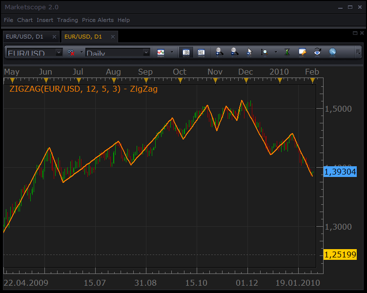

# ZigZag (closed topic)

> Source: https://fxcodebase.com/code/viewtopic.php?f=17&t=275  
> Forum: 17 · Topic 275 · 4 post(s)

---

## ZigZag (closed topic)

**Nikolay.Gekht** · Tue Feb 02, 2010 5:26 pm

**Apr, 10: now the indicator is in the list of the standard indicators of Marketscope. You don't need to download and install it anymore.**

Feb, 26: Fix: ZigZag produced wrong result on some charts.

Please re-download and re-install the indicator. Please, do not forget to restart TS before using the indicator after installing.

ZigZag helps to determine the most important movements in a chart. The indicator filters out any change that is less than a certain amount, and leaves only the significant changes behind.

See also [Zig Zag at Online Trading Concepts](http://www.onlinetradingconcepts.com/TechnicalAnalysis/ZigZag.html) for detailed information on how ZigZag indicator is used.

 

The indicator was revised and updated

Download the indicator:

 [ZigZag.lua](files/438/ZigZag.lua)

---

## Re: ZigZag

**Nikolay.Gekht** · Tue Feb 09, 2010 2:54 pm

See also [Gann Swing](https://fxcodebase.com/code/viewtopic.php?f=17&t=294) indicator.

---

## Re: ZigZag (Upd Feb, 26 10)

**Nikolay.Gekht** · Fri Feb 26, 2010 1:11 pm

Updated Feb, 26

---

## Re: ZigZag (Upd Feb, 26 10)

**Apprentice** · Mon Dec 26, 2016 7:17 am

Indicator was revised and updated.
