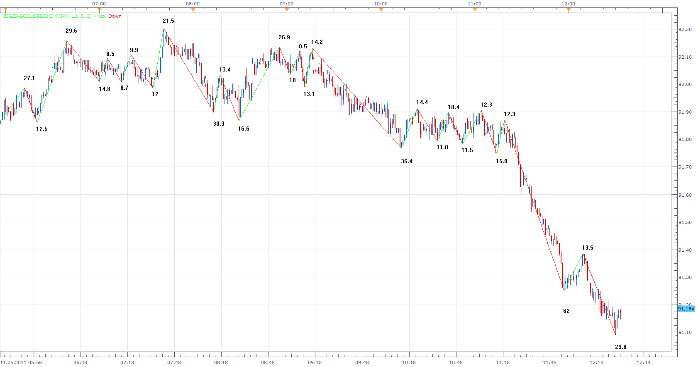

# ZigZag Colored

> Source: https://fxcodebase.com/code/viewtopic.php?f=17&t=1534  
> Forum: 17 · Topic 1534 · 25 post(s)

---

## ZigZag Colored

**Apprentice** · Fri Jul 16, 2010 7:04 am

Unlike Standard Zig Zag indicator, Up Swings are green, Down Swings are red.

 [ZigZagColored.lua](files/2997/ZigZagColored.lua)

The indicator was revised and updated

---

## Re: ZigZag Colored

**yasirali1974** · Tue Jul 20, 2010 12:44 am

Hi,
i was curious how does this indicator determines an end to an on going trend? Is it volume based or candles? Kindly explain if possible. Thanks in advance.
regards.

---

## Re: ZigZag Colored

**Apprentice** · Tue Jul 20, 2010 1:53 am

Zig Zag use both percentages or points (pips) in its construction.

There must be a certain percentage or number of points between a swing high and a swing low before a line will be drawn, in this case we use Deviation in pips.

ZigZag is a trend following indicator, filter out random noise, confirm the Change in trend.

It is price based.

---

## Re: ZigZag Colored

**yasirali1974** · Tue Jul 20, 2010 2:24 am

May i know when this platform be able to support the volume indicators as i believe that it would give the traders great confidence after seeing the big bulls/bears jump in. regards.

---

## Re: ZigZag Colored

**poctimfx** · Tue Sep 28, 2010 4:04 pm

One interesting thing I could see for this ZigZag would be to have a measurement at the tip of each swing, showing total pips for that line. Could be useful ... doable?

---

## Re: ZigZag Colored

**Apprentice** · Tue Sep 28, 2010 4:26 pm

Added to development cue.

---

## Re: ZigZag Colored

**uglock** · Wed Sep 29, 2010 3:55 pm

I'm using the ZigZag colored and found a minor issue in the indicator. Sometimes it displays both green and red lines of the indicator. One of the lines is ok (compared with standard ZigZag) but second is wrong. Please see the attached screenshot and price data.

---

## Re: ZigZag Colored

**Apprentice** · Thu Sep 30, 2010 3:25 am

Update.
 Bug Fixed.

---

## Re: ZigZag Colored

**Hannes Joubert** · Fri Oct 08, 2010 5:32 am

Hi All. Would like some feedback on this indi.

Does it repaint? Is there a two candle lag or similar before it updates the line?

Thanks

H

---

## Re: ZigZag Colored

**Apprentice** · Wed May 11, 2011 11:34 am

Swing Size Label Option Added.

---

## Re: ZigZag Colored

**7510109079** · Thu Aug 28, 2014 11:29 am

Can you do a very quick enhancement on this great tool so users can set:

line color
line style
pip text size
pip text colour

many thx

P.S. there used to be a ZIGZAGCOLORED BUGFIXED indicator. Has this now been incorporated into ZIGZAGCOLORED?

---

## Re: ZigZag Colored

**7510109079** · Thu Sep 11, 2014 5:55 am

can I re-request this please or direct me to a version which has style properties built in.

I know your time is short. Is there any version in which we can change the text size of the pip labels?

thx

---

## Re: ZigZag Colored

**Apprentice** · Sun Sep 14, 2014 4:47 am

Style Option added to ZigZagColored.lua

---

## Re: ZigZag Colored

**7510109079** · Wed Sep 17, 2014 11:48 am

Awesome thx

---

## Re: ZigZag Colored

**7510109079** · Wed Sep 17, 2014 12:15 pm

My apologies for being tedious, but can we make the pip no. an integer?

---

## Re: ZigZag Colored

**7510109079** · Thu Sep 18, 2014 3:28 am

Noticing that the old pip values stay around on the chart as new ones get drawn.

i.e. as the indicator repaints old values are not cleared from screen

---

## Re: ZigZag Colored

**Apprentice** · Thu Sep 18, 2014 4:59 am

Repaint issue fixed.
Apparently, I have broke this bit in my recent Update.

---

## Re: ZigZag Colored

**7510109079** · Thu Sep 18, 2014 8:59 am

np. thx.

Is it easy to get it posting as an integer or is this more involved?

---

## Re: ZigZag Colored

**Apprentice** · Fri Sep 19, 2014 3:40 am

Try this "integer" version.

 [ZigZagColored.lua](files/96001/ZigZagColored.lua)

It's not complicated, in my opinion, most will appreciate decimal places.

---

## Re: ZigZag Colored

**7510109079** · Mon Sep 22, 2014 2:18 am

many thx

---

## Re: ZigZag Colored

**7510109079** · Mon Sep 22, 2014 2:22 am

I am getting an error with both the integer and the previous version.

Any ideas?

---

## Re: ZigZag Colored

**Apprentice** · Mon Sep 22, 2014 3:44 am

1) I need to optimize my algorithm
2) You have a large number of Zig Zag Indicators on your charts.
3) You need to upgrade your system.
4) All the above.

My vote is for 4)

Try updated version that I just uploaded
If this does not help going back to the drawing board.

---

## Re: ZigZag Colored

**7510109079** · Tue Sep 23, 2014 3:42 pm

which version did you update and upload?
was it the integer version or original version, thx

---

## Re: ZigZag Colored

**7510109079** · Tue Sep 23, 2014 3:56 pm

Ignore that last question. I downloaded the Integer version and it now doesnt lag the system. Work great.

Previously i has this indicator loaded in nine m1 charts and at the end of each minute it would max out the CPU and spend 20 secs of the next minute updating (screen frozen) the zig zags. And that was on an i7 Quad core 3Ghz 8GB RAM PC.

Now there is no delay at all at the minute mark.

Whatever you did to the algorithm sure worked!

---

## Re: ZigZag Colored

**Apprentice** · Sat Jun 24, 2017 5:31 am

The indicator was revised and updated.
