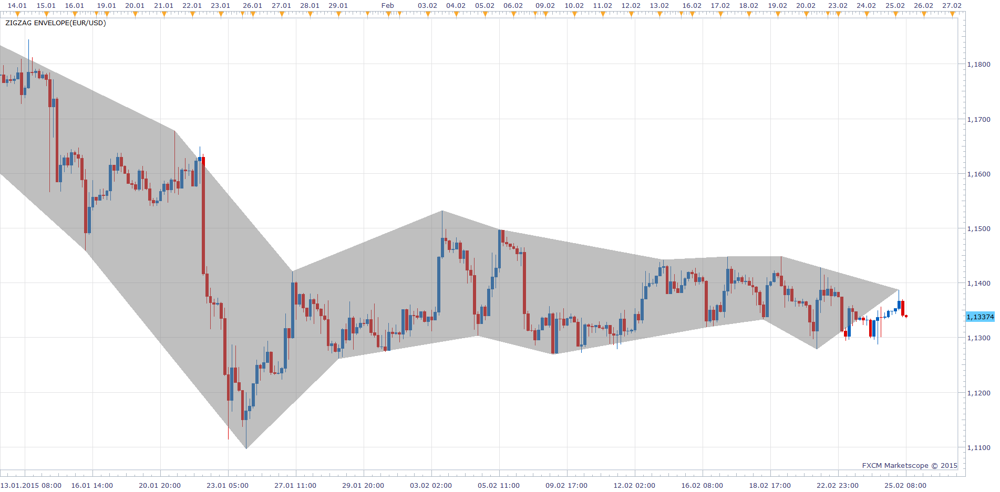

# ZigZag Envelope

> Source: https://fxcodebase.com/code/viewtopic.php?f=17&t=61870  
> Forum: 17 · Topic 61870 · 2 post(s)

---

## ZigZag Envelope

**Apprentice** · Wed Feb 25, 2015 8:05 am

Based on request.
[viewtopic.php?f=27&t=61864](https://fxcodebase.com/code/viewtopic.php?f=27&t=61864)

 [ZigZag Envelope.lua](files/98842/ZigZag%20Envelope.lua)

The indicator was revised and updated

---

## Re: ZigZag Envelope

**Apprentice** · Sun Jul 02, 2017 1:19 pm

The indicator was revised and updated.
