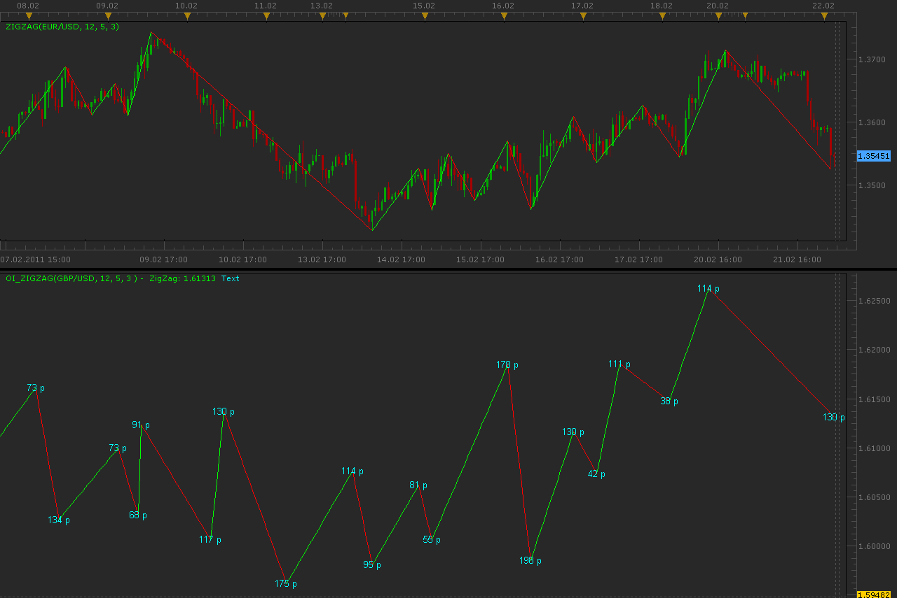

# ZigZag for other instrument with pip label

> Source: https://fxcodebase.com/code/viewtopic.php?f=17&t=3497  
> Forum: 17 · Topic 3497 · 4 post(s)

---

## ZigZag for other instrument with pip label

**Alexander.Gettinger** · Tue Feb 22, 2011 3:39 am

Indicator draw standard ZigZag for specified instrument. Timeframe as a source chart.
Text label show difference between node of ZigZag in pips.

 

Download:

 [OI_ZigZag.lua](files/8321/OI_ZigZag.lua)

The indicator was revised and updated

---

## Re: ZigZag for other instrument with pip label

**poctimfx** · Sat Mar 05, 2011 7:36 am

What about adding an "AutoDetect" for the current currency instead of having to change it in the settings. As well as an overlay on the actual chart?

Or is that another indicator I missed somewhere?

---

## Re: ZigZag for other instrument with pip label

**poctimfx** · Sat Mar 05, 2011 7:55 am

Actually, I figure out how to do it myself

Sorry to post the request for nothing - though, I'm new to the forum, should I add my file to this thread?

---

## Re: ZigZag for other instrument with pip label

**Apprentice** · Fri Feb 17, 2017 10:47 am

Indicator was revised and updated.
