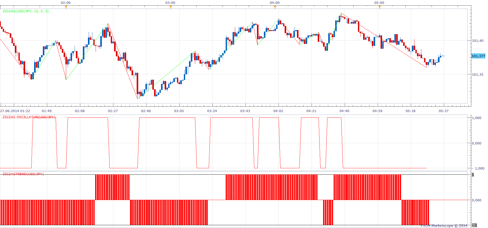

# ZigZag Oscillator

> Source: https://fxcodebase.com/code/viewtopic.php?f=17&t=60848  
> Forum: 17 · Topic 60848 · 2 post(s)

---

## ZigZag Oscillator

**Apprentice** · Fri Jun 27, 2014 4:37 am

 [ZigZag Oscillator.lua](files/94679/ZigZag%20Oscillator.lua)

 [ZigZagTrend.lua](files/94679/ZigZagTrend.lua)

Up Trend
Zig Zag is higher than the previous ZigZag Top
Down Trend
Zig Zag is smaller than the previous ZigZag Bottom
Neutral
In Up Trend, Top is smaller than the previous Top
In Down Trend, Bottom is smaller than the previous Bottom

The indicator was revised and updated

---

## Re: ZigZag Oscillator

**Apprentice** · Sun Jun 25, 2017 1:19 pm

The indicator was revised and updated.
