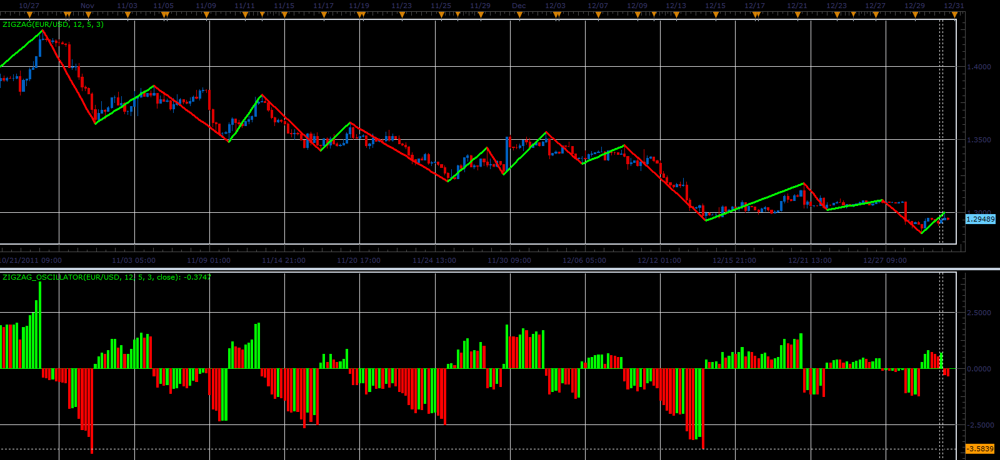

# ZigZag oscillator

> Source: https://fxcodebase.com/code/viewtopic.php?f=17&t=10714  
> Forum: 17 · Topic 10714 · 14 post(s)

---

## ZigZag oscillator

**Alexander.Gettinger** · Fri Dec 30, 2011 2:27 pm

The indicator is written at the request: [viewtopic.php?f=27&t=10573](https://fxcodebase.com/code/viewtopic.php?f=27&t=10573)

Formula:
ZigZag_osc=100*(Price-Base)/Base, where
Base - the starting price of the current branches zigzag indicator.

 

Download:

 [ZigZag_Oscillator.lua](files/22058/ZigZag_Oscillator.lua)

For this oscillator must be installed ZZ_Semafor.lua from [viewtopic.php?f=31&t=3703&p=8964](https://fxcodebase.com/code/viewtopic.php?f=31&t=3703&p=8964).
MT4/MQ4 version
[viewtopic.php?f=38&t=64624](https://fxcodebase.com/code/viewtopic.php?f=38&t=64624)

The indicator was revised and updated

---

## Re: ZigZag oscillator

**thejesters1** · Mon Jan 02, 2012 9:48 am

Hi Apprentice, does the oscillator repaints on already closed candle? As due to my knowledge, a zig-zag must repaint, otherwise its not really a zigzag (well, since the formula is derived from the zig-zag indicator).

What about a strategy on this one?

---

## Re: ZigZag oscillator

**Blackcat2** · Tue Jan 03, 2012 1:18 am

Confirmed that the indicator does not refresh/recalculated on candle close..

---

## Re: ZigZag oscillator

**lisa_baby_xx** · Wed Jan 04, 2012 1:10 pm

Hi Sweeties,

May I request a strategy for this wonderful indicator. The original request for the strategy was here:
[http://www.fxcodebase.com/code/viewtopic.php?f=27&t=10573#p21873](http://www.fxcodebase.com/code/viewtopic.php?f=27&t=10573#p21873)

I hope you ALL had a wonderful Christmas and Happy pipping for 2012!
Much love to everyone! X-X-X.
lisa_baby_xx

---

## Re: ZigZag oscillator

**Apprentice** · Wed Jan 04, 2012 2:15 pm

Your request is noted.
Alex probably forgot this one.

---

## Re: ZigZag oscillator

**lisa_baby_xx** · Wed Jan 04, 2012 2:38 pm

Thank you so muck sweetie, hope you enjoyed your holiday!
lisa_baby_xx

---

## Re: ZigZag oscillator

**Alexander.Gettinger** · Wed Jan 04, 2012 7:25 pm

I added the strategy in the post [http://www.fxcodebase.com/code/viewtopi ... 455#p22455](http://www.fxcodebase.com/code/viewtopic.php?f=27&t=10573&p=22455#p22455).

---

## ZigZag oscillator

**Anariamic** · Wed Jan 04, 2012 11:12 pm

There is no doubt that one of the best ways Fibonacci technical analysis nor objected to it with you
But the zigzag is not strong indicators you can rely on and the Stochastic indicator moving with Fibonacci

---

## Re: ZigZag oscillator

**flem_wad** · Fri Jan 06, 2012 2:37 pm

There is a problem with the strategy guys..
Link here:
[http://www.fxcodebase.com/code/viewtopic.php?f=27&t=10573#p22494](http://www.fxcodebase.com/code/viewtopic.php?f=27&t=10573#p22494)

Thanks,
flem_wad

---

## Re: ZigZag oscillator

**Alexander.Gettinger** · Fri Mar 02, 2012 3:30 pm

I have updated ZigZag oscillator.

---

## Re: ZigZag oscillator

**RJH501** · Thu Jul 19, 2012 7:18 pm

When you have time would you please add the capability to set the strategy to trade by time of day.

Thank you!

RJH

---

## Re: ZigZag oscillator

**RJH501** · Mon Jul 23, 2012 6:13 am

Figured it out - Indicator repaints causing it to open and close multiple times each time histogram repaints up and down as time increases.

Oh well - probably need some type of confirming signal to make this usefull.

Regards

RJH

---

## Re: ZigZag oscillator

**RJH501** · Mon Jul 23, 2012 8:22 am

Would you please add the Volty Channel Stop and Super Trend Indicators as filters to the ZigZag Oscillator strategy:

Volty Channel and SuperTrend should be selectable:

Trading Scenario 1 - Super Trend Indicator Only;

When SuperTrend Indicator registers SHORT (Red) and ZigZag Oscillator Histogram is below "0" open SHORT.

When SuperTrend Indicator registers LONG (GREEN) and ZigZag Oscillator Histogram is above "0" open LONG.

Trading Scenario 2 - Volty Channel Stop Indicator Only;

When Volty Channel Stop Indicator registers SHORT (Red) and ZigZag Oscillator Histogram is below "0" open SHORT.

When Volty Channel Stop Indicator registers LONG (GREEN) and ZigZag Oscillator Histogram is above "0" open LONG.

Trading Scenario 3 - Volty Channel Stop and Super Trend Indicator;

When Volty Channel Stop and SuperTrend Indicators register SHORT (Red) and ZigZag Oscillator Histogram is below "0" open SHORT.

When Volty Channel Stop and SuperTrend Indicators register LONG (GREEN) and ZigZag Oscillator Histogram is above "0" open LONG.

Also add the indicator parameters, time to trade parameters, price parameters, trading parameters and alerts.

Objective is to control the repainting issue that is inherient with the ZigZag Oscillator Indicator when used in a strategy.

SuperTrend ZigZag Oscillator Strategy

Your work is most appreciated!

Thank you and regards!

RJH

---

## Re: ZigZag oscillator

**Apprentice** · Wed Apr 12, 2017 5:59 am

Indicator was revised and updated.
