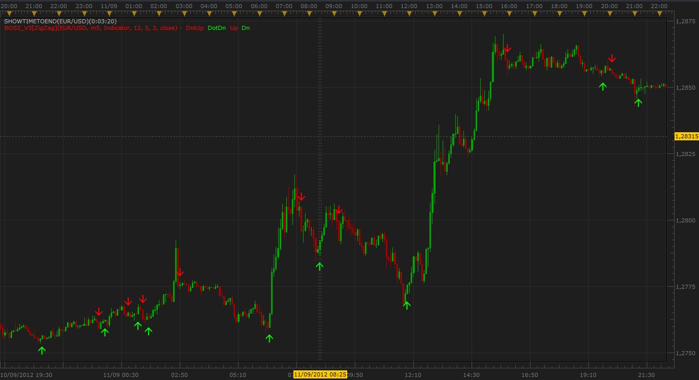

# ZigZag : Personal version "Buy or Sell"

> Source: https://fxcodebase.com/code/viewtopic.php?f=17&t=23339  
> Forum: 17 · Topic 23339 · 13 post(s)

---

## ZigZag : Personal version "Buy or Sell"

**Scrat_Power** · Wed Sep 12, 2012 3:38 pm

Hi,

Here an indicator (BoS Algo 2 Version 3) based on the ZZ_Semafor indicator.
It's just a more readable version of the original.
I also put the ZZ_Semafor signals in a "static" stream for more stability on signals given.

Care of that you need the ZZ_Semafor indicator to be functional.

 

Regards,
Scrat.

The indicator was revised and updated

---

## Re: ZigZag : Personal version "Buy or Sell"

**kankatrader** · Thu Sep 13, 2012 5:59 am

Hi,
Can we have a Strategy for this (BoS Algo 2 Version 3) indicator?

Best regards,

kankatrader

---

## Re: ZigZag : Personal version "Buy or Sell"

**saturn** · Thu Sep 13, 2012 5:09 pm

The same request here.
Could you please built a strategy for this indicator? Cheers!

---

## Re: ZigZag : Personal version "Buy or Sell"

**Apprentice** · Fri Sep 14, 2012 3:38 am

Your request is added to the development list.

---

## Re: ZigZag : Personal version "Buy or Sell"

**muneebkhan** · Sun Sep 16, 2012 5:45 pm

This thing changes it's position - which is why looks good when back testing - not as good as it appears.

---

## Re: ZigZag : Personal version "Buy or Sell"

**saturn** · Mon Sep 17, 2012 3:05 pm

I think this indicator is fine but need to be refreshed or something to clear false signals.
If you use 5m chart and you see red and green arrows at the same candle than change to diffrent time frame and than go back to 5m and everything should look fine.

I'm not English so I'm sorry my writing skills

---

## Re: ZigZag : Personal version "Buy or Sell"

**nsaale** · Tue Sep 18, 2012 11:49 am

does this indicator repaint? or move the arrow after it is created?

---

## Re: ZigZag : Personal version "Buy or Sell"

**saturn** · Tue Sep 18, 2012 2:13 pm

Move the arrow after is created.

---

## Re: ZigZag : Personal version "Buy or Sell"

**Jasmin** · Mon Sep 24, 2012 4:10 pm

Ehhhh i alredy think that i was found my magic indicator but then i see that arrows mowing that kind of indicators are not usefull i can draw arrows by myself like that can you guys do that arrows stay where they appered that will be good

---

## Re: ZigZag : Personal version "Buy or Sell"

**coldplay70** · Fri Mar 29, 2013 10:02 am

Hello there, is it possible to create a strategy with this Indicator? I think this strategy could be very successfull!

Best Regards,
Coldplay70

---

## Re: ZigZag : Personal version "Buy or Sell"

**Apprentice** · Fri Mar 29, 2013 12:59 pm

I believe this is what you need.
[viewtopic.php?f=31&t=3703&p=8964](https://fxcodebase.com/code/viewtopic.php?f=31&t=3703&p=8964)

---

## Re: ZigZag : Personal version "Buy or Sell"

**kalprao** · Fri Apr 11, 2014 1:47 am

The indicator is Fine . you just have to wait until the candle close to confirm a sell or buy signal
the arrows never repaint after the candle close
Great indicator

---

## Re: ZigZag : Personal version "Buy or Sell"

**Apprentice** · Sat Jul 29, 2017 9:51 am

Bump up.
