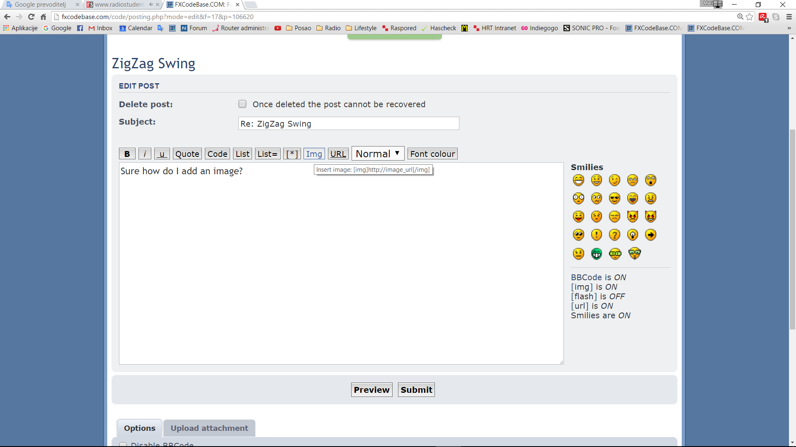
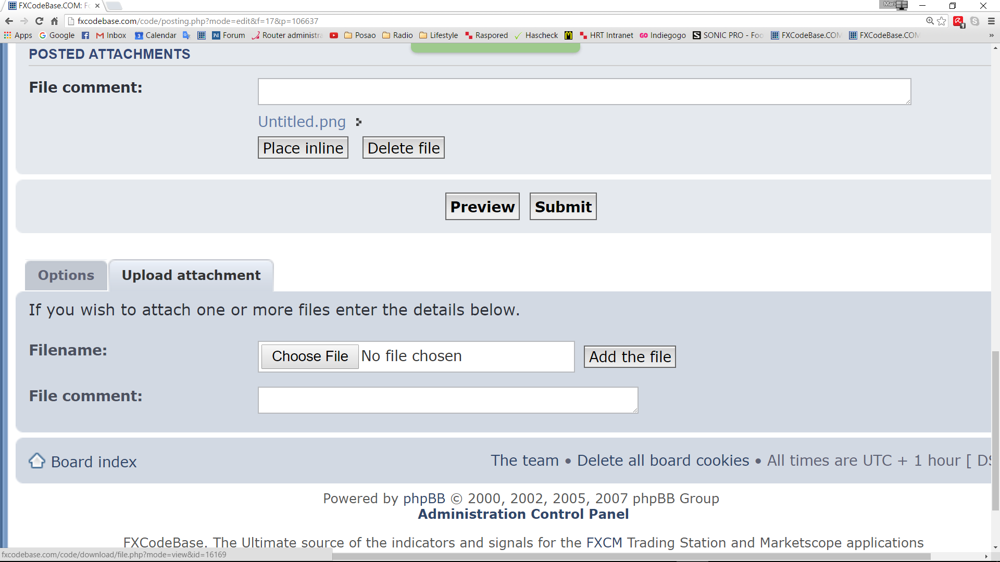

# ZigZag Swing

> Source: https://fxcodebase.com/code/viewtopic.php?f=17&t=63503  
> Forum: 17 · Topic 63503 · 22 post(s)

---

## ZigZag Swing

**Apprentice** · Fri May 20, 2016 6:33 am

Based on request.
[viewtopic.php?f=27&t=63476#p106267](https://fxcodebase.com/code/viewtopic.php?f=27&t=63476#p106267)

 [ZigZag Swing.lua](files/106389/ZigZag%20Swing.lua)

MT4/MQ4 version.
[viewtopic.php?f=38&t=64917](https://fxcodebase.com/code/viewtopic.php?f=38&t=64917)

The indicator was revised and updated

---

## Re: ZigZag Swing

**Apprentice** · Fri May 20, 2016 8:02 am

Update

---

## Re: ZigZag Swing

**daveb1058** · Sun May 22, 2016 5:43 am

Hi there

I have been using FXCodebase for several years and downloaded and trialed dozens of indicators I have been a forex trader for almost 10 years. Thanks for all your work. How are these fractals calculated again? Have you seen how accurate they are in determining price turns? I've checked them on everything from 1 min to weekly charts over 2 dozen markets and on various Renko brick sizes and they're accuracy appears to be near 90%. Can you tell me the formula for determining the swing points Thanks

---

## Re: ZigZag Swing

**Apprentice** · Mon May 23, 2016 5:52 am

1st Level
up fractal
high [+1] is smaller than the current high
high [-1] is smaller than the current high
vice versa for Down

2nd Level
1st Level Up fractal [+1] is smaller than the current high
1st Level Up fractal [-1] is smaller than the current high
vice versa for Down

3rd Level
2nd Level Up fractal [+1] is smaller than the current high
2nd Level Up fractal [-1] is smaller than the current high
vice versa for Down

As you can see indicator has quite lag.
Defines an indication based on future price action.

---

## Re: ZigZag Swing

**Apprentice** · Mon May 23, 2016 7:09 am

Minor Update.
Please re-download.

---

## Re: ZigZag Swing

**daveb1058** · Tue May 24, 2016 3:27 am

Thanks Apprentice, is there any way to hide the very small arrows? I am still trialing it, it works very well in trending markets where one might expect a retracement and turn at minor swings between the 50 and 76 fib Thanks again

---

## Re: ZigZag Swing

**Apprentice** · Wed May 25, 2016 8:40 am

Level Selector Added.

---

## Re: ZigZag Swing

**haveforexfun** · Wed May 25, 2016 10:31 am

Hi Apprentice,

thank you very much for this indicator. Could you please add the possibility to visualize also the first and second order swing with seperate zigzag lines and seperate style options for every line. So one could see the encapsulated trend levels.

Thank you very much
Haveforexfun

---

## Re: ZigZag Swing

**vikraj** · Wed May 25, 2016 11:02 am

Thanks Apprentice,

Could you please add option to display level 2 Swing i.e Zigzag swing formed by connecting level to Pivots. If we opted for Yes then level 2 swing will be displayed along with Main Level 3 Swing. And if we opted for No only Main Swing remains.

Thanks

---

## Re: ZigZag Swing

**Apprentice** · Thu May 26, 2016 3:19 am

Try it now.

---

## Re: ZigZag Swing

**daveb1058** · Sun May 29, 2016 5:15 am

Thats great Apprentice thanks There's a lag yes but that doesn't matter just simply take every sell after a down icon and every buy after an up icon Im using mean renko with brick size set to follow every minor swing, replicating a 5 min chart maso indicator and maso oscillator could you EA this strategy? [imghttps://4.bp.blogspot.com/-KBWOAL06Tq0/V0q3ZWLQmEI/AAAAAAAAAZM/N59QrqSjkgkwH7xpBwL1-2iWBXvrg4WzgCLcB/s320/REN%2528USD_CAD.m1%2529%2B%252805-28-2016%2B2214%2529.png][/img]

---

## Re: ZigZag Swing

**Apprentice** · Mon May 30, 2016 2:09 pm

Can you provide a bit more info?

---

## Re: ZigZag Swing

**daveb1058** · Sat Jun 04, 2016 10:41 am

Sure how do I add an image?

---

## Re: ZigZag Swing

**Apprentice** · Mon Jun 06, 2016 3:03 am

You've got two ways.

 

By providing a link to an external server.

 

Or by uploading it to fxcodebase.

---

## Re: ZigZag Swing

**daveb1058** · Sat Jun 11, 2016 3:10 am

see attached pic

---

## Re: ZigZag Swing

**JOKER83** · Mon Jul 18, 2016 6:08 pm

Can you make a strategy

buy/SELL LEVEL1 OR LEVEL2 OR LEVEL3

EXIT LEVEL1 OR LEVEL2 OR LEVEL3
THANKS

---

## Re: ZigZag Swing

**Apprentice** · Tue Jul 19, 2016 5:56 am

Your request is added to the development list,
Under Bugzilla Id Number 3572

Bugzilla is developer internal requests database.
If someone is interested to do any task from this list please contact me.

---

## Re: ZigZag Swing

**chipsoft** · Fri Jun 02, 2017 4:10 pm

Hi Apprentice,

Could you please convert Zigzag Swing indicator to MT4 .

Thanks

---

## Re: ZigZag Swing

**chipsoft** · Sun Jun 04, 2017 6:08 pm

Could you please provide MQL4 version of this indicator. Thanks in advance.

---

## Re: ZigZag Swing

**Apprentice** · Mon Jun 05, 2017 1:26 pm

Your request is added to the development list, Under Id Number 3808
 If someone is interested to do this task, please contact me.

---

## Re: ZigZag Swing

**Apprentice** · Thu Jul 13, 2017 3:30 am

Try this version.
[viewtopic.php?f=38&t=64917](https://fxcodebase.com/code/viewtopic.php?f=38&t=64917)

---

## Re: ZigZag Swing

**Alexander.Gettinger** · Tue Mar 12, 2019 8:33 pm

> **JOKER83 wrote:**
> Can you make a strategy
>
> buy/SELL LEVEL1 OR LEVEL2 OR LEVEL3
>
> EXIT LEVEL1 OR LEVEL2 OR LEVEL3
> THANKS

Please try this strategy:

 [ZigZag_Swing_Strategy.lua](files/124387/ZigZag_Swing_Strategy.lua)
