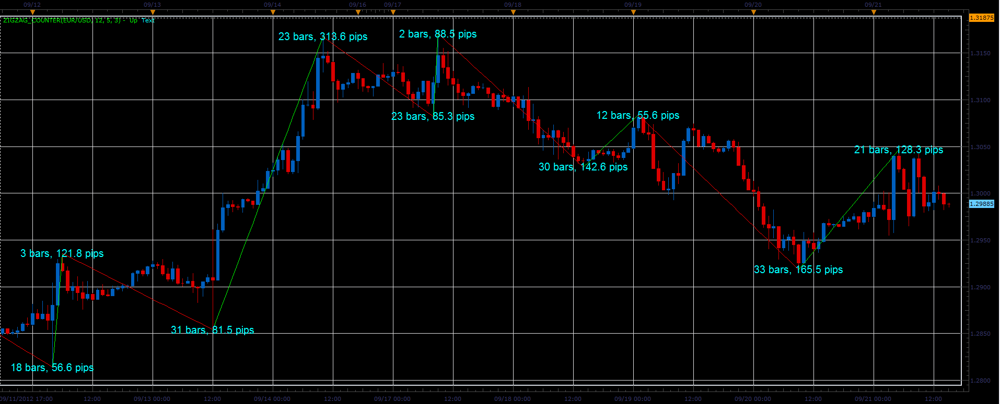
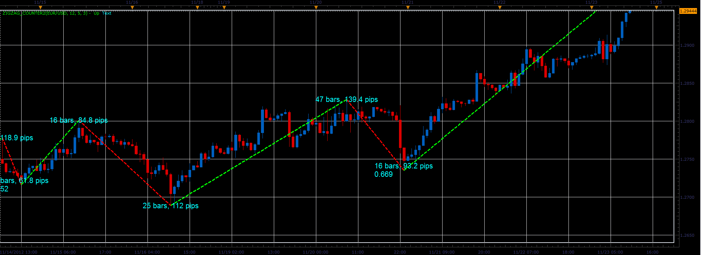
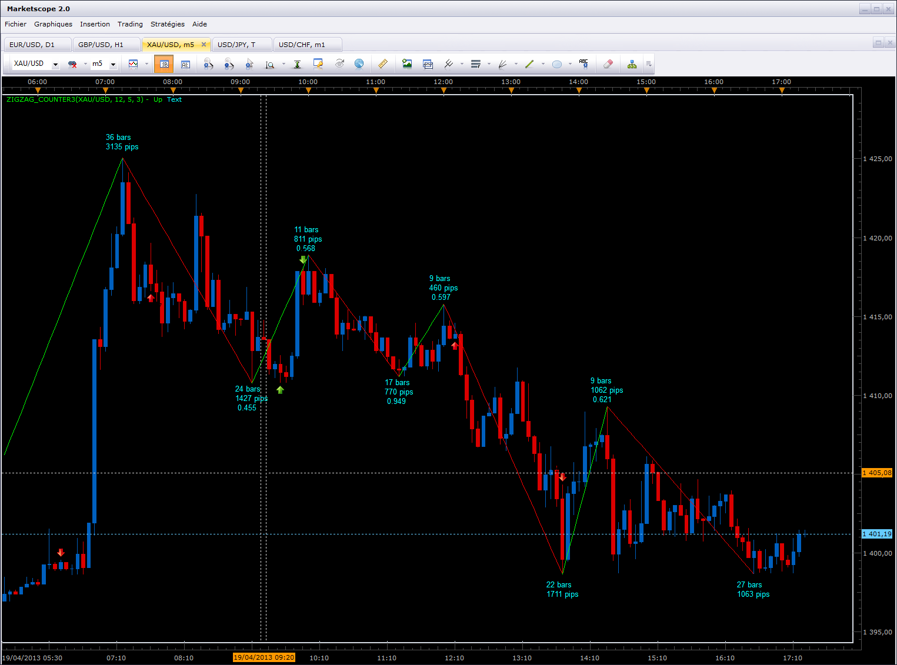
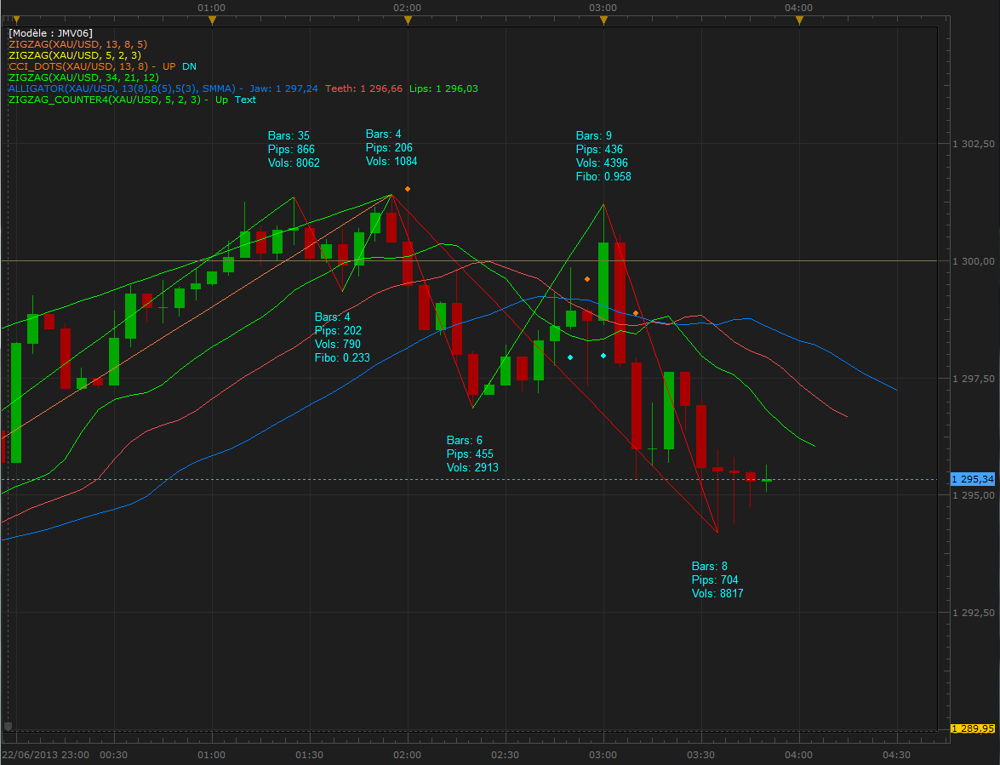
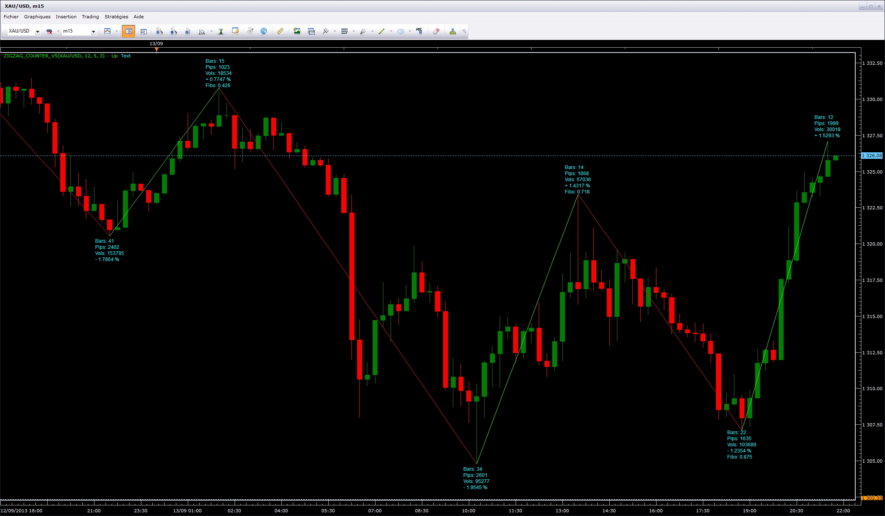
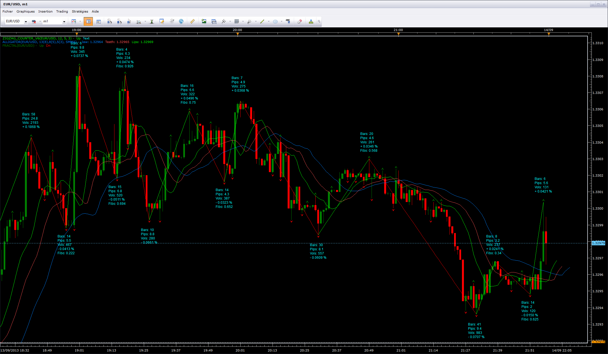
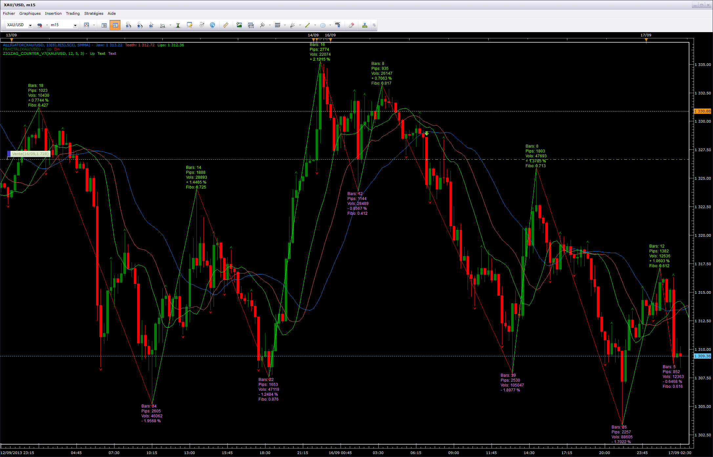
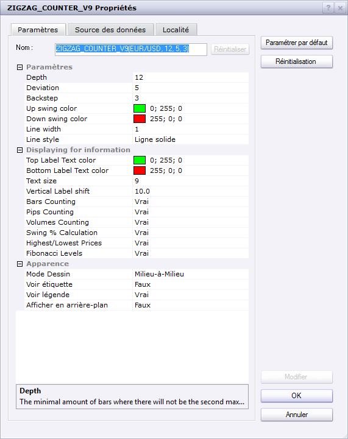
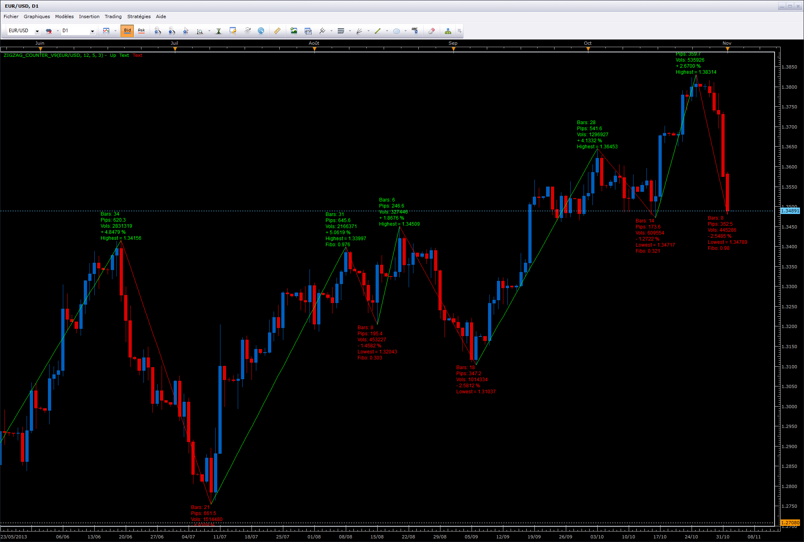
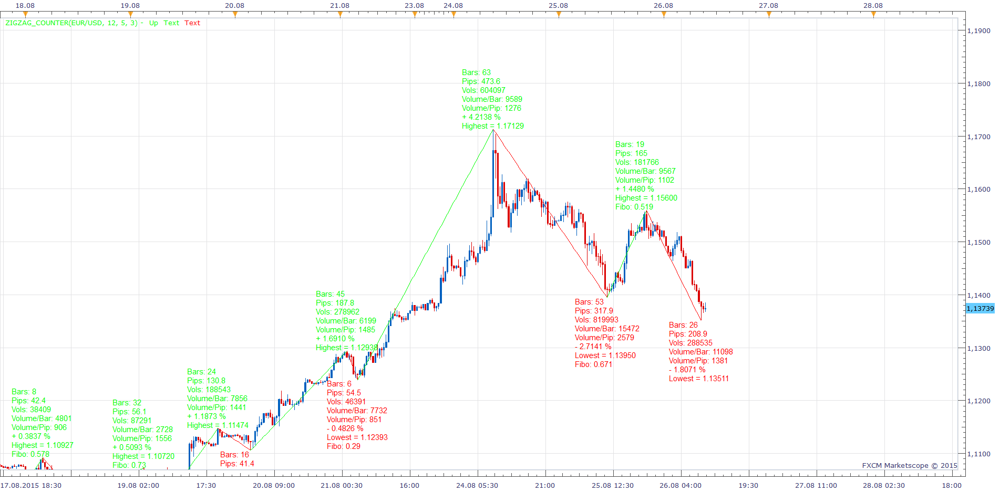

# ZigZag with bar and pips counter.

> Source: https://fxcodebase.com/code/viewtopic.php?f=17&t=23668  
> Forum: 17 · Topic 23668 · 88 post(s)

---

## ZigZag with bar and pips counter.

**Alexander.Gettinger** · Fri Sep 21, 2012 2:23 pm

Standard ZigZag with bar and pips counter.

 

Download:

 [ZigZag_Counter.lua](files/40713/ZigZag_Counter.lua)

---

## Re: ZigZag with bar and pips counter.

**TraderBob** · Thu Nov 01, 2012 7:42 am

This is a great indicator, Thanks for this.
I was using the zigzag before but with the counter its so much better.

---

## Re: ZigZag with bar and pips counter.

**nazaar** · Thu Nov 15, 2012 1:15 am

> **Alexander.Gettinger wrote:**
> Standard ZigZag with bar and pips counter.

Thanks for this excellent tool Alexander. This saves a lot of time and clicks.
Could you please place the bar count and pip values on separate lines?

**Would you be willing to add to this tool?** Please see attachment for a picture presentation, it might make it easier to understand.

Could you add a fib retracement calculator to the zigzag? If a zigzag swing point retraces less than 1.000 then display the retracement value.

In the chart attached, I have shown 3 examples (blue arrows, we really need arrow tool) of displaying the fib retracement value and 2 (blue circles) where there would be no value displayed.

Thank you for your time and consideration.

Now that I have typed this it occurred to me that those swings which go beyond 1.000 retracement you could display the retracement value beyond 1.000 for example 1.272 or 1.618.

Thanks again!

---

## Re: ZigZag with bar and pips counter.

**Apprentice** · Thu Nov 15, 2012 3:23 am

Your request is added to the development list.

---

## Re: ZigZag with bar and pips counter.

**MrDavide79** · Wed Nov 21, 2012 7:12 am

Hello,
how is possible to use correctly this indicator?
what parameters is better to put in setting:
12-5-3 or different

thanks

---

## Re: ZigZag with bar and pips counter.

**Apprentice** · Thu Nov 22, 2012 4:06 am

Personally I do not use indicators in my trading.
So I can not help you about the settings.
Rule of thumb, use setting that gives the best results for the pair, time frame, your strategy.
Two use of Zig Zag.
As helper tool, to chart Ellliot Waves or Harmonic Patterns.

---

## Re: ZigZag with bar and pips counter.

**broken850** · Fri Nov 23, 2012 1:31 am

great indicator. very useful as filter (i use it in combination with supertrend)..............
is it possible to build a strategy / alert when the color of the indicator changes ?

---

## Re: ZigZag with bar and pips counter.

**Apprentice** · Fri Nov 23, 2012 3:51 am

Possible, but impractical.
Zig Zag have great Lag.
Try to define strategy rules, and test it on live chart.

---

## Re: ZigZag with bar and pips counter.

**Alexander.Gettinger** · Thu Nov 29, 2012 11:04 am

> **nazaar wrote:**
> Could you add a fib retracement calculator to the zigzag? If a zigzag swing point retraces less than 1.000 then display the retracement value.

See this version of indicator.

 

Download:

 [ZigZag_Counter2.lua](files/47345/ZigZag_Counter2.lua)

---

## Re: ZigZag with bar and pips counter.

**Fx4mt.com** · Tue Jan 15, 2013 1:23 pm

> **Alexander.Gettinger wrote:**
>
>
> > **nazaar wrote:**
> > Could you add a fib retracement calculator to the zigzag? If a zigzag swing point retraces less than 1.000 then display the retracement value.
>
>
>
> See this version of indicator.
>
>
>
> ZZ_Counter2.PNG
>
>
>
> Download:
>
>
> ZigZag_Counter2.lua

Fantastic indicator, would there be a way to get this where it displays the fib extensions past 1.00 as well?

---

## Re: ZigZag with bar and pips counter.

**Apprentice** · Wed Jan 16, 2013 4:45 am

Your request is added to the development list.

---

## Re: ZigZag with bar and pips counter.

**Steven Smith** · Fri Jan 18, 2013 2:00 am

This is a great indicator, Thanks for this.
I was using the zigzag before but with the counter its so much better.

---

## Re: ZigZag with bar and pips counter.

**alaaroshdy** · Wed Jan 23, 2013 11:08 am

very very very nice indicator, would be great if you add reverse fibo extension too

---

## Re: ZigZag with bar and pips counter.

**helry333** · Mon Apr 15, 2013 11:04 am

> **Alexander.Gettinger wrote:**
> Standard ZigZag with bar and pips counter.
>
>
>
> ZigZag_Counter.PNG
>
>
>
> Download:
>
>
> ZigZag_Counter.lua

hi! Is there ZIGZAG but considering the close only??

---

## Re: ZigZag with bar and pips counter.

**Apprentice** · Wed Apr 17, 2013 2:58 am

Unfortunately there is no such implementation.
With "close only" You mean, Zig Zag indicator that uses Tick (open, close ...), not Bar, as a source.

---

## Re: ZigZag with bar and pips counter.

**Apprentice** · Wed Apr 17, 2013 6:34 am

Requested can be found here.
[viewtopic.php?f=17&t=34791](https://fxcodebase.com/code/viewtopic.php?f=17&t=34791)

---

## Re: ZigZag with bar and pips counter.

**helry333** · Thu Apr 18, 2013 10:31 am

> **Apprentice wrote:**
> Unfortunately there is no such implementation.
> With "close only" You mean, Zig Zag indicator that uses Tick (open, close ...), not Bar, as a source.

The main point of the ZIGZAG is considering the closing price and the percentage change in it. For example, suppose you create a zigzag with a percentage change of 0.05% ... if the price goes up the lag of zigzag will be ascending and remain so while not closing down 0.05% in this case ... and so on.

---

## Re: ZigZag with bar and pips counter.

**LeTigre30** · Fri Apr 19, 2013 1:00 pm

Hi to All,

Nazaar had requested if there a possibility to detach the informations in the printed label of Bars, Pips, and Fibo levels. I've downloaded the ZidZagCounter2.lua, and take a look on it. I've modified a little bit the code and add comments with the modifications. See below after modifications :

 

*Detached Labels*

and the source code of the new indicator :

 [ZigZag_Counter3.lua](files/59376/ZigZag_Counter3.lua)

---

## Re: ZigZag with bar and pips counter.

**Nifty12** · Wed Jun 19, 2013 4:54 pm

Hi Everyone. I have used the ZigZag counter, it is very good. Would it be possible to add volume to the indicator. (ie Volume between the points would be a good addition.) Also an up or down offset for the Data printing because it sometimes gets in the way for reading the tops or bottoms.
Keep up the good work

---

## Re: ZigZag with bar and pips counter.

**LeTigre30** · Sat Jun 22, 2013 6:21 am

Hello Nifty12, and All Traders and Programmers,

When I will have a little time, I will try to add ticks' volumes between bars' number and Fib's number.

Rgds

---

## Re: ZigZag with bar and pips counter.

**LeTigre30** · Sun Jun 23, 2013 9:16 pm

Hello to all Traders who uses this indicator,

I've modified the source code to have the possibility to print in the labels, the volume of ticks between two bars (extreme bars included) as requested by Nifty12, and change the make-up of the label.

I hope that will be good for all of you.

Are some traders can post their feedbacks with using this indi ? Thanks a lot ...

 

 [ZigZag_Counter4.lua](files/68193/ZigZag_Counter4.lua)

---

## Re: ZigZag with bar and pips counter.

**Nifty12** · Wed Jun 26, 2013 6:16 pm

Hi LeTigre30
Thanks for your prompt response.
Great work. I use it all the time now.
Thanks Very Much

---

## Re: ZigZag with bar and pips counter.

**Jamwal Suriya** · Thu Jun 27, 2013 12:53 am

This is a great indicator, Thanks for this.
I was using the zigzag before but with the counter its so much better.

---

## Re: ZigZag with bar and pips counter.

**OverDriven** · Tue Sep 03, 2013 12:54 am

This seems like a great indicator, but on my computer (newest version of Marketscope), none of the text labels show up, so it's just a zigzag. I tried version 3 and 4 with the same result. It gives me the option of text color and size in the properties, but the text is still not showing after trying some different settings.

---

## Re: ZigZag with bar and pips counter.

**Apprentice** · Tue Sep 03, 2013 2:27 am

Affirmative,
LeTigre30 versions do not work as expected.
Will try to find time to fix this.

---

## Re: ZigZag with bar and pips counter.

**LeTigre30** · Tue Sep 03, 2013 5:14 pm

Hello to All,
It looks bizzarous ??? in some hours (or before if possible) I'll send feedback

---

## Re: ZigZag with bar and pips counter.

**LeTigre30** · Tue Sep 03, 2013 5:49 pm

Hello Apprentice, OverDriven, and All who use this great Indi...

PROMISE IS DUE !
As I said a few minutes ago, it looks bizzarous. This indi runs on 3 computers with the same results.
Please, take a look at the following screen hardcopies :

1- Marketscope (hardcopy made on Sept, 3rd, 2013 with servertime at 23:40)
(the display is a 1200x1920 in portrait mode)
2- Parameters
3- TS2 version used

I join again the .lua code of the indi, where I added "_VERIFIED" (these characters must be deleted before using the indi ; this indi is logged in my computers in : C:\Program Files (x86)\Candleworks\FXTS2\indicators\Custom\).

 

 

 

 [ZigZag_Counter4_VERIFIED.lua](files/89142/ZigZag_Counter4_VERIFIED.lua)

Hope this will help;

Bst Rgds,
LeTigre30

---

## Re: ZigZag with bar and pips counter.

**LeTigre30** · Tue Sep 03, 2013 5:53 pm

Addendum ...

To avoid confusion, I deleted the indi Normal ZigZag (12,5,3), the zigzag_Counter4 is also correct.

---

## Re: ZigZag with bar and pips counter.

**LeTigre30** · Tue Sep 03, 2013 5:56 pm

perhaps a way for searching the display bug ...

Graphic card ? mine's have 1GB of DDR5

---

## Re: ZigZag with bar and pips counter.

**TheLight** · Wed Sep 11, 2013 2:56 pm

I use your original ZigZag_counter.lua every day. It currently calculates both the number of bars as well as the number of pips and displays them. My request would be that it would also show the number of pips as a % percent of the latest swing price? GBPJPY example: last swing price 157.989 (3 bars 390.8 pips 2.5%) Thank you.

---

## Re: ZigZag with bar and pips counter.

**LeTigre30** · Thu Sep 12, 2013 12:41 am

Hello TheLight,

My english knowledge is so poor, I don't well understand totally your request. Could you send me more details ; I think I have a bad understanding of this. In your example of 2.5%, does it mean that pips represent a certain percentage versus the last counter ?

I try to detail (on my favorite instrument XAUUSD)

The current counter - a Top- shows 600 pips ; the previous one -a Bottom- is at 1550,00 USD, so the difference is about 6,00 USD from the Bottom to the Top, that equal at a % of :
600 / 155000 or 6 USD / 1550 USD = 0.387096774 % (how many decimals must be shown ?) ?

is it right ?

How you use this percentage ?

Bst Rgds,
LeTigre30

---

## Re: ZigZag with bar and pips counter.

**TheLight** · Thu Sep 12, 2013 1:28 pm

Hi LeTigre30,

I am sorry for the confusion. I will try to simplify.

With the original ZigZag_Counter.lua

Each swing, up or down shows
x bars x pips

With the default 12, 5, 3 setting
I show on my XAU/USD D1 (daily) chart the last upswing completed was:
16 bars 16080 pips

I would like to know or display the 16080 as a % of the price to see how big or small the swing was compared to the price of the market.

The question would be, what price reference to use. Possibly the simplest is the closing price of the last bar of the referenced swing.

So in the XAU example of 16 bars 16080 pips, the close price was 1,417.20 on 08/28/2013. This was the swing high bar that gave us the calculation.

16080 / 141720 = 0.1135 or 1.135%
Displayed on chart as: 16 bars 16080 pips 1.135%

I mainly trade the currency pairs, so when trading CFD's does this present a consistency problem when trying to calculate a % with the ZigZag_Counter across all trade-able markets?

The purpose is having the ability by looking at each chart with the ZigZag_Counter applied and knowing immediately the swing pattern i.e. # of bars, # of pips, % of change (without having to always be putting the data into a spreadsheet to calculate)

I hope this helps. Thank you.

---

## Re: ZigZag with bar and pips counter.

**TheLight** · Thu Sep 12, 2013 1:54 pm

Sorry LeTigre30

Calculation should be:
16080 / 141720 = 0.1135 or 11.35% or
160.80 / 1,417.20 = 0.1135 or 11.35%
Displayed as: 16 bars 16080 pips 11.35%

---

## Re: ZigZag with bar and pips counter.

**LeTigre30** · Thu Sep 12, 2013 4:05 pm

Hello TheLight,

It's more understanding now for me.
One can be add in the indi's parameters, or automatically, show the % in relation with the close price of the bar who support the label, and the % between the previous label and the current label.

I would like bring a precision : the indicated number of bars, include the two extreme bars, that is in my logic, not conform, as the peak is plotted at the closing price, so when the bar is totally finished, and a new bar is started. In your example, from 08/08/2013 to 08/28/2013, there are only 15 bars, which start at the open price of 08/08/2013 and finish at the close price of 08/28/2013. Please, give me your feed back on this ...

If I take your example : on XAUUSD Daily chart, 16 bars with 16074 pips (not 16080), I think I'm able to show the following percentages :

a)- **% given by NbPips / Current Higher (or Lower) price** (the zigzag is plotted on the top and bottom peaks), if your check the result of the top of 08/28/2013, i.e. 1434.05 (Higher) and the Lower price of 08/08/2013, as 1273.31, the result is 160.74 which gives 16074 pips. We can keep this calculation I think, as it is a good representation between the two peaks.

b)- **% given by NbPips / previous price's peak (Top or Bottom)**, this could be help and show a negative %, in case the market is bearish for the current swing, what do you think about this ?

Bst Rgds,
LeTigre30

---

## Re: ZigZag with bar and pips counter.

**LeTigre30** · Fri Sep 13, 2013 1:21 am

> **OverDriven wrote:**
> This seems like a great indicator, but on my computer (newest version of Marketscope), none of the text labels show up, so it's just a zigzag. I tried version 3 and 4 with the same result. It gives me the option of text color and size in the properties, but the text is still not showing after trying some different settings.

Hello OverDriven,

Your display bug could come of the decimals of the instrument you use. Effectively, when I use EURUSD, the labels are not displayed. I think the problem is due to decimal number after decimal point, as I've observed the same issue with AUDUSD. I do my best to fix this issue with the next improvement for TheLight.

Regards

---

## Re: ZigZag with bar and pips counter.

**LeTigre30** · Fri Sep 13, 2013 4:21 pm

Hi TheLight,

Please, find attached files with percentages which works like that :

XAUUSD m15.
On a top of a swing, the datas are (09/13/2013 13:30) : pips=1868, high=1323.45 $, + 1.4317 % ; the previous bottom is for low price at (09/13/2013 10:15) 1304.77 $, that gives :
1304.77 + 1.4317% = 1323.45 $ .

On a bottom of a swing, the datas are (09/13/2013 10:15) pips=2601, low=1304.77 $, - 1.9545 % ; the previous top is for high price at (09/13/2013 02:00) 1330.78 $, that gives :
1330.78 - 1.9545% = 1304.77 $.

please, send your feedback and how you use this new data (if you need, you can write me via PM).

For OverDriven,

I confirm that the issue you find seems coming from all instruments which have more of 2 decimals in their cotes. The indi has a well behavior for XAUUSD, UK100, USDOLLAR, GER30, FRA40, etc.

I do my best this coming week to fix this issue.

Bst Rgds,
leTigre30

 

 [ZigZag_Counter_v5.lua](files/89442/ZigZag_Counter_v5.lua)

---

## Re: ZigZag with bar and pips counter.

**TheLight** · Fri Sep 13, 2013 5:46 pm

Hi LeTigre30,

I needed to do some thinking and some research on this. I do agree with you, we want to make sure that ZigZag is counting correctly in regards to the number of bars (i.e. hours, days, weeks, months, etc.) So any tweaking you can provide to insure the accuracy of the ZigZag_Counter would be greatly appreciated. I had noticed since the beginning that it would always show an extra bar in the count.

What I was after was the ability to see the swing, not only in the quantity of bars (time), as well as pips (quantity), but as importantly simply as a % of the underlying asset (% of movement).

In researching this via a spreadsheet I am reminded that different markets have different decimal points. Which makes it difficult when trying to have a standardized drag and drop indicator such as ZigZag or ATR automatically calculate and display the pips as a % percentage of the current market value price.

Your thoughts or comments are welcome, but after reseraching it appears this may not be feasible. I have attached my research spreadsheet showing the 20 day average ATR in both pips as well as a %. Notice I had to add a multiplier in order to do the calculation accurately. Thank you.

Best regards,
TheLight

---

## Re: ZigZag with bar and pips counter.

**LeTigre30** · Sun Sep 15, 2013 1:07 am

Hello to All Traders who use this nice Indi, more particularily to **Apprentice** and **OverDriven**,

 

*Issue fixed for all instruments*

 [ZigZag_Counter_v6.lua](files/89464/ZigZag_Counter_v6.lua)

The signaled issue seems fixed ...
In fact, the original source code doesn't take in consideration the "pipSize" control variable when displaying the labels. For all instruments which have a pipsize() less than 1 (example EUR/USD = 0.0001), the labels were plotted out of the chart (not very easy to read (lol) ... the .png file shows now correct display ...

I've tested on GBP/USD, EUR/USD, XAG/USD, EUR/JPY, USD/JPY : seems correct.

In extension of the work of this indi, for me it's not logical to display the datas which include the dats of the previous swing (for bars, pips, volume).

Thank you for your feedback.

Bst Rgds,
LeTigre30

---

## Re: ZigZag with bar and pips counter.

**TheLight** · Sun Sep 15, 2013 7:42 pm

LeTigre30,

I have downloaded your updated ZigZag_Counter_V6.lua and have begun to replace my previous ZigZag on all of my research chart layouts. At first glance, I must say, I am impressed as the data provided is most helpful. You have done some nice work here. I will continue to work with this updated version as applied to many different markets and will let you know if I see anything out of the ordinary. Job well done!!!

Best regards,
TheLight

Observation: It may depend on screen size or type, but on my screens it would help if the "data text" could be displayed directly above the swing high and directly below the swing low.

---

## Re: ZigZag with bar and pips counter.

**LeTigre30** · Mon Sep 16, 2013 8:47 pm

Hello to All,

Many thanks to TheLight, your appreciation warms my heart.

For your request, after fighting with the code, I think this new version (7) will bring you what you need.

The previous one depended of the right scale.
Tested with currencies and CFD's.

Thanks for feedback ...

Bst Rgds,
LeTigre30

 

 [ZigZag_Counter_v7.lua](files/89505/ZigZag_Counter_v7.lua)

---

## Re: ZigZag with bar and pips counter.

**LeTigre30** · Mon Sep 16, 2013 9:10 pm

Hello to All Traders,

in addendum to my previous post, I've added the possibility to choose the colors of top and bottom labels.

Bst Rgds,
LeTigre30

---

## Re: ZigZag with bar and pips counter.

**Rachid** · Sat Sep 21, 2013 11:07 am

Hi Apprentice,

You did a great Job

Is it possible to have an automatic Gann Retracement Lines added to the last Zig or Zag (the finshed one and note the current one (means: not the under construction one).

Thank you

---

## Re: ZigZag with bar and pips counter.

**Apprentice** · Sun Sep 22, 2013 5:41 am

For whatever you're accusing me. I assure you, I am not guilty.
Which version will be the basis, of such potential indicators.

---

## Re: ZigZag with bar and pips counter.

**Rachid** · Mon Sep 23, 2013 11:30 am

You sound always good to me

Please find it here attached.

Many thanks

---

## Re: ZigZag with bar and pips counter.

**LeTigre30** · Sun Nov 03, 2013 1:30 pm

Hello to All Traders who use this nice Indi ...

I've updated the last version (v7) to v9 (no v8, too specific for researching).
The improvements :
1- creation of a "Displaying Informations" Group, which contains the colors of Top and Bottom Labels ; text size of the labels, Vertical shift of the labels (pay attention at the number of this parameter, for EURUSD -pipsize=0.0001- the best value is 10, but per example for XAUUSD, the best value is 100 -pipsize=0.01). This vertical shift accomodates the label's position relative to the top/bottom price.

In the same Group, you have the possibility to choose if you want or not, display 1 to 6 infos. At least, one info must be turned on. If none of the six information is 'true', an error message occurs after clicking OK button.

Hoping this will help ...

Best Regards,
LeTigre30

 [ZigZag_Counter_v9.lua](files/90543/ZigZag_Counter_v9.lua)

 

 

---

## Re: ZigZag with bar and pips counter.

**Rachid** · Mon Nov 04, 2013 12:09 pm

Merci LeTigre

---

## Re: ZigZag with bar and pips counter.

**Paul W** · Fri Apr 11, 2014 10:28 am

Great indicator, I've incorporated into my charts.

Only one request. If possible, could you add a sound alert feature

Thanks

---

## Re: ZigZag with bar and pips counter.

**LeTigre30** · Fri Apr 11, 2014 11:45 am

Hi Paul W,

A sound alert, why not, but could you explain to me, in such case the sound comes ?

Bst Rgds,

LeTigre30

---

## Re: ZigZag with bar and pips counter.

**Paul W** · Fri Apr 11, 2014 2:05 pm

Hello, LeTigre30

Default sound location - C:\Program Files (x86)\Candleworks\FXTS2\Sounds\popup message.wav

I hope this helps

---

## Re: ZigZag with bar and pips counter.

**LeTigre30** · Sat Apr 12, 2014 9:33 am

Hi Paul,

My question was not about the sound file, it concerned at which time you need to hear the choosen sound ?
Per example, at each time the zigzag is drawn ? (as you know, this indi repaints).

Rgds,
LeTigre30

---

## Re: ZigZag with bar and pips counter.

**Paul W** · Sat Apr 12, 2014 11:29 am

Hello LeTigre30

My mistake.

Each time the zigzag is drawn, including repaints - just enough to attract my attention to the chart.

Others may like individual sound files for up and down trends, but this could overcomplicate the indicator.

Thanks

---

## Re: ZigZag with bar and pips counter.

**LeTigre30** · Sat Apr 12, 2014 4:14 pm

Hi Paul,

As soon as I've a little time, I'll try to introduce 1 or 2 sound possibilities.

Rgds,
LeTigre30

---

## Re: ZigZag with bar and pips counter.

**Taskryr** · Sun May 11, 2014 10:37 am

Is it possible to add an Average Cycle dialogue to the Zig Zag? That is, If the upswing was X periods and the downswing was Y periods, we divide the total up and down swings by the last N cycles?

Example: We want the cycle length for the last 6 up and down swings. The up and down swing Periods totaled 20,30, 45,15, 21, and 26, Then we get an average cycle length of 21.16.

---

## Re: ZigZag with bar and pips counter.

**Apprentice** · Sun May 11, 2014 3:25 pm

Requested can be found here.
[viewtopic.php?f=33&t=60681](https://fxcodebase.com/code/viewtopic.php?f=33&t=60681)

---

## Re: ZigZag with bar and pips counter.

**jenniferFX888** · Mon Nov 24, 2014 7:51 pm

Hi LeTigre30,

Perhaps this indicator 3_Level_ZZ_Semafor.lua is the answer for a sound alert. ZigZag_Counter_v9.lua is very nice to print the price at top and bottom at the same time the indicator 3_Level_ZZ_Semafor.lua also print level2 and level3. If you can make a sound alert to this indicator that will be great.

Thanks very much,
jennifer

---

## Re: ZigZag with bar and pips counter.

**jenniferFX888** · Mon Nov 24, 2014 8:04 pm

Hi LeTigre30,

Perhaps this indicator 3_Level_ZZ_Semafor.lua is the answer for a sound alert. ZigZag_Counter_v9.lua is very nice to print the price at top and bottom at the same time the indicator 3_Level_ZZ_Semafor.lua also print level2 and level3. If you can make a sound alert to this indicator that will be great. Here is the screenshot: [http://screencast.com/t/l5VoDI0lo8a](http://screencast.com/t/l5VoDI0lo8a)

Can you or Apprentice convert MT4 DT-ZigZag-Lauer into Marketscope lua? This will add more value to Counter_v9 and 3_Level_ZZ_Semfor.lua

Thanks very much,
jennifer

---

## Re: ZigZag with bar and pips counter.

**Apprentice** · Tue Nov 25, 2014 3:58 am

Your request is added to the development list.

---

## Re: ZigZag with bar and pips counter V.9

**jenniferFX888** · Wed Dec 31, 2014 2:56 pm

Hi Mr. LeTigre30,

Do you have the ZigZag with bar and pips counter V.9 on MT4 MLQ4. If not would you please convert it. Very appreciated your work on this.

Regards,
jennifer

---

## Re: ZigZag with bar and pips counter.

**LeTigre30** · Thu Jan 01, 2015 10:53 am

HI Jennifer,

Happy New Year 2015 ... I'll try to vonvert it for MT4 ASAP, coz I'm a little bit buzzy in this year beginning

Bst Rgds,
LeTigre30

---

## Re: ZigZag with bar and pips counter.

**jenniferFX888** · Fri Jan 02, 2015 8:12 am

Hi LeTigre30,

Happy New Year 2015 to you and to your family as well... Thank you I understand this is holiday time.

---

## Re: ZigZag with bar and pips counter.

**copperwasher7** · Fri Mar 13, 2015 1:28 pm

(Not sure if this is a dupe posting - internet connection was lost during the submit stage )

Dear Programmers

Excellent work on this indicator. Is it possible to have an alert when the green Zig line switches direction and becomes a red Zag line, and vice-verse of course. The alert ideally occurs once the direction (line colour has changed)

Can the pop up look like this or similar:
______________________________________
ZIGZAG ALERT - Trend/Direction Change

EUR/USD

Trend now GREEN RISING

Time (live)
Date
______________________________________

Much appreciation for the sterling work you guys do - great work

CopperWasher7

---

## Re: ZigZag with bar and pips counter.

**Apprentice** · Mon Mar 16, 2015 3:02 am

Your request is added to the development list.

---

## Re: ZigZag with bar and pips counter.

**Yodian** · Thu May 28, 2015 9:48 am

Is is possible in the ZIGZAG counter v9 to add as optional indicators (a) the Volume/pips and another (b) volume/bars?
These would give an indication of the effort used for the price going up or down.

Thank you in advance.

---

## Re: ZigZag with bar and pips counter.

**Apprentice** · Sun Jun 07, 2015 3:26 am

Can you explain
 pips in a) the Volume/pips
pips in change in pips from Zig to Zag?

---

## Re: ZigZag with bar and pips counter.

**Yodian** · Mon Jun 08, 2015 9:38 am

I am reffering to the Volume and pips already calculated and displayed in the ZigZang v9 indicator (see attachment).

In this example the indicator shows at some point (May, 7th - in green):
Bars:	19
Pips:	947.3
Vol:	4346086

What I need is to also display (optionally) the results of the following:
(a) the Volume/Pip: 4588 (4346086/947.3)and another
(b) Volume/Bar: 228741 (4346086/19)

Hope it helps.

---

## Re: ZigZag with bar and pips counter.

**Apprentice** · Wed Jun 10, 2015 4:15 am

Volume/Pip , Volume/Bar added.
See first / topmost post in this topic.

---

## Re: ZigZag with bar and pips counter.

**Yodian** · Wed Jun 10, 2015 8:58 am

Thanks!

Great as always...

---

## Re: ZigZag with bar and pips counter.

**afpteam** · Tue Jul 14, 2015 7:04 am

Hi,

New member here. I'm using a lightly modified copy of the ZigZag_Counter for Mt4, see attached.

This is a very nice indicator, simple, clean and very useful for general market trend analysis.

I can donate a reasonable suggested value, if you might consider adding mapped buffers for the following...

1) Average bars and pips for the bullish trend **separate**of bearish trend.
2) Mapped buffer for these four values so iCustom() can read them.
3) Input param to limit the calculations to X bars back, (0 = full bar set).

Thank you much for all the nice productions.

---

## Re: ZigZag with bar and pips counter.

**Maggie Chen** · Tue Jul 21, 2015 7:26 pm

Hello, I have been using the ZigZag Counter but need the following:

I would like to have an option when setting up the indicator on MarketScope, to be able to specify that the ZigZag should only reverse direction after it has moved a sppecified number of pips.

On the current ZigZag Counter indicators using a 1 minute chart the ZigZag lines will reverse after a small move like say 12 pips. I need to have an option where I can specify that the line reversal will only show after say a move of 20 to 30 pips, or 30 to 40 pips - what ever range I choose. This will enable me to only trade after the market has moved a specified number of pips in one direction.

It would also be nice to have an Alert included with the indicator to give me a Signal when the market has moved in one direction for the specified number of pips - meaning if I specify a range of say 50 to 100 pips then the Alert will be given when the market has reached either the 50 or 100 pip move level.

---

## Re: ZigZag with bar and pips counter.

**patibulair** · Wed Aug 19, 2015 10:21 am

Hi,

I am new to this forum and I currently use MarketScope. Zigzag counter is part of one of my strategy forex. But with the counter Marketscope zigzag indicator V1 to V9 included counter4 counter4 verified.lua does not run on the currency pairs. I get only plotting swing lines, but not the size in candles's and pips number.

It works well on GER30 index or Fra40, but not on the EUR / USD.

If I could have the number of candles and the number of ticks that would be great.

Unfortunately, I'm not programmer could someone help me?

---

## Re: ZigZag with bar and pips counter.

**Apprentice** · Wed Aug 26, 2015 9:22 am

Test for ZigZag_Counter.lua on EUR/USD m30
Can you provide a screenshot, parameters used.

---

## Re: ZigZag with bar and pips counter.

**CHISEL** · Fri Oct 09, 2015 7:31 am

> **Yodian wrote:**
> I am reffering to the Volume and pips already calculated and displayed in the ZigZang v9 indicator (see attachment).
>
> In this example the indicator shows at some point (May, 7th - in green):
> Bars:	19
> Pips:	947.3
> Vol:	4346086
>
> What I need is to also display (optionally) the results of the following:
> (a) the Volume/Pip: 4588 (4346086/947.3)and another
> (b) Volume/Bar: 228741 (4346086/19)
>
> Hope it helps.

Hi Apprentice,

I also would like Volume divide by Bars optionally too to ascertain the strength of the relative interest in each zig and Zag. So I can see weather there is a a comparitively High Or Low Or equal tick volume per bar then displayed at the end of Zig and Zag. so I don't have to fiddle around with a calculator whilst trading.

You already did a test example but does not seem to be available when the zig zag counter is downlouded.

Thanks

---

## Re: ZigZag with bar and pips counter.

**cnikitopoulos94** · Sat Oct 10, 2015 12:46 pm

Hey Apprentice, can you create an option for the ZigZag so it can update itself on the intrabar instead of after it closes by changing period== 0 instead of -1 and updates as it keeps changing the highs and lows?

If you can Id greatly appreciate it

---

## Re: ZigZag with bar and pips counter.

**cnikitopoulos94** · Sat Oct 10, 2015 12:50 pm

p.s. if you cant then dont worry Ill try my best to work on it by myself.

---

## Re: ZigZag with bar and pips counter.

**AlphaBagel** · Thu Dec 10, 2015 11:48 pm

Great work on this indicator. I am finding it supremely useful and it is a huge timesaver. I am looking for some added functionality please let me know your thoughts on the following and if it is achievable.

1) Velocity indication: (Pips/Bars) I added the following to the code

if DisplayVelocity then TextLabel = TextLabel .. "\r\n" .. "Velocity:" .. ((math.floor(math.abs(pips)/pipSize*10+0.5)/10)/(math.abs(bars)+1)); end

but am having the value return a really long decimal place. An example is in the next image. I want to reduce that to 2 decimal places. I have looked up some tut's on how to accomplish this but am not succeeding so any assistance is grateful.

2)Counting of candles in between the swing high's and swing lows. the image attached shows an example of what I am looking for.

3) Highlighting of ichimoku numbers in 2 colors. The image shows a highlighted box around the number. changing the color of the text, a highlighted box or an Ichi Num field would be perfectly fine. I am just looking for an identifier
Color 1: 9,17,26,33,42,65,76,129,172
Color 2: 8,10,16,18,25,27,32,34,41,43,64,66,75,77,128,130,171,173,200-258

I know you all are very busy, if any of these are complex to implement please let me know. If there are some indicators I could try to deconstruct by looking at the code to incorporate this functionality please point me into that direction. Thanks!.

---

## Re: ZigZag with bar and pips counter.

**Apprentice** · Fri Dec 11, 2015 4:41 am

How we calculate Bar Highs/Lows

---

## Re: ZigZag with bar and pips counter.

**AlphaBagel** · Fri Dec 11, 2015 8:36 am

Well it is the distance between the peaks. In the image I drew a dotted line in between peaks to show what I was after. Zigzag presents, high low high low high low points..... so the distance of just the highs and the distance of just the lows is the calculation to create.

So, perhaps to get the distance between the highs
In an Bullish upswing
Current swing high bars + previous swing low Bars = Bars Highs (This would be a measurement peak to peak)

In an Bearish downswing
Current swing low bars + previous swing high Bars = Bars lows (This would be a measurement valley to valley)

and then a line to connects the highs .
and then a line to connects the lows.
just like in the image. if this line is problematic, it is not too important. distance between the peaks and valleys is ultimately what I am after. Thankyou!

---

## Re: ZigZag with bar and pips counter.

**Apprentice** · Wed Dec 16, 2015 5:34 am

Your request is added to the development list.

---

## Re: ZigZag with bar and pips counter.

**AlphaBagel** · Thu Apr 21, 2016 11:06 am

You can scrap my request above. I am still looking for a modification to this indicator, if anyone is interested.

The indicator would need another field added called "Ichi Num". When turned on it will only display (8-10, 16-18 , 25-27 , 32-34 , 41-43 , 64-66 , 75-77 , 128-130 , 171-173 , 199-258) when those numbers are reached at the swing high or low of the zig zag indicator, and if they arent reached it just remains blank. The description on the chart " Ichi Bars:" should also be blank, just need a number displayed.

I don't think the request above will be much work and I am willing to pay for the development if that can expedite the request.

Thanks

---

## Re: ZigZag with bar and pips counter.

**Apprentice** · Fri Apr 22, 2016 1:10 am

Your request is added to the development list.
Can you explain how "Ichi Num" is calculated.

---

## Re: ZigZag with bar and pips counter.

**AlphaBagel** · Fri Apr 22, 2016 7:18 am

Nothing changes with the calculation of the zigzag or the swings. The difference is ichimoku numbers are shown when the zig zag indicator counts them as a swing high or low and all other numbers are excluded.

---

## Re: ZigZag with bar and pips counter.

**Apprentice** · Mon Apr 25, 2016 4:05 am

Contact me via Skype for consultation.
My skype id is mario.jemic

---

## Re: ZigZag with bar, pips, and volume counter.

**pdkang** · Thu May 12, 2016 2:28 am

Hi Guys,

Did anyone convert the ZigZag Indicator with total pip move, total number of bars, and total volume into a .mq4 file? I can't find it anywhere.

Thanks

---

## Re: ZigZag with bar and pips counter.

**Apprentice** · Sun May 15, 2016 6:18 am

Your request is added to the development list.

---

## Re: ZigZag with bar and pips counter.

**spazzy252** · Tue Aug 16, 2016 7:54 pm

Hi Guys,

Would it be possible to add price action labels for example (HH,LL,HL,LH) for each swing?

Thank You,

---

## Re: ZigZag with bar and pips counter.

**Apprentice** · Wed Aug 17, 2016 2:15 pm

Your request is added to the development list, Under Id Number 3602
 If someone is interested to do this task, please contact me.

---

## Re: ZigZag with bar and pips counter.

**Apprentice** · Mon Sep 24, 2018 10:14 am

The indicator was revised and updated.

---

## Re: ZigZag with bar and pips counter.

**Alexander.Gettinger** · Wed Mar 06, 2019 8:34 pm

Please try this indicator:

 [ZigZag_Counter2.lua](files/124286/ZigZag_Counter2.lua)
