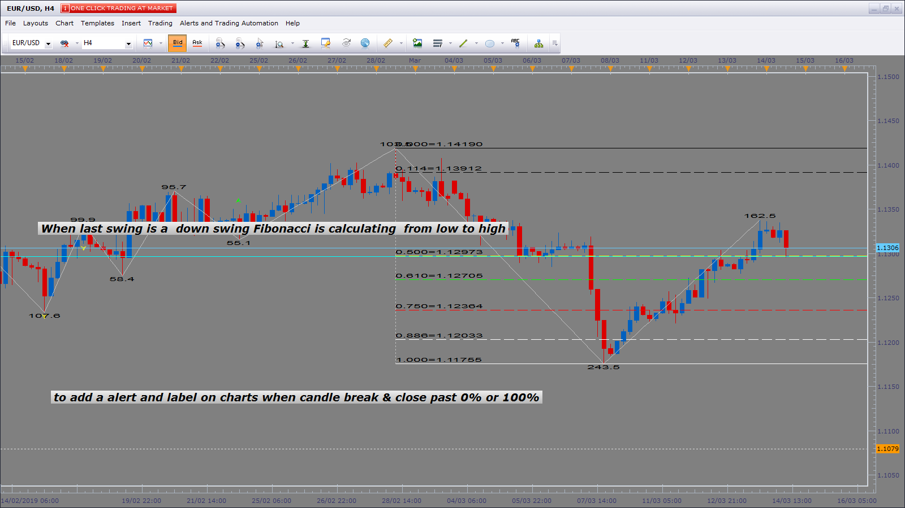

# ZigZag with Fibonacci

> Source: https://fxcodebase.com/code/viewtopic.php?f=17&t=59571  
> Forum: 17 · Topic 59571 · 61 post(s)

---

## ZigZag with Fibonacci

**Apprentice** · Wed Sep 25, 2013 6:15 am

The indicator draws the Fibonacci or Gann levels between last two ZigZag.
 You can select either fibonacci or gann levels and how much lines to show (variants: 3, 5, 7 or 9).

 [ZigZag with Fibonacci.lua](files/89678/ZigZag%20with%20Fibonacci.lua)

 [Custom ZigZag with Fibonacci.lua](files/89678/Custom%20ZigZag%20with%20Fibonacci.lua)

MT4/MQ4 version.
[viewtopic.php?f=38&t=68551](https://fxcodebase.com/code/viewtopic.php?f=38&t=68551)

---

## Re: ZigZag with Fibonacci

**Rachid** · Mon Sep 30, 2013 10:56 am

Hi Apprentice,

Here on Hourly TF, the indicator works perfectly,

I'm wondering if it is possible to add the following conditions:

1 - If price close above +125%

 then draw the following levels: 137% 150% 162.50% 175% 187.50 200% 212.50% 225% 250% 275% 300% 325% 350% 375% and 400%.

and don't recalculate the retracement 'till the -25% or the 400% level is tooken

2 - If price close under -25%

then draw the following levels: -37.50% -50% -62.50% -75% -87.50 -100% -112.50%
-125% -137% -150% -162.50% -175% -187.50 -200% -225% -250% -275% -300% -325% -350% -375% and -400%.

and don't recalculate the retracement 'till the 125% or the -400% level is tooken

---

## Re: ZigZag with Fibonacci

**Apprentice** · Wed Oct 02, 2013 3:31 am

Your request is added to the development list.

---

## Re: ZigZag with Fibonacci

**sedraude** · Fri Feb 28, 2014 6:05 am

The indicator draws the Fibonacci or Gann levels between last two ZigZag.
 You can select either fibonacci or gann levels and how much lines to show (variants: 3, 5, 7 or 9).

Dear Apprentice,

Can you make show label with option color and font size too?

Thanks in advance

---

## Re: ZigZag with Fibonacci

**Apprentice** · Sun Mar 02, 2014 4:24 am

Your request is added to the development list.

---

## Re: ZigZag with Fibonacci

**rtsayers** · Mon Mar 03, 2014 2:06 pm

I would like to see the fib lines extended into the future and the ability to turn off zig zag also adjustable label size.

Thanks very nice indicator

---

## Re: ZigZag with Fibonacci

**Apprentice** · Thu Mar 06, 2014 2:52 am

Your request is added to the development list.

---

## Re: ZigZag with Fibonacci

**Apprentice** · Thu Mar 06, 2014 8:26 am

ZigZag On/Off, Extend Line, Font Size Added.

---

## Re: ZigZag with Fibonacci

**rtsayers** · Thu Mar 06, 2014 12:40 pm

Awesome Thank you very much just one more request the lines are dashed and I can't seem to change them to solid on the fib levels.

Thanks

---

## Re: ZigZag with Fibonacci

**Apprentice** · Tue Mar 18, 2014 2:04 am

If "No Line" is selected we have Solid.
And vice versa.

Investigating.

---

## Re: ZigZag with Fibonacci

**Apprentice** · Tue Mar 18, 2014 3:01 am

Line style issue is Fixed.

---

## Re: ZigZag with Fibonacci

**tdesiato** · Thu May 15, 2014 7:21 pm

Attached is an updated version of the file. I modified it as follows;

-- Corrected Fib levels to match numerical values.
-- Corrected Fib levels to match the direction of the swing.
-- Changed text on the "0" level to display the length of the swing instead of price.
-- Changed default colors (Yellow is too hard to see and there are too many of them to set in the menu.)

Thanks to Apprentice, I was going to create this indicator for myself and I decided to look and see if it already exists. Nice job.

Enjoy!

---

## Re: ZigZag with Fibonacci

**tdesiato** · Sun May 18, 2014 12:21 am

Thanks for posting my update.

Would it be possible for you to add an Email Alert to this indicator that triggers on the condition;

1. When the indicator updates the levels for a new swing.

I tried to do it myself using your _Alert.lua app but I couldn't get it to work. It's a little beyond my ability with lua.

Thanks.
Todd

---

## Re: ZigZag with Fibonacci

**Apprentice** · Wed May 21, 2014 4:20 am

Your request is added to the development list.

---

## Re: ZigZag with Fibonacci

**zl068565** · Thu Sep 03, 2015 5:10 pm

Hey Apprentice,

Trace: 'Custom ZigZag with Fibonacci.lua:227: Index is out of range'. This is showing in this indicator too. Can you fix this error please.

Thanks!

---

## Re: ZigZag with Fibonacci

**Apprentice** · Sun Sep 06, 2015 4:24 am

Try it now.

---

## Re: ZigZag with Fibonacci

**Apprentice** · Thu May 26, 2016 3:40 am

Minor Update.

---

## Re: ZigZag with Fibonacci

**Apprentice** · Mon Aug 06, 2018 1:38 pm

The indicator was revised and updated.

---

## Re: ZigZag with Fibonacci

**minifire18** · Tue Dec 11, 2018 1:24 pm

Hi guys would you be able to add the swing size in pips and be able to colour the up swings blue and down swings red (have a colour option) to this zigzag with Fibonacci, as in topic below

[viewtopic.php?f=17&t=1534&hilit=zigzag#p2997](http://www.fxcodebase.com/code/viewtopic.php?f=17&t=1534&hilit=zigzag#p2997)

thanks in advance

---

## Re: ZigZag with Fibonacci

**Apprentice** · Wed Dec 12, 2018 2:34 pm

Your request is added to the development list under Id Number 4362

---

## Re: ZigZag with Fibonacci

**Apprentice** · Thu Dec 13, 2018 5:06 am

Try this version.
[viewtopic.php?f=17&t=67155](https://fxcodebase.com/code/viewtopic.php?f=17&t=67155)

---

## Re: ZigZag with Fibonacci

**minifire18** · Sun Jan 13, 2019 10:36 am

Hi Guys is it possible to add to this already great custom indicators you have already built. So all the indicator will stay how it is and add alerts when the pattern below is created and pip swing count
X to A
A pullback B
B Break & Close past A creating C
Then D will pullback not past B
D will be defined by the close passes the previous open.

**Custom ZigZag Fibonacci to add ABC , D or ABC Double Tops/Bottom**

Alerts display on chart to look a dot (able to change colours for the four-point count and size of label on display)

**Pip Count Per Swing**
And if we can add pip count on the swings and as like the way the Fibonacci deletes old Fibonacci when new ones created if we can do same with ABC ,D and with pip count on swing have option to how many swings pip data to display eg: last 10 swings (on parameter box) but zigzags would go back as now to show all historical data. I have seen the custom zigzag with pip count already but trying if possible to have one indicator and to have multi functions and currently using custom zigzag with Fibonacci.

Hope you can help with this addition to already great indicator
Minifire18

---

## Re: ZigZag with Fibonacci

**Apprentice** · Mon Jan 14, 2019 5:15 am

Your request is added to the development list under Id Number 4423

Do you have the name of that pattern or / and presentation of it on the actual chart?

---

## Re: ZigZag with Fibonacci

**minifire18** · Mon Jan 14, 2019 6:58 am

> **Apprentice wrote:**
> Your request is added to the development list under Id Number 4423
>
> Do you have the name of that pattern or / and presentation of it on the actual chart?

Hi Apprentice
I just realized I am using the the ZigZag coloured to show the swings and pips on the chart but also have the with the ZigZag Fibonacci to show the extensions and structure of the current swing as zigzag Fibonacci don’t show pips swing size and zigzags. Pattern also known as 123 pattern but trying to get alerts on advance 4th point Screenshot will show the pattern I am trying to be alerted on at the D point once the current candle closed past previous candle open
Hope this explains what i am looking for
thanks for your help in advance
minifire 18

---

## Re: ZigZag with Fibonacci

**minifire18** · Thu Jan 17, 2019 10:17 am

Thanks looks great as per screenshot candle closed above previous open no signal was created can you please look into this and if you can put option to be able to change levels and colours and line option to solid,dash and dotted as more of a fibonacci extension take profit as D is the signal also option to not show price and level and if you can add the swing size in pips

Thanks minifire18

---

## Re: ZigZag with Fibonacci

**Apprentice** · Fri Jan 18, 2019 5:24 am

Your request is added to the development list under Id Number 4430

---

## Re: ZigZag with Fibonacci

**minifire18** · Fri Jan 25, 2019 7:46 am

Hi Apprentice any update with this topic
minifire18

---

## Re: ZigZag with Fibonacci

**Apprentice** · Fri Jan 25, 2019 8:36 am

Try this version.

 [ZigZag with Fibonacci.lua](files/123533/ZigZag%20with%20Fibonacci.lua)

---

## Re: ZigZag with Fibonacci

**minifire18** · Fri Jan 25, 2019 11:53 am

Hi Apprentice
looks great but not getting and sound alerts getting labels on screen if you can make option to make label larger, have also noticed that on current swing drawn it sometimes sticks as per screenshot 1 as requested in last post can we have option to change the levels as more of fibonacci extension indicator, as per screenshot 2 from the Custom Zigzag Fibonacci and if you can add 5 more levels total of 14. Instead of having last swing in the legend if we could have on chart same as the zigzag colored and option to show last 6 swing.
Thanks minifire18

---

## Re: ZigZag with Fibonacci

**Apprentice** · Mon Jan 28, 2019 7:00 am

Your request is added to the development list under Id Number 4441

---

## Re: ZigZag with Fibonacci

**Apprentice** · Mon Jan 28, 2019 9:13 am

[ZigZag with Fibonacci.minifire18.lua](files/123562/ZigZag%20with%20Fibonacci.minifire18.lua)

Try this version.
Label size option already exists. And there is nothing we can do with
that missing swing - ZigZag indicator does not detect it there.

---

## Re: ZigZag with Fibonacci

**Kelly123** · Tue Jan 29, 2019 7:22 am

he work you do on this site for people is brilliant, been using the site for a while now just downloading indicators & strategies already posted, this is my 1st request I have an idea for a reversal strategy but need a indicator would you be able to add to this indicator another function or if you can make new one (ideally add to this multi-function indicator) with same Zigzag Fibonacci & pip swing and add or instead of the ABC D pattern have new reversal parameters would involve two timeframes High and Low add to existing alert on display would need to be trending ABC D or Reversal ABC D. Would need option to be able to turn off the trending pattern and for reversal pattern. Would need 2 t-frames to set the Reversal pattern ABC D parameters as per screenshot

Kelly123

X to A
A pull back B
B past A creating C
C reverse break and close past A (on high t-frame) creating D
D Will be defined by the closed candle past previous open Low t-frame

 

---

## Re: ZigZag with Fibonacci

**Apprentice** · Tue Jan 29, 2019 4:44 pm

Sure we can write this for you.
XABCD are based on lower time frame ZigZag?
Can you define strategy Entry/Exit points?

---

## Re: ZigZag with Fibonacci

**Kelly123** · Wed Jan 30, 2019 11:53 am

Hi thanks for taking this topic on. The indicator is based on two t-frames can it still be made as a visual on chart once alerted to strategy alert? Would be a great addition to current indicator.

The low t-frame would give the entry once the high t-frame has reverse and broke and closed past (A) on previous mid zigzag everything is calculated from close of candle and stops & profit take would have options pips ,atr and fibonacci and fibonacci extensions adjustable levels. If we have the strategy set up for one direction, everything in parameter box would be set up for buy and separate strategy for sell. There are 4 t-frames Zigzag, High, Mid, Low the Zigzag t-frame would have option to able and disable.

**Parameter box should look like for LONG SET UP**

Labelled ZigZag,High Mid and Low 4 T-frames

T-frame (t-frame period option)

Period of MA (set to EMA)

Look Back (amount of previous candle back) option to able/disable

Zigzag (would need to be able to change setting on zigzag)

Reversal ABC D be added to all t-frames (within zigzag settings) with the options to able and disable on each t-frame

High T-frame (option period)

Low T-frame (option period)

Volume Price Change (would need to be able to change setting and on this indicator to be able to disable on each t-frames) option for both conditions 1. Above signal line. 2. Above signal line & Zero line

Have option for condition to reach 15% on stochastic (option to change %)

Stochastics % K Periods, Stochastics % Slowing K Periods, Stochastics Periods, Stochastics % Slowing K Method Stochastics % Slowing D Method

This would be repeated for all 4 t-frames

**Buy set up Commands**

If High t-frame reverses break and close then the previous Mid swing low (A) closed as full body candle stochastics @ 15% or lower K line crossed above the D line and if closed above EMA

Mid t-frame created K line crosses Above D line on stochastic @ 15% and closed above EMA

If Low t-frame not created a lower low over past 100 candles (to have option Look Back period) and stochastics @ 15% or lower K line crossed above the D line and if closed above EMA

**Parameter box should look like for SHORT SET UP**

Labelled ZigZag,High Mid and Low 4 T-frames

T-frame (t-frame period option)

Period of MA (set to EMA)

Look Back (amount of previous candle back) option to able/disable

Zigzag (would need to be able to change setting)

Reversal ABC D be added to all t-frames (within zigzag settings) with the options to able and disable on each t-frame

High T-frame (option period)

Low T-frame (option period)

Volume Price Change (would need to be able to change setting and on this indicator to be able to disable on each t-frames) option for both conditions 1. Below signal line. 2. Below signal line & Zero line

Have option for condition to reach 85% on stochastic (option to change %)

Stochastics % K Periods, Stochastics % Slowing K Period, Stochastics Periods, Stochastics % Slowing K Method, Stochastics % Slowing D Method

This would be repeated for all 4 t-frames

**SELL set up Commands**

If High t-frame reverses break and close then the mid previous swing high (A) closed as full body candle stochastics @ 85% or higher K line crossed below the D line and if closed below EMA

Mid t-frame created K line crosses below D line on stochastic @ 85% closed below EMA

If Low t-frame not created a higher high over past 100 candles (to have option Look Back period) and stochastics @ 85% or higher K line crossed below the D line and if closed below EMA

**Phase 1 conditions met**

All conditions need to met on High, Mid and Low need to be met before any alerts created (optional ZigZag t-frame if enabled)

**Phase 2 entry**

Re-enter alert would only be created when High, Mid are complying (optional ZigZag t-frame if enabled) When Low t-frame K line crosses D line at 85/15 % depending on BUY or SELL strategy (% option)

**Need to prioritise the procedures**

From High t-frame Stochastic @ % K line crosses D line then Break & Close past previous Mid (A) ZigZag and close through ema

Mid and Low ZigZag option stochastic @ % K line crosses D line then closed through ema in that order

sorry for long post

 

 

---

## Re: ZigZag with Fibonacci

**Apprentice** · Thu Jan 31, 2019 6:32 am

Your request is added to the development list under Id Number 4447

---

## Re: ZigZag with Fibonacci

**Apprentice** · Fri Feb 01, 2019 7:05 am

[ZigZag with Fibonacci Strategy.Kelly123.lua](files/123645/ZigZag%20with%20Fibonacci%20Strategy.Kelly123.lua)

Try this version.
I didn't manage to find any chart where it opens a trade
using these rules. In the description and on the
screenshots you are using different rules. I coded the rules from the
screenshots.
Can you clarify?

---

## Re: ZigZag with Fibonacci

**Kelly123** · Sun Feb 03, 2019 11:39 am

Hi Apprentice, tried to back test the strategy and there’s no timeframe period option on the high middle lower, and to your question yes entry for the strategy should be on the 1st pullback reaching 15% and closed candle above EMA on the low t-frame after the high & mid have met there conditions and still complying (k line above d line and price above ema) is possible to add advance alert when the conditions are met on the high & mid? Or can you add this reversal ABC D to code to zigzag fibonacci minifire18 and have labels in the way coloured circles different then the trending labels and pop up alerts would need to say Trending ABC D and Reversal ABC D. In the screenshot, I didn’t have the volume price change if that can be added to all t-frames option to able and disable on each t-frame for different market conditions.
Volume Price Change (would need to be able to change setting and on this indicator to be able to disable on each t-frames) options 1. Above signal line. 2. Above signal line & Zero line

Volume Price Change (would need to be able to change setting and on this indicator to be able to disable on each t-frames) options 1. Below signal line. 2. Below signal line & zero line

And as there are so many different conditions for buy & sell eg; BID /ASK above/below ema, above/below signal & zero line, K line above/below D line on stochastics would strategy benefit from having a buy set up and sell set up?
Most appreciated for all the work already gone into this topic

Kelly

---

## Re: ZigZag with Fibonacci

**Apprentice** · Mon Feb 04, 2019 4:59 am

Your request is added to the development list under Id Number 4455

---

## Re: ZigZag with Fibonacci

**minifire18** · Thu Feb 07, 2019 8:03 am

Hey Guys thanks done great job noticed that some times that if the pattern has been created no more alerts or labels come through can you code so this is a ongoing pattern alert and label display as per screen shot
minifire18

---

## Re: ZigZag with Fibonacci

**Kelly123** · Fri Feb 08, 2019 5:00 am

[quote="Apprentice"]

ZigZag with Fibonacci Strategy.Kelly123.lua

Try this version.

Hi Apprentice, has there been any development with the Reversal ABC D strategy?
Kelly

---

## Re: ZigZag with Fibonacci

**Kelly123** · Tue Feb 12, 2019 4:20 am

> **Apprentice wrote:**
> Your request is added to the development list under Id Number 4455

H Apprentice has there been any development with this topic?
Kelly

---

## Re: ZigZag with Fibonacci

**minifire18** · Fri Mar 08, 2019 6:58 am

> **Apprentice wrote:**
>
>
> ZigZag with Fibonacci.minifire18.lua
>
>
> Try this version.

Hi Apprentice have just noticed a error with the writing of the Fibonacci for upswing write it low to high and down swing high to low indicator writes both low to high please can you fix
Minifire18

---

## Re: ZigZag with Fibonacci

**Apprentice** · Fri Mar 08, 2019 7:15 am

Your request is added to the development list under Id Number 4523

---

## Re: ZigZag with Fibonacci

**bartwas1** · Mon Mar 11, 2019 10:20 am

Hi Apprentice

Is this indi you're developing - ZigZag with Fibonacci.minifire18.lua - has got or will have somewhere an option to automatically display a letter label (XABC) for the beginning and end of current swing or do you require to input it manually?
Bart

---

## Re: ZigZag with Fibonacci

**Apprentice** · Tue Mar 12, 2019 11:40 am

You have to add it manually.

---

## Re: ZigZag with Fibonacci

**minifire18** · Thu Mar 14, 2019 5:20 am

> **Apprentice wrote:**
> Your request is added to the development list under Id Number 4523

Apprentice any update with this indicator and can put alerts on Break & Close candle at 0%/100%
minifire18

---

## Re: ZigZag with Fibonacci

**Apprentice** · Thu Mar 14, 2019 7:01 am

The development team does NOT understand what you mean.
Can you provide more information?

---

## Re: ZigZag with Fibonacci

**minifire18** · Thu Mar 14, 2019 9:44 am

> **Apprentice wrote:**
> The development team does NOT understand what you mean.
> Can you provide more information?

As per screen shots the fibonacci always takes the information from low to high and on a down swing that's incorrect note that on both screenshot one up swing and one down swing both 100% levels at bottom and can you also add alerts when candle break & close 0% or 100%
minifire18

 

 

---

## Re: ZigZag with Fibonacci

**minifire18** · Wed Mar 20, 2019 5:07 am

Apprentice has the the indicator been updated with alerts when price break and close through 0% and 100% and the writing of the ZZ to give correct retracement data?
minifire18

---

## Re: ZigZag with Fibonacci

**Apprentice** · Wed Mar 20, 2019 1:47 pm

Try this version.

 [ZigZag with Fibonacci.minifire18.lua](files/124822/ZigZag%20with%20Fibonacci.minifire18.lua)

---

## Re: ZigZag with Fibonacci

**minifire18** · Thu Mar 21, 2019 5:08 am

This looks great thanks so much
minifire

---

## Re: ZigZag with Fibonacci

**minifire18** · Thu Mar 21, 2019 6:11 am

Hey Apprentice seem to still have same problem with how the fibonacci is taking the data the down swings is writing correctly **up swings is writing wrong**as per screen shot the move was to the up side so data should be taken from low to high 61.8% on indicator is really 38.2 as with all marked out boxes wrong %
0/100% alert seems great thanks
minifire

 

---

## Re: ZigZag with Fibonacci

**Apprentice** · Thu Mar 21, 2019 3:58 pm

Your request is added to the development list under Id Number 4558

---

## Re: ZigZag with Fibonacci

**minifire18** · Fri Mar 22, 2019 1:07 pm

Hey Apprentice the alerts on the 0/100% are great but as using multiple timeframes on multiple screens with the indicator on all gets a bit confusing can you code for the relevant time frame to show on the alert and time as noticed with some alerts on higher time frames happened long time back
thanks in advance for all the great work you have done
minifire

---

## Re: ZigZag with Fibonacci

**Apprentice** · Tue Apr 23, 2019 6:46 am

Can't repat it. The latest version is attached.

 [ZigZag with Fibonacci.minifire18.lua](files/125908/ZigZag%20with%20Fibonacci.minifire18.lua)

---

## Re: ZigZag with Fibonacci

**minifire18** · Thu Jun 06, 2019 4:51 am

Apprentice
Can you code for MT4 and pls can you add more levels total of 22
thanks minifire

---

## Re: ZigZag with Fibonacci

**Apprentice** · Thu Jun 06, 2019 5:57 am

Your request is added to the development list under Id Number 4700

---

## Re: ZigZag with Fibonacci

**Apprentice** · Sat Jun 08, 2019 2:45 am

MT4/MQ4 version
[viewtopic.php?f=38&t=68551](https://fxcodebase.com/code/viewtopic.php?f=38&t=68551)

---

## Re: ZigZag with Fibonacci

**minifire18** · Mon Jun 10, 2019 2:29 am

> **Apprentice wrote:**
> MT4/MQ4 version
> [viewtopic.php?f=38&t=68551](https://fxcodebase.com/code/viewtopic.php?f=38&t=68551)

There is nothing on the link
minifire

---

## Re: ZigZag with Fibonacci

**Apprentice** · Mon Jun 10, 2019 3:47 am

Fixed.

---

## Re: ZigZag with Fibonacci

**minifire18** · Mon Jun 10, 2019 4:08 am

> **Apprentice wrote:**
> Fixed.

Thank you Apprentice
