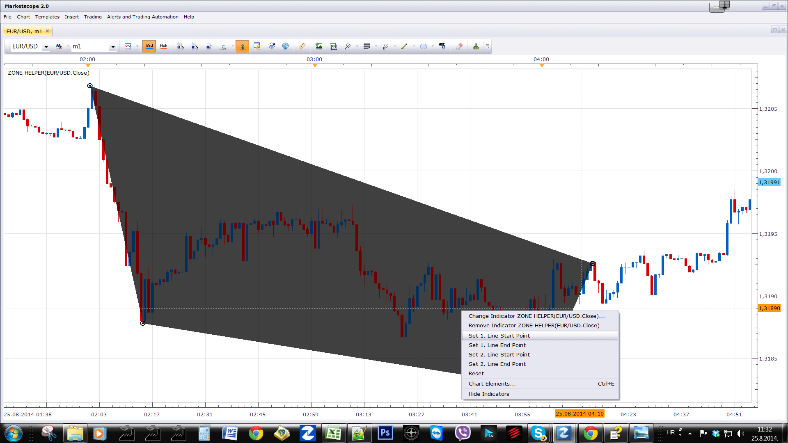

# Zone Helper

> Source: https://fxcodebase.com/code/viewtopic.php?f=17&t=61069  
> Forum: 17 · Topic 61069 · 8 post(s)

---

## Zone Helper

**Apprentice** · Mon Aug 25, 2014 4:29 am

With this tool you can define a simple zone
defined by four points.

 [Zone Helper.lua](files/95543/Zone%20Helper.lua)

 [Triangle Helper.lua](files/95543/Triangle%20Helper.lua)

 

 

 [Two Level Zone Helper.lua](files/95543/Two%20Level%20Zone%20Helper.lua)

---

## Re: Zone Helper

**daniel.kovacik** · Mon Aug 25, 2014 3:24 pm

Hi, what about zone defined by three points?

---

## Re: Zone Helper

**Apprentice** · Tue Aug 26, 2014 2:33 am

Try Triangle Helper.

---

## Re: Zone Helper

**daniel.kovacik** · Fri Feb 27, 2015 7:58 am

Hello,
I have an error on high timeframe... dont know why, could you help?

Thanks
DK

---

## Re: Zone Helper

**Apprentice** · Fri Feb 27, 2015 12:34 pm

Please try updated version.

---

## Re: Zone Helper

**Apprentice** · Sun Jul 02, 2017 1:12 pm

The indicator was revised and updated.

---

## Re: Zone Helper

**lixiaopan0502** · Mon Oct 29, 2018 8:10 pm

> **Apprentice wrote:**
> The indicator was revised and updated.

So, what is the www.

---

## Re: Zone Helper

**Apprentice** · Tue Oct 30, 2018 4:15 pm

Files in the top, first post of this topic was updated.
