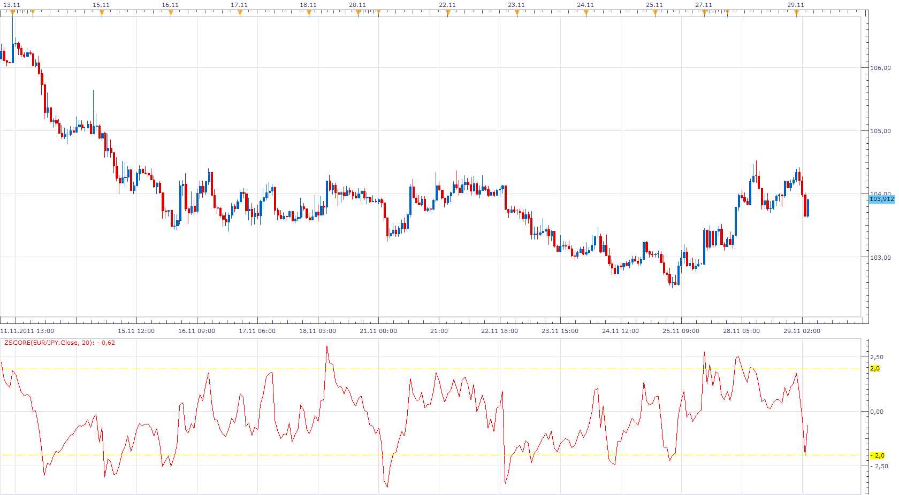
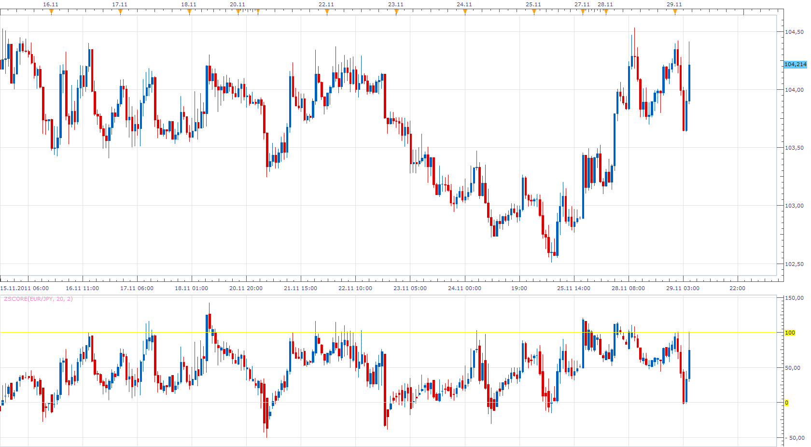
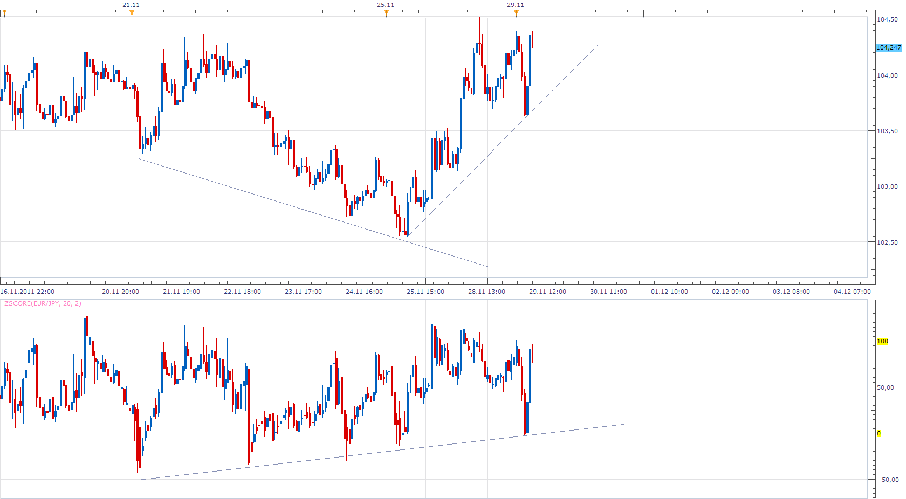

# ZScore

> Source: https://fxcodebase.com/code/viewtopic.php?f=17&t=8619  
> Forum: 17 · Topic 8619 · 25 post(s)

---

## ZScore

**Apprentice** · Tue Nov 29, 2011 4:20 am

ZScore = (Close - MVA of Close)/ Stdev of Close;

Z Scope basically translate the movement of Price within the Bollinger Bands,
to move within a fixed, deviation channel.
Every time B.B. touches the channel, Z Scope do the same thing.

 [ZScore.lua](files/18993/ZScore.lua)

 [ZScore with Alert.lua](files/18993/ZScore%20with%20Alert.lua)

The indicator was revised and updated

---

## Re: ZScore

**Apprentice** · Tue Nov 29, 2011 5:46 am

As Bonus i have write Z Score Price Normalization indicator.

 

It is interesting to observe the normalized price action.
While Price achieved, higher highs, lower lows,
but, normalized price, give the opposite indications,
suggesting a possible change in trend.
The difference between the indicators applied to the price and the normalized price is also interesting.

 [Z Score Price Normalization.lua](files/19003/Z%20Score%20Price%20Normalization.lua)

---

## Re: ZScore

**leah123** · Tue Nov 29, 2011 7:27 pm

Thank you for the fast work. The price normalization part of the indicator works well with the double smooth stochastic. Excellent work. Thank You.

---

## Re: ZScore

**AlbertoFX** · Tue Jan 03, 2012 10:46 am

Thanks so much for you support.
About ZCore, its fantastic, but, please. Can you make a zcore ( without normalize ) but show diference between 2 pairs.?
This mean if Zcore EURUSD = +2 and GBPUSD= -1 then the zcore total = +2 - (-1) = +3
I wish to see the diference above "zero" and below "zero".

Thanks...

---

## Re: ZScore

**Apprentice** · Wed Jan 04, 2012 7:07 am

Your request is added to the developmental cue.

---

## Re: ZScore

**AlbertoFX** · Wed Jan 04, 2012 12:55 pm

Thanks so much!

> **Apprentice wrote:**
> Your request is added to the developmental cue.

---

## Re: ZScore

**Apprentice** · Wed Jan 11, 2012 1:54 pm

Two Currency ZScore

 

TCZ = First Currency Zscore - Second Currency Zscore

 [Two Currency ZScore.lua](files/23086/Two%20Currency%20ZScore.lua)

---

## Re: ZScore

**Alexander.Gettinger** · Tue Jun 19, 2012 5:41 pm

MQL4 version of ZScore indicator: [viewtopic.php?f=38&t=20398](https://fxcodebase.com/code/viewtopic.php?f=38&t=20398)

---

## Re: ZScore

**Coondawg71** · Thu Nov 15, 2012 11:08 am

Can we please request an update to the Z Score NORMALIZED indicator. Please allow user to change the color of the price line. It would be beneficial in regards to correlation trading to differentiate the two pairs within the indicator. Otherwise, GREAT indicator!!! Nice job Apprentice.

Thanks,

sjc

---

## Re: ZScore

**Apprentice** · Fri Nov 16, 2012 5:02 am

Can you post this indicator.
I have trouble finding this version.
All existing versions have style option.

---

## Re: ZScore

**Coondawg71** · Fri Nov 16, 2012 9:08 am

I could have been more specific. We are currently allowed to change the LEVELs of overbought or oversold, but not the VALUE of the instrument, like we can in Two Instrument Stochastic. My apologies.

Thanks,

sjc

---

## Re: ZScore

**Apprentice** · Sat Nov 17, 2012 4:29 am

We have a problem here.
My Z Score Price Normalization only have bar as output,
your have line.
Are you using a modified version.

---

## Re: ZScore

**Coondawg71** · Sat Nov 17, 2012 10:08 am

Again, my apologies. I have not modified the code of the indicator. But, I have confused the matter by changing the indicator price line to LINE from BAR and eliminated the high and low lines for the sake of smoothing the value. Sorry for not divulging that sooner. Now I am realizing that my request may not be possible for price by line is only available as one option within system settings. If so, please disregard this particular request. Proper request would need to be for a new indicator just like the Two Instrument Stochastic for plotting two lines independent of each other. I believe this will be the ending result of my initial request. If so, please notify me so I may post the request for Two Instrument Z Score Normalized properly. I find the Z Score Normalized as extremely useful indicator!

Thanks,

sjc

---

## Re: ZScore

**Apprentice** · Sun Nov 18, 2012 8:42 am

> by changing the indicator price line to LINE from BAR and eliminated the high and low lines for the sake of smoothing the value.

This is a modification in my book.

---

## Re: ZScore

**Apprentice** · Sun Nov 18, 2012 8:50 am

Try Tick Version of Z Score Price Normalization.

 [Tick Z Score Price Normalization.lua](files/45011/Tick%20Z%20Score%20Price%20Normalization.lua)

---

## Re: ZScore

**speakinmymind** · Wed Mar 27, 2013 1:13 pm

can it be possible to place entry orders on the zScore indicator? Or as an alternative, put the the zscore channel (yellow lines) on the actual chart as a reference to what price the yellow line is at.

Also, can an audio / visual alert (arrow or something) let you know when there is convergence/divergence with respect to actual price movement

---

## Re: ZScore

**Coondawg71** · Tue Nov 12, 2013 4:55 pm

Can we please add Alert function to Zscore indicator.

Alert upon cross of Center Line "0"
Alert upon cross of Deviation Overbought/Oversold Levels.

Thanks,

sjc

---

## Re: ZScore

**Apprentice** · Wed Nov 13, 2013 2:44 am

ZScore with Alert Added.

---

## Re: ZScore

**easytrading** · Wed Nov 26, 2014 12:38 am

hello Apprentice,

very useful indicator.is it posible to develop another indicator which shows the same Bars of price action all plotted on the X-axis (represent time ) and Y-axis represent the length of the Bar in pips not price for the same timeframe used in price action chart above .so this will help us to see the relationship of price action in deffirent parts of the day precisely.thank you very much for the axcellent job. cheers

---

## Re: ZScore

**Apprentice** · Wed Nov 26, 2014 3:27 am

Can you specify which version will be used.
Can you please outline/sketch on chart, how it will be implemented.

---

## Re: ZScore

**easytrading** · Thu Nov 27, 2014 1:19 am

Hello Apprentice,

the platform using is Marketscope 2,and for the chart/sketch i couldn't find any thing close to what i am asking for it will be completely a new indicator as far as i knew.but in general outlook it is similar to bar volume indicator which represent the volume of each bar below it side by side on a horizontal line (floor) of the indicator.
the defferance here the new indicator will plot the same bars shown in price chart side by side in a horizontal line (floor) of the indicator which will have the same time scale of price chart X-axis ,and Y-axis will show in suitable scale also the hight of the bar in pips instead of price scale.and both price chart and the indicator will have the same timefram each time we change it.
hoping this will give you a picture of the whole idea.

kindest regards.

---

## Re: ZScore

**Apprentice** · Sun Nov 30, 2014 2:15 pm

Something like this?
[viewtopic.php?f=17&t=61561](https://fxcodebase.com/code/viewtopic.php?f=17&t=61561)

---

## Re: ZScore

**Coondawg71** · Thu Jul 02, 2015 5:50 am

Can we please request a couple amendments to Zscore with Alert indicator.

I would like to ask for the following:

Addition of a horizontal line for "Zero" centerline

Addition of a second deviation barrier to which Alert function would be operable, creating a deviation zone. For example -2.33 and -3.09 creates a zone through which the Zscore would travel through and Alerts will be triggered upon entry and exit of this zone.

Shading the area of the Zscore OB/OS deviation zone.

Please see attached image for visual representation of request.

Thanks!!!

sjc

---

## Re: ZScore

**Apprentice** · Mon Dec 14, 2015 6:20 am

Dec 14, 2015: Compatibility issue Fixed. _Alert helper is not longer needed.

If you want to use updated version of this indicator,
please make sure to use TS Version 01.14.101415. or higher.

---

## Re: ZScore

**Apprentice** · Wed Aug 02, 2017 7:32 am

The indicator was revised and updated.
