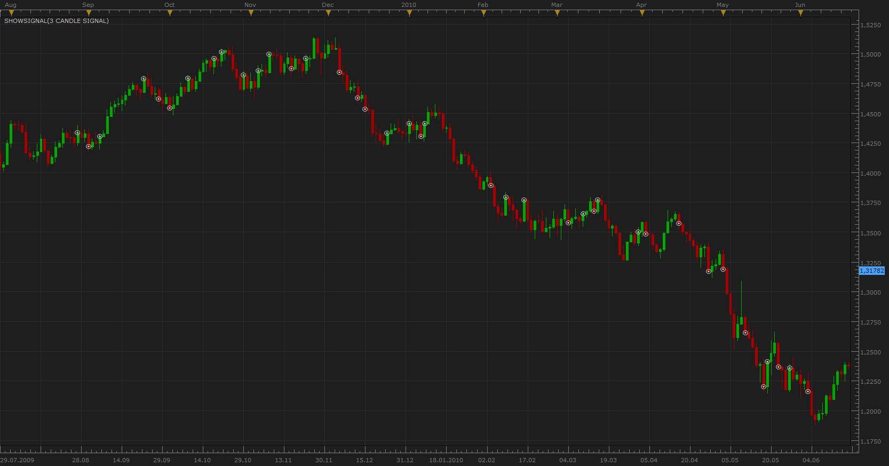

# 3 candle signal

> Source: https://fxcodebase.com/code/viewtopic.php?f=29&t=1645  
> Forum: 29 · Topic 1645 · 1 post(s)

---

## 3 candle signal

**Apprentice** · Mon Aug 02, 2010 3:50 pm

To go LONG
1. Body of the latest candle is greater than body of each of the 2 previous candles
2. Previous candle must be bearish
3. Close of latest candle is higher than close of the previous candle

To go SHORT
1. Body of the latest candle is greater than body of each of the 2 previous candles
2. Previous candle must be bullish
3. Close of latest candle is lower than close of the previous candle

 [3 candle signal.lua](files/3280/3%20candle%20signal.lua)

Developed according to User request.
