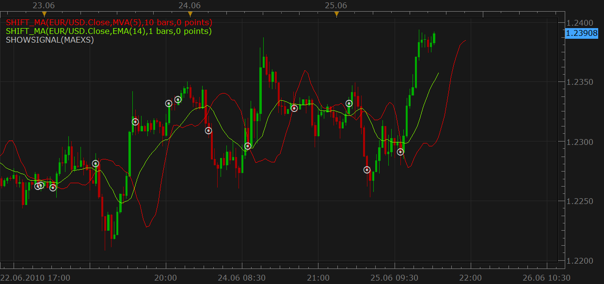

# Advanced moving average cross signal

> Source: https://fxcodebase.com/code/viewtopic.php?f=29&t=1254  
> Forum: 29 · Topic 1254 · 11 post(s)

---

## Advanced moving average cross signal

**Nikolay.Gekht** · Thu Jun 03, 2010 12:47 pm

The signal is similar to the standard moving average cross, but, unlike the standard signal it allows to:
a) choose different moving average methods for the fast and slow MAs
b) choose different prices for the fast and slow MAs (open, close, high, low, median, typical and weighted).
c) choose more methods. Please, note that methods marked with asterisk (such as SMMA) must be loaded and installed from the custom indicators section of this site.

You can also use this signal to check the cross of the Moving Average and the price. Just set the fast method to MVA and number of periods to 1.

download:

 [MAEX.lua](files/2383/MAEX.lua)

```lua
function Init()
    strategy:name("Advanced Moving Average Strategy");
    strategy:description("");

    strategy.parameters:addInteger("FMA_N", "Fast Moving Average Period", "", 5);
    strategy.parameters:addString("FMA_M", "Moving Average Method", "The methods marked by an asterisk (*) require the appropriate strategys to be loaded.", "MVA");
    strategy.parameters:addStringAlternative("FMA_M", "MVA", "", "MVA");
    strategy.parameters:addStringAlternative("FMA_M", "EMA", "", "EMA");
    strategy.parameters:addStringAlternative("FMA_M", "LWMA", "", "LWMA");
    strategy.parameters:addStringAlternative("FMA_M", "TMA", "", "TMA");
    strategy.parameters:addStringAlternative("FMA_M", "SMMA*", "", "SMMA");
    strategy.parameters:addStringAlternative("FMA_M", "Vidya (1995)*", "", "VIDYA");
    strategy.parameters:addStringAlternative("FMA_M", "Vidya (1992)*", "", "VIDYA92");
    strategy.parameters:addStringAlternative("FMA_M", "Wilders*", "", "WMA");
    strategy.parameters:addStringAlternative("FMA_M", "TEMA*", "", "TEMA1");
    strategy.parameters:addString("FMA_P", "Fast Moving Average Price", "", "C");
    strategy.parameters:addStringAlternative("FMA_P", "Open", "", "O");
    strategy.parameters:addStringAlternative("FMA_P", "High", "", "H");
    strategy.parameters:addStringAlternative("FMA_P", "Low", "", "L");
    strategy.parameters:addStringAlternative("FMA_P", "Close", "", "C");
    strategy.parameters:addStringAlternative("FMA_P", "Median", "", "M");
    strategy.parameters:addStringAlternative("FMA_P", "Typical", "", "T");
    strategy.parameters:addStringAlternative("FMA_P", "Weighted", "", "W");

    strategy.parameters:addInteger("SMA_N", "Fast Moving Average Period", "", 20);
    strategy.parameters:addString("SMA_M", "Moving Average Method", "The methods marked by an asterisk (*) require the appropriate strategys to be loaded.", "MVA");
    strategy.parameters:addStringAlternative("SMA_M", "MVA", "", "MVA");
    strategy.parameters:addStringAlternative("SMA_M", "EMA", "", "EMA");
    strategy.parameters:addStringAlternative("SMA_M", "LWMA", "", "LWMA");
    strategy.parameters:addStringAlternative("SMA_M", "TMA", "", "TMA");
    strategy.parameters:addStringAlternative("SMA_M", "SMMA*", "", "SMMA");
    strategy.parameters:addStringAlternative("SMA_M", "Vidya (1995)*", "", "VIDYA");
    strategy.parameters:addStringAlternative("SMA_M", "Vidya (1992)*", "", "VIDYA92");
    strategy.parameters:addStringAlternative("SMA_M", "Wilders*", "", "WMA");
    strategy.parameters:addStringAlternative("SMA_M", "TEMA*", "", "TEMA1");

    strategy.parameters:addString("SMA_P", "Fast Moving Average Price", "", "C");
    strategy.parameters:addStringAlternative("SMA_P", "Open", "", "O");
    strategy.parameters:addStringAlternative("SMA_P", "High", "", "H");
    strategy.parameters:addStringAlternative("SMA_P", "Low", "", "L");
    strategy.parameters:addStringAlternative("SMA_P", "Close", "", "C");
    strategy.parameters:addStringAlternative("SMA_P", "Median", "", "M");
    strategy.parameters:addStringAlternative("SMA_P", "Typical", "", "T");
    strategy.parameters:addStringAlternative("SMA_P", "Weighted", "", "W");

    strategy.parameters:addString("PriceType", "Price Type", "", "Bid");
    strategy.parameters:addStringAlternative("PriceType", "Bid", "", "Bid");
    strategy.parameters:addStringAlternative("PriceType", "Bid", "", "Ask");
    strategy.parameters:addString("Period", "Time frame", "", "m1");
    strategy.parameters:setFlag("Period", core.FLAG_PERIODS);

    strategy.parameters:addBoolean("ShowAlert", "Show Alert", "", true);
    strategy.parameters:addBoolean("PlaySound", "Play Sound", "", false);
    strategy.parameters:addFile("SoundFile", "Sound file", "", "");
end

local gSource;
local FMA, SMA;
local first;

function CreateIndicator(method, n, price)
    local source;
    if price == "O" then
        source = gSource.open;
    elseif price == "H" then
        source = gSource.high;
    elseif price == "L" then
        source = gSource.low;
    elseif price == "C" then
        source = gSource.close;
    elseif price == "M" then
        source = gSource.median;
    elseif price == "T" then
        source = gSource.typical;
    elseif price == "W" then
        source = gSource.weighted;
    end
    return core.indicators:create(method, source, n);
end

function Prepare()
    local ShowAlert;

    ShowAlert = instance.parameters.ShowAlert;
    if instance.parameters.PlaySound then
        SoundFile = instance.parameters.SoundFile;
    else
        SoundFile = nil;
    end
    assert(not(PlaySound) or (PlaySound and SoundFile ~= ""), "Sound file must be specified");
    ExtSetupSignal(profile:id() .. ":", ShowAlert);

    assert(instance.parameters.Period ~= "t1", "Can't be applied on ticks!");
    gSource = ExtSubscribe(1, nil, instance.parameters.Period, instance.parameters.PriceType == "Bid", "bar");

    FMA = CreateIndicator(instance.parameters.FMA_M, instance.parameters.FMA_N, instance.parameters.FMA_P);
    SMA = CreateIndicator(instance.parameters.SMA_M, instance.parameters.SMA_N, instance.parameters.SMA_P);

    first = math.max(FMA.DATA:first(), SMA.DATA:first()) + 1;

    local name = profile:id() .. "(" .. gSource:name() .. ", " .. instance.parameters.FMA_M .. "," .. instance.parameters.FMA_N .. "," .. instance.parameters.FMA_P
                                                       .. ", " .. instance.parameters.SMA_M .. "," .. instance.parameters.SMA_N .. "," .. instance.parameters.SMA_P .. ")";
    instance:name(name);
end

function ExtUpdate(id, source, period)
    FMA:update(core.UpdateLast);
    SMA:update(core.UpdateLast);
    if id == 1 and period > first then
        if core.crossesOver(FMA.DATA, SMA.DATA, period) then
            ExtSignal(gSource, period, "Fast over Slow", SoundFile);
        elseif core.crossesOver(SMA.DATA, FMA.DATA, period) then
            ExtSignal(gSource, period, "Slow over Fast", SoundFile);
        end
    end
end

dofile(core.app_path() .. "\\strategies\\standard\\include\\helper.lua");
```

---

## Re: Advanced moving average cross signal

**soridaijin** · Wed Jun 09, 2010 1:17 pm

Many thanks for coding this Nikolay. It's very helpful to be able to incorporate different moving averages in the same signal - one can get much finer sensitivity.

---

## Re: Advanced moving average cross signal

**jsi@jp** · Tue Jun 22, 2010 9:51 am

Thank you very much for this Signal.

Can a "SHIFT_MA" signal be done ?
[http://www.fxcodebase.com/code/viewtopic.php?f=17&t=1044#p1965](http://www.fxcodebase.com/code/viewtopic.php?f=17&t=1044#p1965)

I hope to add "ARSI".

---

## Re: Advanced moving average cross signal

**Nikolay.Gekht** · Tue Jun 22, 2010 10:36 am

SHIFT_MA as it is a bit complexer in the configuration, because it requires to choose another choice of the indicator... Probably, it's simplier to add parameters to shift the chosen MA right in this signal. I'll think about, ok?

---

## Re: Advanced moving average cross signal

**jsi@jp** · Wed Jun 23, 2010 7:18 am

I think it is in the image file. Is it feasible

---

## Re: Advanced moving average cross signal

**Nikolay.Gekht** · Wed Jun 23, 2010 9:42 am

Yes, It's exactly as I think. Will do it asap.

---

## Re: Advanced moving average cross signal

**Nikolay.Gekht** · Fri Jun 25, 2010 3:48 pm

Well. Here is a beta of the moving average cross with time shift.

There are two nuances found:
a) I can't implement the price shift in the signal in the current version of the Marketscope (hopefully I checked on the production version before publish... It worked in new QA version, but does not in production... )
b) The time shift can be only positive (i.e. in future). If shift is into the past - there is no value for the current moment, so signal can't work.

 



Download:

 [MAEXS.lua](files/2755/MAEXS.lua)

To make this signal working, please also download and install SHIFT_MA indicator:
[viewtopic.php?f=17&t=1044](https://fxcodebase.com/code/viewtopic.php?f=17&t=1044)

I also fixed the parameter names and introduced groups for the parameters for easier navigation.

---

## Re: Advanced moving average cross signal

**jsi@jp** · Fri Jun 25, 2010 7:05 pm

Thank you. I'd really appreciate it
This signal is enough.

---

## Re: Advanced moving average cross signal

**sushi689** · Thu Apr 26, 2012 1:27 am

thank you for the signal.
very helpfull

---

## Re: Advanced moving average cross signal

**xpertizetrading** · Fri Nov 14, 2014 5:33 am

Request,

Can you please add the option:

Allowed Side: Buy/Sell/Both

Regards,
xpertizetrading

---

## Re: Advanced moving average cross signal

**Apprentice** · Sat Nov 15, 2014 5:55 am

Allowed Side: CrossOver/CrossUnder/Both option added to Shift_MA Version.
