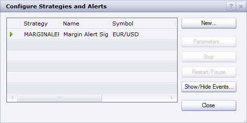
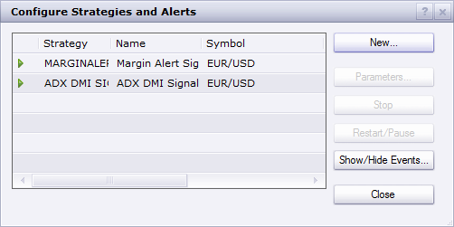

# ADX, DMI Signal

> Source: https://fxcodebase.com/code/viewtopic.php?f=29&t=885  
> Forum: 29 · Topic 885 · 42 post(s)

---

## ADX, DMI Signal

**Apprentice** · Fri Apr 30, 2010 2:55 am

*ADX, DMI Signal*

In addition to DMI signal, allows filtering by using the ADX indicator.

**Buy**
DMI+ > DMI -
**Sell**
DMI+ < DMI -

 [ADX DMI Signal.lua](files/1618/ADX%20DMI%20Signal.lua)

ADX, DMI Signal

---

## Re: ADX, DMI Signal

**elmcceen** · Fri Apr 30, 2010 4:19 am

There would be a more quality signal if the adx line is in the same range like the cross off the dmi lines!

example: dmi line cross at 21and the adx is in in that range (20-22) the signal by the dmi cross would be very strong!

Is it possible to prepare that signal with this ????

---

## Re: ADX, DMI Signal

**Apprentice** · Fri Apr 30, 2010 8:48 am

Something like this?

I made this promptly, the algorithm is not one hundred percent correct.

 [Auto ADX DMI Signal.lua](files/1631/Auto%20ADX%20DMI%20Signal.lua)

---

## Re: ADX, DMI Signal

**DS0167** · Mon Sep 06, 2010 5:23 pm

Usually even if ADX is above 20, when DMI+ and DMI- cross under 17, the signal is weak.

The ideal would be to add a DMI cross level option and so the signal will be generate with, for instance: ADX above 20 with a DMI cross above 17.

The cherry on the cake would be to have the SAR option in this signal (when DMI cross above 17 with and ADX above 20 with SAR confirmation)...

I hope you can do that when you have a moment?

Many thanks in advance.

Kind regards,
DS0167

---

## Re: ADX, DMI Signal

**Apprentice** · Tue Sep 07, 2010 8:40 am

Added to developmental cue.

---

## Re: ADX, DMI Signal

**DS0167** · Tue Sep 07, 2010 2:16 pm

I am impatient to see it working

---

## Re: ADX, DMI Signal

**Apprentice** · Wed Sep 08, 2010 4:29 am

Something like this.

 [ADX DMI SAR Signal.lua](files/4301/ADX%20DMI%20SAR%20Signal.lua)

---

## Re: ADX, DMI Signal

**DS0167** · Wed Sep 08, 2010 9:42 am

This is absolutely perfect! (very few "normal" false signals !)

Thank you so much for this very good job.

Kind regards,
DS0167

---

## Re: ADX, DMI Signal

**DS0167** · Wed Sep 08, 2010 9:50 am

Just one thing (problem) with the DMI level...

It is the cross of DMI+ and DMI- that should generate the signal not the DMI+ above 17 or DMI- above 17. It is really the cross of both...

?

Thanks in advance to let me know if it is possible.

Kind regards
DS0167

---

## Re: ADX, DMI Signal

**Apprentice** · Wed Sep 08, 2010 10:41 am

Both. To get a signal must be satisfied both conditions.

---

## Re: ADX, DMI Signal

**DS0167** · Wed Sep 08, 2010 3:41 pm

This signal is just Very Good.

Thanks again

Kind regards,
DS0167

---

## Re: ADX, DMI Signal

**boondai** · Sun Sep 12, 2010 11:57 am

Hello,

Could you please show me how to install the ADX,DMI Signal strategy onto the FXCM platform?

Also, can you get notification via email or to a PDA?

Thank you,

Boondai

---

## Re: ADX, DMI Signal

**Apprentice** · Sun Sep 12, 2010 1:34 pm

Added to developmen cue.

---

## Re: ADX, DMI Signal

**Jakeman123** · Sun Sep 12, 2010 5:23 pm

This latest version really kicks butt!

Would it be possible to further program this version for e-mail notification and auto-trading?

Thanks!

Jake

---

## Re: ADX, DMI Signal

**boondai** · Sun Sep 12, 2010 7:22 pm

Hello,

Do you know how to send email notifications and backtest for this strategy on FXCM platform?

Thank you.

---

## Re: ADX, DMI Signal

**Apprentice** · Mon Sep 13, 2010 4:05 am

Currently this feature is not supported.
Give me a few days.

---

## Re: ADX, DMI Signal

**Apprentice** · Tue Sep 14, 2010 2:09 pm

**Before its use test this strategy.
Do not test this strategy on a live account.
Or turn off the Trade functionality .**

 [ADX DMI SAR Strategy.lua](files/4495/ADX%20DMI%20SAR%20Strategy.lua)

---

## Re: ADX, DMI Signal

**luigipg** · Sat Apr 16, 2011 1:57 am

Hello, can someone develop the following signal concerning ADX? I think is the best.
Example of entry Long: ADX >= 20 and DMI+ >= 25 and DMI- <20.
Example of entry Short: ADX >= 20 and DMI+ < 25 and DMI- >= 25.
As usual thanks for your valuable work. Luigi!!!

---

## Re: ADX, DMI Signal

**Apprentice** · Sat Apr 16, 2011 9:40 am

Added to developmental cue.

---

## Re: ADX, DMI Signal

**luigipg** · Sun Apr 17, 2011 2:58 am

Thanks a lot, anyway i wrong example of entry short, the correct one is the follow:
"entry Short: ADX >= 20 and **DMI+ < 20** and DMI- >= 25. Sorry and thanks again. Luigi!!!

---

## Re: ADX, DMI Signal

**Alexander.Gettinger** · Wed May 04, 2011 2:14 am

Strategy you may find here: [viewtopic.php?f=31&t=4107](https://fxcodebase.com/code/viewtopic.php?f=31&t=4107)

---

## Re: ADX, DMI Signal

**BS_biggie** · Wed Mar 14, 2012 5:46 am

I've downloaded the ADX DMI SAR file but I'm not seeing the Sell and Buy signal as per your chart.
Could you please advise what else I've not installed?

---

## Re: ADX, DMI Signal

**AndreaBo** · Tue Jul 10, 2012 2:49 pm

I've downloaded the Adx Dmi Sar signal, but ther's something wrong.
When i try to backtest the signal, the process is stopped by this alert:

"The index is out of range"

Do you know which is the problem and how could I solve it?

Thank you very much!

---

## Re: ADX, DMI Signal

**Apprentice** · Fri Jul 13, 2012 7:16 am

Bug is Fixed now.

---

## Re: ADX, DMI Signal

**AndreaBo** · Fri Jul 13, 2012 8:07 am

Thank you very much, now it works perfectly.
But last thing....i am experiencing the same problem on the "Adx Dmi Sar Strategy".

Could you kindly check wich is the problem?

Thank you again,
Andrea

---

## Re: ADX, DMI Signal

**Apprentice** · Fri Jul 13, 2012 12:33 pm

I have fix all three of them.

---

## Re: ADX, DMI Signal

**AndreaBo** · Sun Jul 15, 2012 4:41 pm

I'm sorry but i've downloaded again the "Adx Dmi Sar Strategy" (the file I found in the second page of this thread) and i'm still experiencing the same problem.
Could it depend on the settings of my trading station?

Thank you!

---

## Re: ADX, DMI Signal

**AndreaBo** · Wed Jul 25, 2012 11:03 am

Can anybody help me with the "Adx Dmi Sar Strategy"?

Thank you

---

## Re: ADX, DMI Signal

**sagymmm** · Thu Sep 20, 2012 7:22 am

Hello Sir, May I ask for a strategy involved about DMI crossover at any reading without anything else

---

## Re: ADX, DMI Signal

**Apprentice** · Fri Sep 21, 2012 4:08 pm

Strategy like this one?
[viewtopic.php?f=31&t=2572&p=8557&hilit=dmi#p8557](https://fxcodebase.com/code/viewtopic.php?f=31&t=2572&p=8557&hilit=dmi#p8557)

---

## Re: ADX, DMI Signal

**sagymmm** · Fri Sep 21, 2012 6:54 pm

> **Apprentice wrote:**
> Strategy like this one?
> [viewtopic.php?f=31&t=2572&p=8557&hilit=dmi#p8557](https://fxcodebase.com/code/viewtopic.php?f=31&t=2572&p=8557&hilit=dmi#p8557)

Thx sir, that is exactly what I was looking for

---

## Re: ADX, DMI Signal

**VeloMedia** · Sat Sep 22, 2012 1:19 pm

I have downloaded the signal and tried to import/load it into Marketscope 2.0 but each time I try to import the indicator it comes back with and error ?

Any suggestions as to why this is ? Any other indicator I have added has not had a problem.

---

## Re: ADX, DMI Signal

**Apprentice** · Sun Sep 23, 2012 2:42 pm

Can you give me more detail about error you are getting, also,
which version of the signal you're using.

---

## Re: ADX, DMI Signal

**VeloMedia** · Sun Sep 23, 2012 5:20 pm

I saved the both :

ADX DMI SAR Signal.lua

and

Auto ADX DMI Signal.lua

When trying to import either into Marketscope the second column allong just reads "error" so no proper error reporting to share.

---

## Re: ADX, DMI Signal

**Apprentice** · Mon Sep 24, 2012 12:14 pm

Hm, i have Load this signal without problem.
What Settings you are using?
Have you try to load it on the indicator or as Strategy / Signal?

---

## Re: ADX, DMI Signal

**VeloMedia** · Mon Sep 24, 2012 1:34 pm

I have now managed to load it as a strategy however when I select the "ADX DMI SAR signal" nothing shows onthe chart.

---

## Re: ADX, DMI Signal

**Apprentice** · Mon Sep 24, 2012 1:40 pm

U have to use Strategy Backtester for historical testing,

 

or load and run Signal to have Live Alerts.

 

---

## ADX DMI Signal

**queldorei** · Tue Jun 11, 2013 10:05 pm

I am looking for a signal that starts shouting at me when 2 different EMAs cross each other after the close of a candle/at open of new candle. I have added an image to show where I would like it to make a noise or something.
Is this possible at all? or even better, does it already exist?

---

## Re: ADX, DMI Signal

**Apprentice** · Wed Jun 12, 2013 5:28 am

Can you post, chart example with description.

---

## Re: ADX, DMI Signal

**ThemBonez** · Sat Sep 28, 2013 7:42 am

Hello,
I am having the same problem Andreabo posted a while back.
When i try to backtest the strategy, the process is stopped by this alert:

"The index is out of range"

---

## Re: ADX, DMI Signal

**Apprentice** · Sun Sep 29, 2013 3:47 am

ADX DMI SAR Signal Strategy Bug Fixed.

---

## Re: ADX, DMI Signal

**Avignon** · Tue Mar 17, 2015 6:26 pm

(I use Google Translate)

Hello,

The platform rotates on a VPS. By restarting it fixed the bug but I did not notice, sorry if it was only that the yen exchange rates.

That was last week, never had before or the week so far and no error message.
