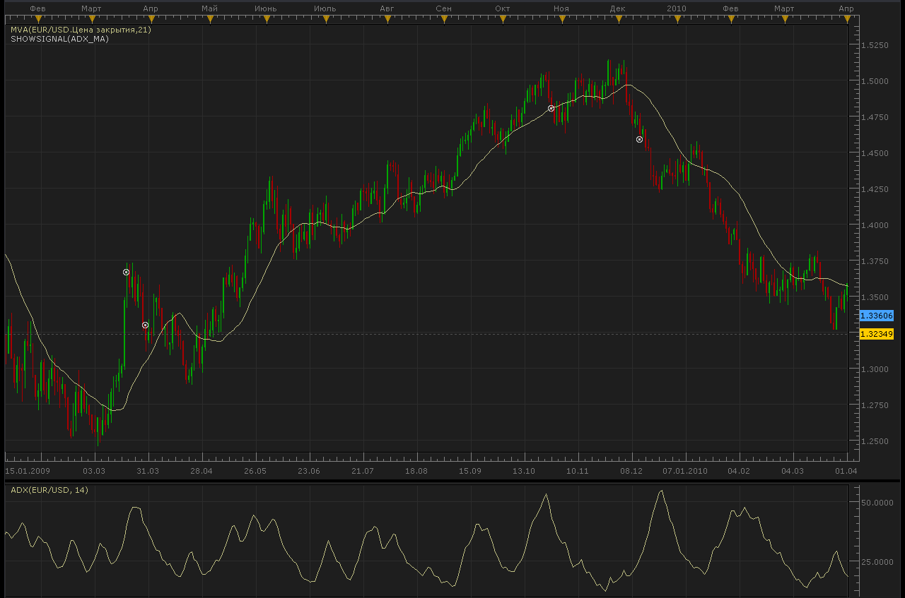

# ADX & MA Signals

> Source: https://fxcodebase.com/code/viewtopic.php?f=29&t=845  
> Forum: 29 · Topic 845 · 3 post(s)

---

## ADX & MA Signals

**Alexander.Gettinger** · Mon Apr 26, 2010 3:27 pm

Trading Strategy Algorithm:

1. Open a daily chart for EURUSD, lots 0.1.

2. Draw an ADX with the period of 14, mark level 20 in the indicator.

3. Draw an MA with the period of 21.

Buying signal: The bar closes above MA, and the ADX line is above 20.
Selling signal: The bar closes below MA, and the ADX line is above 20.

 



```lua
function Init()
    strategy:name("ADX/MA signal");
    strategy:description("Buying signal: The bar closes above MA, and the ADX line is above 20. Selling signal: The bar closes below MA, and the ADX line is above 20.");

    strategy.parameters:addGroup("Parameters");

    strategy.parameters:addInteger("MA_Period", "Period of MA", "", 21);
    strategy.parameters:addInteger("ADX_Period", "Period of ADX", "", 14);
    strategy.parameters:addInteger("ADX_Value", "Value of ADX for buy or sell", "", 20);
    strategy.parameters:addInteger("TP", "Limit in pips", "", 180);
    strategy.parameters:addInteger("SL", "Stop loss in pips", "", 420);
   
    strategy.parameters:addString("Period", "Timeframe", "", "m5");
    strategy.parameters:setFlag("Period", core.FLAG_PERIODS);
    strategy.parameters:addGroup("Signals");
    strategy.parameters:addBoolean("ShowAlert", "Show Alert", "", true);
    strategy.parameters:addBoolean("PlaySound", "Play Sound", "", false);
    strategy.parameters:addFile("SoundFile", "Sound File", "", "");
end

local ADX;
local MA;
local TP;
local SL;
local ADX_Value;
local SoundFile;
local gSourceBid = nil;
local gSourceAsk = nil;
local first;

local BidFinished = false;
local AskFinished = false;
local LastBidCandle = nil;

function Prepare()
    local FastN, SlowN;

    ShowAlert = instance.parameters.ShowAlert;
    if instance.parameters.PlaySound then
        SoundFile = instance.parameters.SoundFile;
    else
        SoundFile = nil;
    end

    TP = instance.parameters.TP * instance.bid:pipSize();
    SL = instance.parameters.SL * instance.bid:pipSize();
    ADX_Value = instance.parameters.ADX_Value;

    assert(not(PlaySound) or (PlaySound and SoundFile ~= ""), "Sound file must be specified");
    assert(instance.parameters.Period ~= "t1", "Signal cannot be applied on ticks");

    ExtSetupSignal("ADX/MA signal:", ShowAlert);

    gSourceBid = core.host:execute("getHistory", 1, instance.bid:instrument(), instance.parameters.Period, 0, 0, true);
    gSourceAsk = core.host:execute("getHistory", 2, instance.bid:instrument(), instance.parameters.Period, 0, 0, false);

    ADX = core.indicators:create("ADX", gSourceBid, instance.parameters.ADX_Period);
    MA = core.indicators:create("MVA", gSourceBid.close, instance.parameters.MA_Period);

    first = math.max(ADX.DATA:first(), MA.DATA:first()) + 2;

    local name = profile:id() .. "(" .. instance.bid:instrument() .. "(" .. instance.parameters.Period  .. ")" .. instance.parameters.ADX_Period .. "," .. instance.parameters.MA_Period .. "," .. instance.parameters.ADX_Value .. ")";
    instance:name(name);
end

local LastDirection=nil;

function Update()
    if not(BidFinished) or not(AskFinished) then
        return ;
    end

    local period;

    -- check for TP/SL (exit logic)
    if LONG ~= nil then
        period = gSourceBid:size() - 1;
        -- check profit
        if gSourceBid.high[period] >= LONG + TP then
            ExtSignal(gSourceBid.high, period, "Exit Buy (L)", SoundFile);
            LONG = nil;
        elseif gSourceBid.low[period] <= LONG - SL then
            ExtSignal(gSourceBid.high, period, "Exit Buy (S)", SoundFile);
            LONG = nil;
        end
    end
    if SHORT ~= nil then
        period = gSourceAsk:size() - 1;
        -- check profit
        if gSourceAsk.low[period] <= SHORT - TP then
            ExtSignal(gSourceBid.low, period, "Exit Sell (L)", SoundFile);
            SHORT = nil;
        elseif gSourceAsk.high[period] >= SHORT + SL then
            ExtSignal(gSourceBid.high, period, "Exit Sell (S)", SoundFile);
            SHORT = nil;
        end
    end

    -- update moving average
    ADX:update(core.UpdateLast);
    MA:update(core.UpdateLast);

    -- calculate enter logic
    if LastBidCandle == nil or LastBidCandle ~= gSourceBid:serial(gSourceBid:size() - 1) then
        LastBidCandle = gSourceBid:serial(gSourceBid:size() - 1);

        period = gSourceBid:size() - 2;
        if period >= first then
         if LONG==nil and LastDirection~=1 then
          if gSourceBid.close[period]>MA.DATA[period] and ADX.DATA[period]>=ADX_Value then
           ExtSignal(gSourceAsk, period, "Buy", SoundFile);
           LONG = gSourceAsk.close[period];
           LastDirection=1;
          end
         elseif SHORT==nil and LastDirectiob~=-1 then
          if gSourceBid.close[period]<MA.DATA[period] and ADX.DATA[period]>=ADX_Value then
           ExtSignal(gSourceBid, period, "Sell", SoundFile);
           SHORT = gSourceBid.close[period];
           LastDirection=-1;
          end
         end
       
        end
    end
end

function AsyncOperationFinished(cookie)
    if cookie == 1 then
        BidFinished = true;
    elseif cookie == 2 then
        AskFinished = true;
    end
end

local gSignalBase = "";     -- the base part of the signal message
local gShowAlert = false;   -- the flag indicating whether the text alert must be shown

-- ---------------------------------------------------------
-- Sets the base message for the signal
-- @param base      The base message of the signals
-- ---------------------------------------------------------
function ExtSetupSignal(base, showAlert)
    gSignalBase = base;
    gShowAlert = showAlert;
    return ;
end

-- ---------------------------------------------------------
-- Signals the message
-- @param message   The rest of the message to be added to the signal
-- @param period    The number of the period
-- @param sound     The sound or nil to silent signal
-- ---------------------------------------------------------
function ExtSignal(source, period, message, soundFile)
    if source:isBar() then
        source = source.close;
    end
    if gShowAlert then
        terminal:alertMessage(source:instrument(), source[period], gSignalBase .. message, source:date(period));
    end
    if soundFile ~= nil then
        terminal:alertSound(soundFile, false);
    end
end
```

---

## Re: ADX & MA Signals

**Silver23** · Tue Feb 02, 2016 1:51 pm

Hi Avignon,

Is this a strategy or just a signal?

---

## Re: ADX & MA Signals

**Avignon** · Wed Feb 03, 2016 4:48 pm

Just signal.

AMHA, to limit false signals, you expect the trade signal in daily but will switch to lower UT to place your order. So you will be sure to be in the trend.
