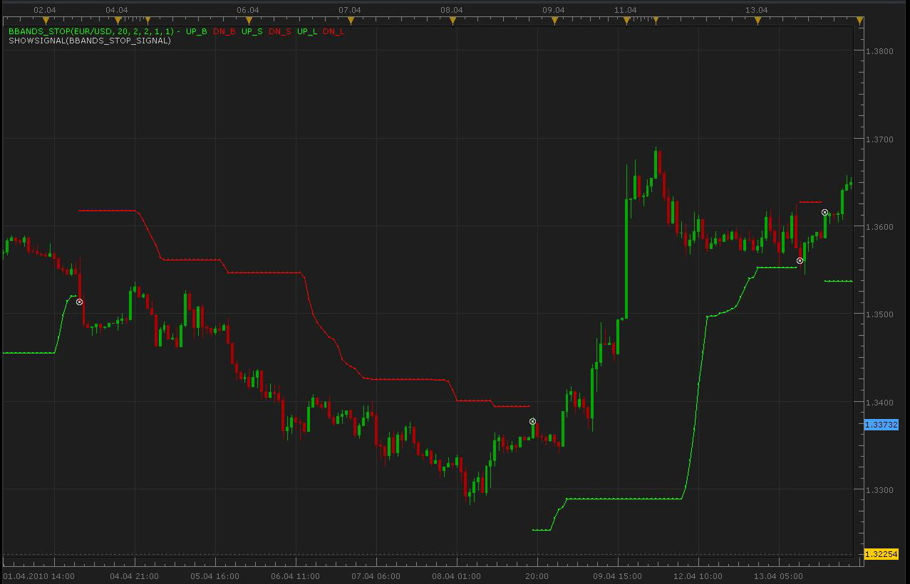
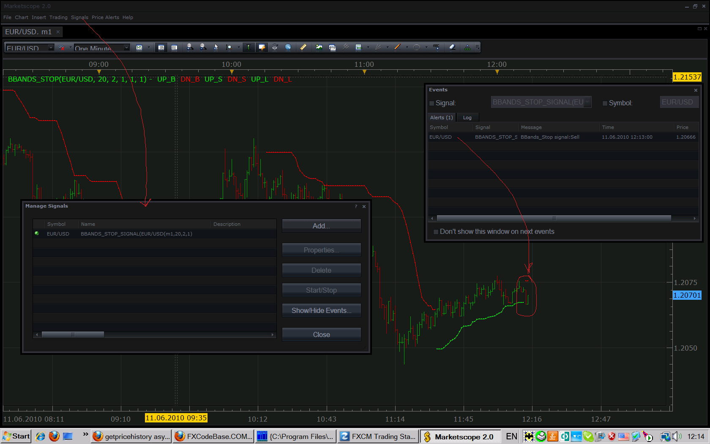

# BB_Bands stop Signals [Upd: Jun 06]

> Source: https://fxcodebase.com/code/viewtopic.php?f=29&t=852  
> Forum: 29 · Topic 852 · 20 post(s)

---

## BB_Bands stop Signals [Upd: Jun 06]

**Alexander.Gettinger** · Mon Apr 26, 2010 10:42 pm

Upd Jun 6 2010 by ng: Fixed the problem when the signal checks the incomplete candle when it only appears instead of checking the most recently completed candle. Details are here: [viewtopic.php?f=29&t=852#p2376](https://fxcodebase.com/code/viewtopic.php?f=29&t=852#p2376)

Please, remove the old version and install the new one.

Signals based on indicator BB_Bands stop: [viewtopic.php?f=17&t=757&p=1449](https://fxcodebase.com/code/viewtopic.php?f=17&t=757&p=1449). Please, do not forget to download and install indicator too!

 

Download:

 [BBands_Stop_Signal.lua](files/1526/BBands_Stop_Signal.lua)

Code: [Select all](https://fxcodebase.com/code/)
`function Init()
    strategy:name("BBands_Stop signal");
    strategy:description("");

    strategy.parameters:addGroup("Parameters");

    strategy.parameters:addInteger("Length", "Length", "Bollinger Bands Period for BBands_Stop", 20);
    strategy.parameters:addDouble("Deviation", "Deviation", "Deviation for BBands_Stop", 2);
    strategy.parameters:addDouble("MoneyRisk", "MoneyRisk", "Offset Factor for BBands_Stop", 1);

    strategy.parameters:addString("Period", "Timeframe", "", "m5");
    strategy.parameters:setFlag("Period", core.FLAG_PERIODS);

    strategy.parameters:addGroup("Signals");
    strategy.parameters:addBoolean("ShowAlert", "Show Alert", "", true);
    strategy.parameters:addBoolean("PlaySound", "Play Sound", "", false);
    strategy.parameters:addFile("SoundFile", "Sound File", "", "");
end

local SoundFile;
local gSourceBid = nil;
local gSourceAsk = nil;
local first;

local BidFinished = false;
local AskFinished = false;
local LastBidCandle = nil;

local EMA50;

function Prepare()
    local FastN, SlowN;

    ShowAlert = instance.parameters.ShowAlert;
    if instance.parameters.PlaySound then
        SoundFile = instance.parameters.SoundFile;
    else
        SoundFile = nil;
    end

    assert(not(PlaySound) or (PlaySound and SoundFile ~= ""), "Sound file must be specified");
    assert(instance.parameters.Period ~= "t1", "Signal cannot be applied on ticks");

    ExtSetupSignal("BBands_Stop signal:", ShowAlert);

    gSourceBid = core.host:execute("getHistory", 1, instance.bid:instrument(), instance.parameters.Period, 0, 0, true);
    gSourceAsk = core.host:execute("getHistory", 2, instance.bid:instrument(), instance.parameters.Period, 0, 0, false);

    BBands = core.indicators:create("BBANDS_STOP", gSourceBid, instance.parameters.Length,instance.parameters.Deviation,instance.parameters.MoneyRisk,1,1);

    first = BBands.DATA:first() + 4;

    local name = profile:id() .. "(" .. instance.bid:instrument() .. "(" .. instance.parameters.Period  .. "," .. instance.parameters.Length ..  "," .. instance.parameters.Deviation ..  "," .. instance.parameters.MoneyRisk .. ")";
    instance:name(name);
end

local LastDirection=nil;

-- when tick source is updated
function Update()
    if not(BidFinished) or not(AskFinished) then
        return ;
    end

    local period;

    -- update moving average
    BBands:update(core.UpdateLast);

    -- calculate enter logic
    if LastBidCandle == nil or LastBidCandle ~= gSourceBid:serial(gSourceBid:size() - 1) then
        LastBidCandle = gSourceBid:serial(gSourceBid:size() - 1);

        period = gSourceBid:size() - 2;
        if period > first then
         if BBands.UP_B[period-1]==-1 and BBands.DN_B[period]==-1 and LastDirection~=1 then
                ExtSignal(gSourceAsk, period, "Buy", SoundFile);
                LastDirection=1;
         elseif BBands.DN_B[period-1]==-1 and BBands.UP_B[period]==-1 and LastDirection~=-1 then
                ExtSignal(gSourceBid, period, "Sell", SoundFile);
                LastDirection=-1;
         end

        end
    end
end

function AsyncOperationFinished(cookie)
    if cookie == 1 then
        BidFinished = true;
    elseif cookie == 2 then
        AskFinished = true;
    end
end

local gSignalBase = "";     -- the base part of the signal message
local gShowAlert = false;   -- the flag indicating whether the text alert must be shown

-- ---------------------------------------------------------
-- Sets the base message for the signal
-- @param base      The base message of the signals
-- ---------------------------------------------------------
function ExtSetupSignal(base, showAlert)
    gSignalBase = base;
    gShowAlert = showAlert;
    return ;
end

-- ---------------------------------------------------------
-- Signals the message
-- @param message   The rest of the message to be added to the signal
-- @param period    The number of the period
-- @param sound     The sound or nil to silent signal
-- ---------------------------------------------------------
function ExtSignal(source, period, message, soundFile)
    if source:isBar() then
        source = source.close;
    end
    if gShowAlert then
        terminal:alertMessage(source:instrument(), source[period], gSignalBase .. message, source:date(period));
    end
    if soundFile ~= nil then
        terminal:alertSound(soundFile, false);
    end
end`

---

## Re: BB_Bands stop Signals

**jsi@jp** · Tue Jun 01, 2010 12:12 am

Hi, I cannot load this indicator

ADX & MA Signals I can load
EMA50 signals I can load
BB_Bands stop Signals I cannot load

Please help

---

## Re: BB_Bands stop Signals

**Nikolay.Gekht** · Tue Jun 01, 2010 8:39 am

This is not an indicator. This is a signal. And... Could you please provide a bit more details about "cannot load".

---

## Re: BB_Bands stop Signals

**jsi@jp** · Tue Jun 01, 2010 10:50 pm

Jun 01,2010

I'm sorry.
I cannot speak English.

signal sound of "ADX&MA" "EMA50" rings, but signal sound of "BB_Bands" not rings.

--------------------
Jun 02,2010

I tried once again, the signal sounded.
But it sometimes sound.
It does not sound in many cases.

This may not sound in the place which must sound.

Why does not the signal to all
Please look at the image file.

---

## Re: BB_Bands stop Signals

**Nikolay.Gekht** · Wed Jun 02, 2010 9:36 am

Oh, I see. It looks like this could be Marketscope problem. I reported the problem to the developers to have it the checked carefully. Thank you for the reporting. I'll keep you informed.

---

## Re: BB_Bands stop Signals

**jsi@jp** · Thu Jun 03, 2010 6:44 am

Thank you Nikolay

>It looks like this could be Marketscope problem.

It is regrettable.

>I reported the problem to the developers to have it the checked carefully. Thank you for the reporting. I'll keep you informed.

Marketscope becomes better, it is good.

---

## Re: BB_Bands stop Signals

**Nikolay.Gekht** · Thu Jun 03, 2010 8:20 am

Alexander, I checked the strategy carefully. Look, the problem is in a bit incorrect implementation of the closed candle checking in the strategy.

First, you detects when another candle is closed:

Code: [Select all](https://fxcodebase.com/code/)
`if LastBidCandle == nil or
   LastBidCandle ~= gSourceBid:serial(gSourceBid:size() - 1) then`
So, all other code works every time when a new candle is started. But then you check a newly started candle, not a completely closed candle, i.e. this code

Code: [Select all](https://fxcodebase.com/code/)
`period = gSourceBid:size() - 1;`
gets index of the newly created candle, not a completed candle, which must be

Code: [Select all](https://fxcodebase.com/code/)
`period = gSourceBid:size() - 2;`
So, in the situation when signal happens not a the first ticks of the new candle - the signal will not happen at all.

There is two way to fix the strategy:
1) Check the completed candle.
or, if you want to provide a signal with no lag
2) Check condition on every tick and signal at the first tick at which the condition is satified.
However, in that case if the candle is closed but the condition disappears - probably we need another signal which shows that condition is not... hm... let's call it "confirmed".

Alexander, could you please fix the strategy?

jsi@jp, thank you very much for reporting the problem. I hope the fix will be provided pretty fast.

---

## Re: BB_Bands stop Signals [Upd: Jun 06]

**Nikolay.Gekht** · Tue Jun 08, 2010 3:01 pm

Up. The signal is updated.

---

## Re: BB_Bands stop Signals [Upd: Jun 06]

**jeffjeffz** · Thu Jun 10, 2010 2:47 am

Hi Nikolay
Am I doing somthing wrong?

The signal is not giving any notifiactions.

Tested it on 1min, 15mins charts.

Can you check.

---

## Re: BB_Bands stop Signals [Upd: Jun 06]

**Nikolay.Gekht** · Fri Jun 11, 2010 11:17 am

Could you please provide a bit more details on how you apply the signal?

Do you use Signal->Manage signal to apply the signal on the real-time data?
Don't you disable the alert window?

Please see the snapshot below to see how the applied signal should look:

 

---

## Re: BB_Bands stop Signals [Upd: Jun 06]

**Alexander.Gettinger** · Sun Jun 20, 2010 9:43 pm

Update signal:

Code: [Select all](https://fxcodebase.com/code/)
`function Init()
    strategy:name("BBands_Stop signal");
    strategy:description("");

    strategy.parameters:addGroup("Parameters");

    strategy.parameters:addInteger("Length", "Length", "Bollinger Bands Period for BBands_Stop", 20);
    strategy.parameters:addDouble("Deviation", "Deviation", "Deviation for BBands_Stop", 2);
    strategy.parameters:addDouble("MoneyRisk", "MoneyRisk", "Offset Factor for BBands_Stop", 1);

    strategy.parameters:addString("Period", "Timeframe", "", "m5");
    strategy.parameters:setFlag("Period", core.FLAG_PERIODS);

    strategy.parameters:addGroup("Signals");
    strategy.parameters:addBoolean("ShowAlert", "Show Alert", "", true);
    strategy.parameters:addBoolean("PlaySound", "Play Sound", "", false);
    strategy.parameters:addFile("SoundFile", "Sound File", "", "");
end

local SoundFile;
local gSourceBid = nil;
local gSourceAsk = nil;
local first;

local BidFinished = false;
local AskFinished = false;
local LastBidCandle = nil;

local EMA50;

function Prepare()
    local FastN, SlowN;

    ShowAlert = instance.parameters.ShowAlert;
    if instance.parameters.PlaySound then
        SoundFile = instance.parameters.SoundFile;
    else
        SoundFile = nil;
    end
   
    assert(not(PlaySound) or (PlaySound and SoundFile ~= ""), "Sound file must be specified");
    assert(instance.parameters.Period ~= "t1", "Signal cannot be applied on ticks");

    ExtSetupSignal("BBands_Stop signal:", ShowAlert);

    gSourceBid = core.host:execute("getHistory", 1, instance.bid:instrument(), instance.parameters.Period, 0, 0, true);
    gSourceAsk = core.host:execute("getHistory", 2, instance.bid:instrument(), instance.parameters.Period, 0, 0, false);

    BBands = core.indicators:create("BBANDS_STOP", gSourceBid, instance.parameters.Length,instance.parameters.Deviation,instance.parameters.MoneyRisk,1,1);

    first = BBands.DATA:first() + 2;

    local name = profile:id() .. "(" .. instance.bid:instrument() .. "(" .. instance.parameters.Period  .. "," .. instance.parameters.Length ..  "," .. instance.parameters.Deviation ..  "," .. instance.parameters.MoneyRisk .. ")";
    instance:name(name);
end

local LastDirection=nil;

-- when tick source is updated
function Update()
    if not(BidFinished) or not(AskFinished) then
        return ;
    end

    local period;

    -- update moving average
    BBands:update(core.UpdateLast);

    -- calculate enter logic
    if LastBidCandle == nil or LastBidCandle ~= gSourceBid:serial(gSourceBid:size() - 1) then
        LastBidCandle = gSourceBid:serial(gSourceBid:size() - 1);

        period = gSourceBid:size() - 2;
        if period > first then
         if BBands.UP_B[period-1]==-1 and BBands.DN_B[period]==-1 and LastDirection~=1 then
                ExtSignal(gSourceAsk, period, "Buy", SoundFile);
                LastDirection=1;
         elseif BBands.DN_B[period-1]==-1 and BBands.UP_B[period]==-1 and LastDirection~=-1 then
                ExtSignal(gSourceBid, period, "Sell", SoundFile);
                LastDirection=-1;
         end   

        end
    end
end

function AsyncOperationFinished(cookie)
    if cookie == 1 then
        BidFinished = true;
    elseif cookie == 2 then
        AskFinished = true;
    end
end

local gSignalBase = "";     -- the base part of the signal message
local gShowAlert = false;   -- the flag indicating whether the text alert must be shown

-- ---------------------------------------------------------
-- Sets the base message for the signal
-- @param base      The base message of the signals
-- ---------------------------------------------------------
function ExtSetupSignal(base, showAlert)
    gSignalBase = base;
    gShowAlert = showAlert;
    return ;
end

-- ---------------------------------------------------------
-- Signals the message
-- @param message   The rest of the message to be added to the signal
-- @param period    The number of the period
-- @param sound     The sound or nil to silent signal
-- ---------------------------------------------------------
function ExtSignal(source, period, message, soundFile)
    if source:isBar() then
        source = source.close;
    end
    if gShowAlert then
        terminal:alertMessage(source:instrument(), source[period], gSignalBase .. message, source:date(period));
    end
    if soundFile ~= nil then
        terminal:alertSound(soundFile, false);
    end
end`

Download:

 [BBands_Stop_Signal.lua](files/2676/BBands_Stop_Signal.lua)

Please, do not forget to download and install the indicator BBANDS_STOP from here:
[viewtopic.php?f=17&t=757](https://fxcodebase.com/code/viewtopic.php?f=17&t=757)

---

## Re: BB_Bands stop Signals [Upd: Jun 06]

**thejesters1** · Thu Jun 24, 2010 8:06 am

umm can someone enlighten me on how to add a sound alert for this one? cant seem to get it working, btw the signal is working fine. just needed a sound alert.

thanks!

---

## Re: BB_Bands stop Signals [Upd: Jun 06]

**bchami** · Thu Jun 24, 2010 9:19 pm

For some strange reason, i get the error message: [string "BBands_Stop_Signal.lua"]:49: The indicator with the requested id is not found. This happens when i try to apply the signal to a currency pair. Any suggestions as how to fix this problem?
Cheers
bill

---

## Re: BB_Bands stop Signals [Upd: Jun 06]

**Nikolay.Gekht** · Fri Jun 25, 2010 11:28 am

Did you install BBANDS_STOP indicator?
[viewtopic.php?f=17&t=757](https://fxcodebase.com/code/viewtopic.php?f=17&t=757)

---

## Re: BB_Bands stop Signals [Upd: Jun 06]

**Nikolay.Gekht** · Fri Jun 25, 2010 11:41 am

> **thejesters1 wrote:**
> umm can someone enlighten me on how to add a sound alert for this one? cant seem to get it working, btw the signal is working fine. just needed a sound alert.
> thanks!

Have you tried to switch "Play Sound" parameter to "Yes" and then choose the sound file (any wav file, the default Trading Station set is located here: "C:\Program Files\Candleworks\FXTS2\Sounds\")?

---

## Re: BB_Bands stop Signals [Upd: Jun 06]

**Merchantprince** · Sun Aug 29, 2010 6:09 pm

Is it possible to update this signal to employ the new email alert feature in the latest TS II update?

Thanks!

---

## Re: BB_Bands stop Signals [Upd: Jun 06]

**Apprentice** · Mon Aug 30, 2010 3:05 am

Added to developmen cue.

---

## Re: BB_Bands stop Signals [Upd: Jun 06]

**Apprentice** · Thu Jun 09, 2011 11:23 am

Sound Problem Fixed.

---

## Re: BB_Bands stop Signals [Upd: Jun 06]

**4xtr8r** · Thu Jun 09, 2011 11:54 am

Strategy has been added to cue?

Do you know how long it will take?

rules:

Enter buy/sell when initial signal is given (long or short).

sell half at +10 (hopefully you can set it up where you can change the amount)...

second half out when signal reverses.

Thank you!

---

## Re: BB_Bands stop Signals [Upd: Jun 06]

**Apprentice** · Thu Jun 09, 2011 12:32 pm

To Merchantprince

I wrote a Strategy which is identical to the signal.
It has email functionality.
You can find it here.
[viewtopic.php?f=31&t=4672](https://fxcodebase.com/code/viewtopic.php?f=31&t=4672)
