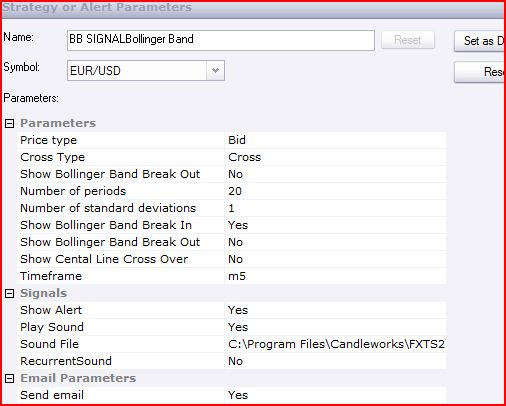

# Bollinger Band Signal

> Source: https://fxcodebase.com/code/viewtopic.php?f=29&t=1445  
> Forum: 29 · Topic 1445 · 34 post(s)

---

## Bollinger Band Signal

**Apprentice** · Thu Jul 01, 2010 6:27 am

*Bollinger Band Signal*

You have a choice between three types of signals.
When the price leaves the channel, go back inside the canal and crossed the center line.

Each of these signals can be switched off.

 [BB Signal.lua](files/2825/BB%20Signal.lua)

---

## Re: Bollinger Band Signal

**wizardpro** · Fri Oct 15, 2010 9:33 am

Hi, This is a great indicator but there are some challange whereby I had add this into my FXCM trading stations whereby monitor on GBP/USD and Aud/USD whenever it the BBand Sigal vis the email alert, it had msg from the subject such as " Top Line cross over or bottom line cross over " without tell me which currency pair was that since I had 2 BB sigal load into the FXCM trading statiosn monitor the GBP/USD and Aud/USD.
Any extra setting I need to add on ?

---

## Re: Bollinger Band Signal

**wizardpro** · Mon Oct 25, 2010 1:20 pm

Hi ,
This is a great product ,but there are some improve version such as
1) Email alert in the email suject such as
1) What the currency pair
2) Prices and Time
3)It woudl be good if add on such as auto trade Enable or disable
That would be perfer product
Note: The emails alert currently does not tell which pair ,just got emails alert break out that all as I am running 5 differnet pair loading this indicator as monitoring but does not help since it did not tell which pair.
Note: Is there a technical probelms as when I get emails notification, all the information are inside emails header instead of emaisl eubject whereby using Windows Mobile ver 6.1 Mail, I will have missing informations .Is that common ?

---

## Re: Bollinger Band Signal

**wizardpro** · Tue Oct 26, 2010 4:13 am

Hi ,
The emails alert notification need to reconfig how it work .
As the emails content are all squeze into the emails subject header instead of emails subject.
The result of the content is been cut off.
Here the images differnet between email client and windows mobile and iphone as important informations such as Symbol,pair and time are not shown .

Here's the link to this file:
[http://www.yousendit.com/download/ZGJje ... TWxFQlE9PQ](http://www.yousendit.com/download/ZGJjeFlZeDN0TWxFQlE9PQ)

Note: I was advise the emails client on Windows mobile and Iphone had to change to text instead of HTML was that true as I had try both seemed same result.
Please do advise.

---

## Re: Bollinger Band Signal

**olgasgs** · Wed Oct 27, 2010 7:19 am

Thank you for reporting the problem. We'll fix it in the next Marketscope release. Sorry for the inconvenience.

---

## Re: Bollinger Band Signal

**wizardpro** · Wed Oct 27, 2010 2:20 pm

Hi
This is a great product for BB bank Signal.
Can it be update or improve such as for example
1)Instead of just send the email/sound notification when there is a BB break out, can it be configure such as it will only send the signal if the candle is more then XXX % price out of the bb band.
For example :
H4 time frames on EUR/USD if the body of the candle or the candle twin if was 50% or certain XX % adjustable amount which can be enter out of the BB band ,then send email
NOte: % can be abjustable which is refering to prices
2)Allow only 1 trade to be open instead of multi order enable or disable when conditiosn meet.
2) Allow auto trade with Stop Loss, Take Profit and Trailing /Dynamic setting.
3) Close for trade monitoring whereby if this trade is close,it will send email notification with all the setitng such as prices open,close and time and etc.
Great product looking forward other improve version and more
How my wish list come true

---

## Re: Bollinger Band Signal

**wizardpro** · Sun Nov 07, 2010 11:58 pm

Hi
Is there a way to add one such as when there is a BB break out, if the candle close is more then 50% of the candle of the body, then send alert or auto trade ?

---

## Re: Bollinger Band Signal

**Apprentice** · Mon Nov 08, 2010 3:46 am

It is possible. Hopefully I'll have time soon.

---

## Re: Bollinger Band Signal

**wizardpro** · Sun Nov 14, 2010 12:16 pm

Hi
It there a way to configure whereby I can enter % of the body candle /twin such as only send BB Singal if break more then 50% of the BB band base on adjustable time frames ?

---

## Re: Bollinger Band Signal

**alepan72** · Tue Apr 19, 2011 4:38 pm

Hi all!
Is there a possibility of a strategy based on BB signal? Also, allow multiple positions open...?
Thanks in advance and best regards for your services!!!

---

## Re: Bollinger Band Signal

**jcmercier** · Tue May 24, 2011 2:32 pm

Hello,

Could you please help with the "load" error documented in the attached GIF File?

Thanks!

---

## Re: Bollinger Band Signal

**Apprentice** · Tue May 24, 2011 4:05 pm

BB signal is not a Indicator.
Look for it under Manage Custom Strategies.

---

## Re: Bollinger Band Signal

**4xtr8r** · Wed May 25, 2011 2:45 pm

can you program this as a strategy so it can autotrade?

thank you.

---

## Re: Bollinger Band Signal

**Apprentice** · Thu May 26, 2011 7:14 am

Happy to.
But you gotta give me the entry rules.
Exit conditions.
This signal gives a general signals.

---

## Re: Bollinger Band Signal

**4xtr8r** · Thu May 26, 2011 7:22 am

Thx Apprentice,

Autotrade rules:

Entry: if bar closes above band, go long. if bar closes below band, go short.

Exit: close half at +15 (or whatever amount you want. it would be nice to be able to change it). other half stays open until opposite signal is given.

Thank you.

---

## Re: Bollinger Band Signal

**Apprentice** · Thu May 26, 2011 2:14 pm

Your request has been added to developmental cue.

---

## Re: Boll Band Backtest

**jcmercier** · Tue May 31, 2011 12:46 pm

Please refer to comments in the attached file.

Cheers!

---

## Re: Bollinger Band Signal

**sunshine** · Mon Jun 13, 2011 11:27 pm

Hi,

The parameter 'Price Simulation' lets you choose how ticks will be simulated on the basis of your price history. The default value (“Mix”) uses HLC (to high, to then low, then to close) pattern for descending candles and LHC (to low, then to high, then to close) for ascending candles.

Please refer to this post for details:
[http://fxcodebase.com/code/viewtopic.php?f=31&t=3036#p7064](https://fxcodebase.com/code/viewtopic.php?f=31&t=3036#p7064)
As for the Data source tab, it doesn't make sense for backtesting. You should ignore this tab when backtesting.

---

## Re: Bollinger Band Signal

**virgilio** · Fri Feb 22, 2013 6:41 pm

Hello Programmers,

Can you please create a strategy off the BB Signal? The parameters should be:
Buy when the price pierces the bottom band;
Sell when the price pierces the top band;

The above strategy should also work in reverse.

Many thanks,
Virgilio

---

## Re: Bollinger Band Signal

**Apprentice** · Sat Feb 23, 2013 7:32 am

Your request is added to the development list.

---

## Re: Bollinger Band Signal

**virgilio** · Wed Mar 27, 2013 7:32 pm

Hello, do I have any hopes for this one? I requested it over a month ago.
Thanks.

---

## Re: Bollinger Band Signal

**ute333** · Thu Apr 04, 2013 6:40 pm

The BB Signal. lua published on 7/1/2010 works just the way I want it to - it signals when the candle closes after breaking out but it does not does not contain recurrent sound and email options

I know that you updated the signal for these items on 10/13/2010 but the signal comes out at one bar late - sometimes several bars late

would it be possible to update the original signal for the recurrent sound and email options and leave everything else alone - call it BB Signal Breakout

Thanks

Steve K

---

## Re: Bollinger Band Signal

**Apprentice** · Sat Apr 06, 2013 4:26 am

Your request is added to the development list.

---

## Re: Bollinger Band Signal

**zolz66** · Tue Jan 14, 2014 4:16 pm

Hi,

Has the issue about the alert not indicating the currency pair (mentioned in this topic in October 2010) been fixed? I started to use this signal and still get alerts without saying which pair it is. Makes a big difference when you run the signal on a dozen of pairs.

Thanks for any answer.

---

## Re: Bollinger Band Signal

**Apprentice** · Wed Jan 15, 2014 6:40 am

Better Email formatting added.

---

## Re: Bollinger Band Signal

**zolz66** · Wed Jan 15, 2014 6:53 am

Thanks.

Which is actually the most current version? The one attached to the first post in this topic (July 2010) or the one in the second (October 2010)?

---

## Re: Bollinger Band Signal

**zolz66** · Fri Jan 17, 2014 5:22 am

Hello,

In Parameters, I set "Show BB Break Out = No" and "Show BB Break In = Yes", assuming that in this way I would receive signals only if price returns into band (after breaking out). However, I receive the signal when price breaks out of the band.
Why?

Thanks for any clue.

---

## Re: Bollinger Band Signal

**zolz66** · Mon Jan 27, 2014 2:38 am

Hello Apprentice,

Now I have these problems with the signal:
- whenever it triggers, first it sends following error message "BB Signal.lua:269: attempt to concatenate global "label" (a nil value)", and it is automatically paused in Strategy Dashboard (the same problem you recently solved with "Momentum Signal")
- still no email alert

Could you pls fix these?

---

## Re: Bollinger Band Signal

**Apprentice** · Mon Jan 27, 2014 3:07 am

"label" Bug Fixed.

---

## Re: Bollinger Band Signal

**zolz66** · Mon Jan 27, 2014 3:47 pm

Thanks, Apprentice, it works now (I even get email alerts).

Now my only open question remains the one I asked before: with the following settings, shouldn't the signal trigger when price gets back into the band after a breakout? As it is now, it still triggers when it leaves the band, but it does nothing when price returns into the band (this latter would be more interesting to me). And why is actually "Show Bollinger Band Break Out" listed twice in parameters? Can you pls explain?

 

---

## Re: Bollinger Band Signal

**Apprentice** · Tue Jan 28, 2014 2:42 am

"Show Bollinger Band Break In"
 "Show Bollinger Band Break Out"
 "Show Cental Line" Show Cental Line Cross Over "
Please set all third is yes.
Duplicate has no impact on the final result.

---

## Re: Bollinger Band Signal

**Apprentice** · Tue Feb 10, 2015 3:52 am

Updated.

---

## Re: Bollinger Band Signal

**SenseClash** · Thu Mar 05, 2015 3:20 pm

Would it be possible to change this signal so that it can accept values greater than 2 for the "Number of Standard Deviations"? I'd like to use 3.5 standard deviations to filter out a lot of junk. Maybe you could make it go a little higher than that?

---

## Re: Bollinger Band Signal

**Apprentice** · Thu Mar 05, 2015 5:42 pm

Try it now.
