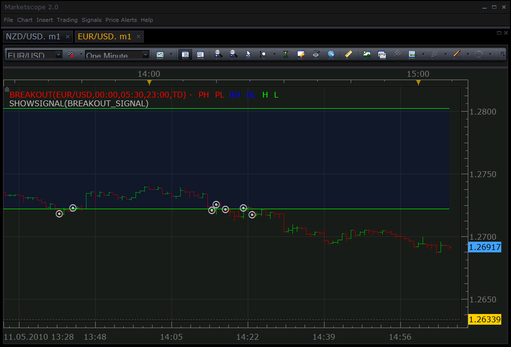

# Breakout signal

> Source: https://fxcodebase.com/code/viewtopic.php?f=29&t=1001  
> Forum: 29 · Topic 1001 · 5 post(s)

---

## Breakout signal

**Nikolay.Gekht** · Tue May 11, 2010 2:08 pm

The signal is based on the [Breakout](https://fxcodebase.com/code/viewtopic.php?f=17&t=966) indicator and shows the signal when bid price crosses the box line.

The breakout indicator must be also installed. The step for defining the period and box borders is 15 minutes.

The indicator works on close prices of the 1 minute candle to avoid "noise" when the prices fluctuates around high/low lines.

 

Download signal:

 [breakout_signal.lua](files/1869/breakout_signal.lua)

---

## Re: Breakout signal

**onehandman** · Sun Jul 17, 2011 1:05 pm

THIS IS PERFECT, THANK YOU VERY MUCH !!!!!!!!!

YOUR WORK HELPS OUR WORK !

---

## Re: Breakout signal

**flashking71** · Wed Oct 05, 2011 5:23 pm

Please I am have problem with this signal, its not showing on my market scope, the breakout indicator is showing but the breakout signal and strategy are not giving me signal and it has been successfully installed in my strategy folder. please help

---

## Re: Breakout signal

**sunshine** · Thu Oct 06, 2011 6:35 am

1) To view signals given in the past you can add a special indicator SHOWSIGNAL. The indicator shows labels at price levels where the signal alerts occurred.
Please read: [Show Signal on Chart](http://www.fxcorporate.com/help/MS/NOTFIFO/web-content.html?key=http://www.fxcorporate.com/help/MS/NOTFIFO/Show_Signal_onChart.html)

2) To get signals in the real time, you should start the signal (the Strategies menu -> Add Strategy).
Please make sure that your signals is in the list in the Manage Strategies dialog (the Strategies menu -> Manage Strategies). The signal should be marked with the green circle.

---

## Re: Breakout signal

**flashking71** · Thu Oct 06, 2011 3:25 pm

Thanks, very helpfull
