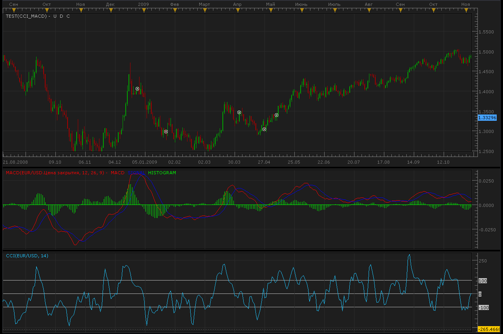
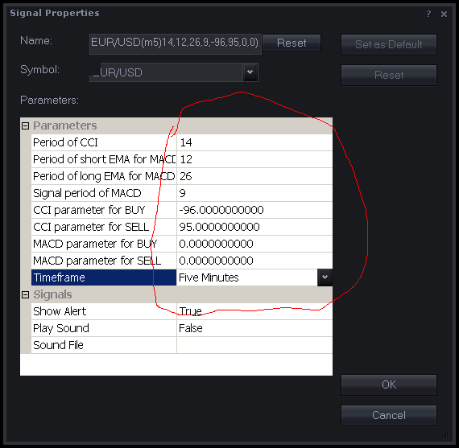
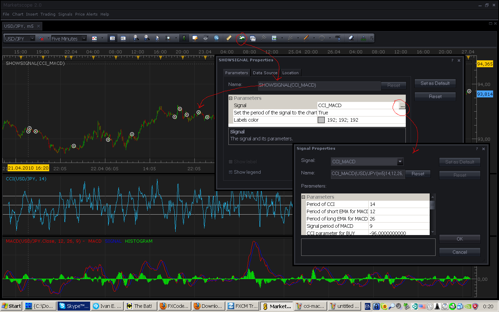

# CCI/MACD Signal

> Source: https://fxcodebase.com/code/viewtopic.php?f=29&t=844  
> Forum: 29 · Topic 844 · 12 post(s)

---

## CCI/MACD Signal

**Alexander.Gettinger** · Mon Apr 26, 2010 10:07 am

> pipsqueak wrote:
>
> CCI/MACD collaboration
>
> Postby pipsqueak » Fri Apr 16, 2010 7:53 am
> I would like to try a thought I have been considering over the past year.
> It would utilize the CCI and the MACD indicators.
>
> I believe that this indicator will NOT include the false signals that the RUBCCI gives. If you'll note, when using the that indicator, several signals result in a poor position. The MACD in these instances indicates momentum in the opposite direction. I've included it here to remove those possible false indications.
>
> This indicator would indicate a BUY when ALL of the following conditions are met:
>
> 1) CCI > -95 (adjustable?)
> 2) d(CCI)/dt is positive (the derivative is positive based on previous price action t-1) (adjustable?)
> 3) signal of MACD is > MACD (adjustable?)
> 4) d(MACD)/dt is positive (the derivative is positive based on previous price action t-1) (adjustable?)
>
> This indicator would indicate a SELL when ALL of the following conditions are met:
>
> 1) CCI is < 95 (adjustable?)
> 2) d(CCI/dt is negative (the derivative is negative based on previous price action t-1) (adjustable?)
> 3) signal of MACD is < MACD (adjustable?)
> 4) d(MACD)/dt is negative (the derivative is negative based on previous price action t-1) (adjustable?)

 



```lua
function Init()
    strategy:name("CCI/MACD signal");
    strategy:description("CCI/MACD collaboration");

    strategy.parameters:addGroup("Parameters");

    strategy.parameters:addInteger("CCI_Period", "Period of CCI", "", 14);
    strategy.parameters:addInteger("MACD_Short", "Period of short EMA for MACD", "", 12);
    strategy.parameters:addInteger("MACD_Long", "Period of long EMA for MACD", "", 26);
    strategy.parameters:addInteger("MACD_Signal", "Signal period of MACD", "", 9);
    strategy.parameters:addDouble("CCI_Buy", "CCI parameter for BUY", "", -96);
    strategy.parameters:addDouble("CCI_Sell", "CCI parameter for SELL", "", 95);
    strategy.parameters:addDouble("MACD_Buy", "MACD parameter for BUY", "", 0);
    strategy.parameters:addDouble("MACD_Sell", "MACD parameter for SELL", "", 0);

    strategy.parameters:addString("Period", "Timeframe", "", "m5");
    strategy.parameters:setFlag("Period", core.FLAG_PERIODS);

    strategy.parameters:addGroup("Signals");
    strategy.parameters:addBoolean("ShowAlert", "Show Alert", "", true);
    strategy.parameters:addBoolean("PlaySound", "Play Sound", "", false);
    strategy.parameters:addFile("SoundFile", "Sound File", "", "");
end

local SoundFile;
local gSourceBid = nil;
local gSourceAsk = nil;
local first;

local BidFinished = false;
local AskFinished = false;
local LastBidCandle = nil;

local CCI;
local MACD;

function Prepare()
    local FastN, SlowN;

    ShowAlert = instance.parameters.ShowAlert;
    if instance.parameters.PlaySound then
        SoundFile = instance.parameters.SoundFile;
    else
        SoundFile = nil;
    end
   
    assert(not(PlaySound) or (PlaySound and SoundFile ~= ""), "Sound file must be specified");
    assert(instance.parameters.Period ~= "t1", "Signal cannot be applied on ticks");

    ExtSetupSignal("CCI/MACD signal:", ShowAlert);

    gSourceBid = core.host:execute("getHistory", 1, instance.bid:instrument(), instance.parameters.Period, 0, 0, true);
    gSourceAsk = core.host:execute("getHistory", 2, instance.bid:instrument(), instance.parameters.Period, 0, 0, false);

    CCI = core.indicators:create("CCI", gSourceBid, instance.parameters.CCI_Period);
    MACD = core.indicators:create("MACD", gSourceBid.close, instance.parameters.MACD_Short,instance.parameters.MACD_Long,instance.parameters.MACD_Signal);

    first = math.max(CCI.DATA:first(), MACD.DATA:first()) + math.max(instance.parameters.CCI_Period,instance.parameters.MACD_Short,instance.parameters.MACD_Long)+ 2;

    local name = profile:id() .. "(" .. instance.bid:instrument() .. "(" .. instance.parameters.Period  .. ")" .. instance.parameters.CCI_Period .. "," .. instance.parameters.MACD_Short .. "," .. instance.parameters.MACD_Long .. "," .. instance.parameters.MACD_Signal .. "," .. instance.parameters.CCI_Buy .. "," .. instance.parameters.CCI_Sell .. "," .. instance.parameters.MACD_Buy .. "," .. instance.parameters.MACD_Sell .. ")";
    instance:name(name);
end

local LastDirection=nil;

-- when tick source is updated
function Update()
    if not(BidFinished) or not(AskFinished) then
        return ;
    end

    local period;

    period = gSourceBid:size() - 1;
    -- update moving average
    if period>first then
     CCI:update(core.UpdateLast);
     MACD:update(core.UpdateLast);
    end

    -- calculate enter logic
    if LastBidCandle == nil or LastBidCandle ~= gSourceBid:serial(gSourceBid:size() - 1) then
        LastBidCandle = gSourceBid:serial(gSourceBid:size() - 1);

        period = gSourceBid:size() - 1;
        if period > first then
         if CCI.DATA[period]>instance.parameters.CCI_Buy and (CCI.DATA[period]-CCI.DATA[period-1])>0. and
            MACD.SIGNAL[period]>instance.parameters.MACD_Buy and (MACD.MACD[period]-MACD.MACD[period-1]>0.) and LastDirection~=1 then
                ExtSignal(gSourceAsk, period, "Buy", SoundFile);
                LastDirection=1;
         elseif CCI.DATA[period]<instance.parameters.CCI_Sell and (CCI.DATA[period]-CCI.DATA[period-1])<0. and
            MACD.SIGNAL[period]<instance.parameters.MACD_Sell and (MACD.MACD[period]-MACD.MACD[period-1]<0.) and LastDirection~=-1 then
                ExtSignal(gSourceBid, period, "Sell", SoundFile);
                LastDirection=-1;
         end   

        end
    end
end

function AsyncOperationFinished(cookie)
    if cookie == 1 then
        BidFinished = true;
    elseif cookie == 2 then
        AskFinished = true;
    end
end

local gSignalBase = "";     -- the base part of the signal message
local gShowAlert = false;   -- the flag indicating whether the text alert must be shown

-- ---------------------------------------------------------
-- Sets the base message for the signal
-- @param base      The base message of the signals
-- ---------------------------------------------------------
function ExtSetupSignal(base, showAlert)
    gSignalBase = base;
    gShowAlert = showAlert;
    return ;
end

-- ---------------------------------------------------------
-- Signals the message
-- @param message   The rest of the message to be added to the signal
-- @param period    The number of the period
-- @param sound     The sound or nil to silent signal
-- ---------------------------------------------------------
function ExtSignal(source, period, message, soundFile)
    if source:isBar() then
        source = source.close;
    end
    if gShowAlert then
        terminal:alertMessage(source:instrument(), source[period], gSignalBase .. message, source:date(period));
    end
    if soundFile ~= nil then
        terminal:alertSound(soundFile, false);
    end
end
```

---

## Re: CCI/MACD Signal

**pipsqueak** · Mon Apr 26, 2010 12:42 pm

Thanks for the code!

Unfortunately, it is giving several false signals from the graph you presented. I'm not sure what is causing them, so I've downloaded the code and will attempt to determine what is wrong.

I also wanted to know whether it was a buy or a sell. The symbols appear to not indicate that.

Again, thanks for the code!!

---

## Re: CCI/MACD Signal

**pipsqueak** · Mon Apr 26, 2010 3:41 pm

Dang I wish I had taken some classes in C++ This is nothing like the programing languages of yore!

I don't want to date myself but, Fortran IV and DOS are my speed.

Oh, Alex, I downloaded the file, but I got an error trying to load it. I'll try again later with my laptop.

Thanks

---

## Re: CCI/MACD Signal

**Nikolay.Gekht** · Mon Apr 26, 2010 4:11 pm

Please, check whether you have used the Signals->Manage Custom Signals command, not the Indicators->Manage Custom Indicators command.

---

## Re: CCI/MACD Signal

**pipsqueak** · Mon Apr 26, 2010 11:04 pm

I'm definitely confused.

What is the parameter for MACD?

I wanted to know for a buy:

when the CCI is equal to -95 AND the slope of the CCI curve is positve AND the slope of the MACD is positive AND the MACD signal has crossed.

for a sell:

when the CCI is equal to 95 AND the slope of the CCI is negative AND the slope of the MACD is negative AND the MACD signal has crossed.

Is that what the code is accomplishing?

Jerry

Oh Signals do not show historical information?

The signal is not displaying although I am getting a message.

I have not been able to load the MACD for it is not in the list.
I have been able to load the CCI.

---

## Re: CCI/MACD Signal

**Nikolay.Gekht** · Mon Apr 26, 2010 11:22 pm

> **pipsqueak wrote:**
> I'm definitely confused.
>
> What is the parameter for MACD?

You can specify all parameter, such as the indicator parameter or triggering levels when you add the signal:

 



> **pipsqueak wrote:**
> Oh Signals do not show historical information?

You can see all triggered events in the "Signals->Show Events"

If you would like to test the signal on the historical data - just open the chart, scroll to load enough data to test and the apply SHOWSIGNAL indicator. This indicator executes chosen signal on the historical data and shows the marks at the bars at which the signals triggered events.

 



The show signal indicator is in the "Other" section of the "Add Indicator" form.

---

## Re: CCI/MACD Signal

**pipsqueak** · Tue Apr 27, 2010 12:52 am

This must not work under the micro trading station. I do not get the same pull down windows as you are showing.

And I still don't know what the value for the MACD represents. What is the range of values.

I see the CCI value for that was the default I requested.

The derivative parameter I don't see. How many time periods back for the derivative.

Signal display is set for yes under options yet does not display.

---

## Re: CCI/MACD Signal

**Nikolay.Gekht** · Tue Apr 27, 2010 8:35 am

There is no special version of the FX Trading Station for micro accounts. The things above must work at any account. Could you please provide me the list of actions you do and some snapshots to have an idea what you see?

---

## Re: CCI/MACD Signal

**pipsqueak** · Thu Apr 29, 2010 2:30 am

Drat, I pasted this from a Word doc and I see the font colors did not come thru. I had highlighted my changes:

from Word doc:

Your results show that there are still false signals. I think some of the criteria are incorrect, not by you, but from my poor description of what I was wanting. I’ve shown in red my changes. For instance it appears to me that a signal occurred when one of the criteria had NOT been met, i.e. all of the criteria have to be met. Can a BUY graphic signal be distinguishable from a SELL signal?

I’ve created a CCI value range to allow a better chance to create a signal. (I knew better!)

Oh, a “period” is a candle, right?

A BUY signal would occur when ALL of the following conditions are met at a particular time period:

1) CCI between –85 and -100 (adjustable?)
2) d(CCI)/dt is positive (the derivative is positive based on previous period) (adjustable?)
 Remove: signal of MACD is > MACD (adjustable?)
3) d(MACD histogram)/dt is positive (the derivative is positive based on previous period) (adjustable?)

A SELL signal would occur when ALL of the following conditions are met at a particular time period:

1) CCI between 85 and 100 (adjustable?)
2) d(CCI/dt is negative (the derivative is negative based on previous period) (adjustable?)
Remove: signal of MACD is < MACD (adjustable?)
3) d(MACD histogram)/dt is negative (the derivative is negative based on previous period) (adjustable?)

```lua
function Init()
    strategy:name("CCI/MACD signal");
    strategy:description("CCI/MACD collaboration");

    strategy.parameters:addGroup("Parameters");

    strategy.parameters:addInteger("CCI_Period", "Period of CCI", "", 14);
    strategy.parameters:addInteger("MACD_Short", "Period of short EMA for MACD", "", 12);
    strategy.parameters:addInteger("MACD_Long", "Period of long EMA for MACD", "", 26);
    strategy.parameters:addInteger("MACD_Signal", "Signal period of MACD", "", 9);
    strategy.parameters:addDouble("CCI_Buy", "CCI parameter for BUY", -85, -100);
    strategy.parameters:addDouble("CCI_Sell", "CCI parameter for SELL", 85, 100);
   
I don’t think I meant the following two lines. Is this when the MACD crosses zero?

If so, that is not what I had intended. Here as with the CCI I want to check for the slope of the MACD histogram. Check if Positive for a BUY and negative for a SELL.

    strategy.parameters:addDouble("MACD_Buy", "MACD parameter for BUY", "", 0);
    strategy.parameters:addDouble("MACD_Sell", "MACD parameter for SELL", "", 0);

    strategy.parameters:addString("Period", "Timeframe", "", "m5");
    strategy.parameters:setFlag("Period", core.FLAG_PERIODS);

    strategy.parameters:addGroup("Signals");
    strategy.parameters:addBoolean("ShowAlert", "Show Alert", "", true);
    strategy.parameters:addBoolean("PlaySound", "Play Sound", "", false);
    strategy.parameters:addFile("SoundFile", "Sound File", "", "");
end

local SoundFile;
local gSourceBid = nil;
local gSourceAsk = nil;
local first;

local BidFinished = false;
local AskFinished = false;
local LastBidCandle = nil;

local CCI;
local MACD;

function Prepare()
    local FastN, SlowN;

    ShowAlert = instance.parameters.ShowAlert;
    if instance.parameters.PlaySound then
        SoundFile = instance.parameters.SoundFile;
    else
        SoundFile = nil;
    end
   
    assert(not(PlaySound) or (PlaySound and SoundFile ~= ""), "Sound file must be specified");
    assert(instance.parameters.Period ~= "t1", "Signal cannot be applied on ticks");

    ExtSetupSignal("CCI/MACD signal:", ShowAlert);

    gSourceBid = core.host:execute("getHistory", 1, instance.bid:instrument(), instance.parameters.Period, 0, 0, true);
    gSourceAsk = core.host:execute("getHistory", 2, instance.bid:instrument(), instance.parameters.Period, 0, 0, false);

    CCI = core.indicators:create("CCI", gSourceBid, instance.parameters.CCI_Period);
    MACD = core.indicators:create("MACD", gSourceBid.close, instance.parameters.MACD_Short,instance.parameters.MACD_Long,instance.parameters.MACD_Signal);

    first = math.max(CCI.DATA:first(), MACD.DATA:first()) + math.max(instance.parameters.CCI_Period,instance.parameters.MACD_Short,instance.parameters.MACD_Long)+ 2;

    local name = profile:id() .. "(" .. instance.bid:instrument() .. "(" .. instance.parameters.Period  .. ")" .. instance.parameters.CCI_Period .. "," .. instance.parameters.MACD_Short .. "," .. instance.parameters.MACD_Long .. "," .. instance.parameters.MACD_Signal .. "," .. instance.parameters.CCI_Buy .. "," .. instance.parameters.CCI_Sell .. "," .. instance.parameters.MACD_Buy .. "," .. instance.parameters.MACD_Sell .. ")";
    instance:name(name);
end

local LastDirection=nil;

-- when tick source is updated
function Update()
    if not(BidFinished) or not(AskFinished) then
        return ;
    end

    local period;

    period = gSourceBid:size() - 1;
    -- update moving average
    if period>first then
     CCI:update(core.UpdateLast);
     MACD:update(core.UpdateLast);
    end

    -- calculate enter logic
    if LastBidCandle == nil or LastBidCandle ~= gSourceBid:serial(gSourceBid:size() - 1) then
        LastBidCandle = gSourceBid:serial(gSourceBid:size() - 1);

        period = gSourceBid:size() - 1;
        if period > first then
         if CCI.DATA[period]>instance.parameters.CCI_Buy and (CCI.DATA[period]-CCI.DATA[period-1])>0. and
            MACD.SIGNAL[period]>instance.parameters.MACD_Buy and (MACD.MACD[period]-MACD.MACD[period-1]>0.) and LastDirection~=1 then
                ExtSignal(gSourceAsk, period, "Buy", SoundFile);
                LastDirection=1;
         elseif CCI.DATA[period]<instance.parameters.CCI_Sell and (CCI.DATA[period]-CCI.DATA[period-1])<0. and
            MACD.SIGNAL[period]<instance.parameters.MACD_Sell and (MACD.MACD[period]-MACD.MACD[period-1]<0.) and LastDirection~=-1 then
                ExtSignal(gSourceBid, period, "Sell", SoundFile);
                LastDirection=-1;
         end   

        end
    end
end

function AsyncOperationFinished(cookie)
    if cookie == 1 then
        BidFinished = true;
    elseif cookie == 2 then
        AskFinished = true;
    end
end

local gSignalBase = "";     -- the base part of the signal message
local gShowAlert = false;   -- the flag indicating whether the text alert must be shown

-- ---------------------------------------------------------
-- Sets the base message for the signal
-- @param base      The base message of the signals
-- ---------------------------------------------------------
function ExtSetupSignal(base, showAlert)
    gSignalBase = base;
    gShowAlert = showAlert;
    return ;
end

-- ---------------------------------------------------------
-- Signals the message
-- @param message   The rest of the message to be added to the signal
-- @param period    The number of the period
-- @param sound     The sound or nil to silent signal
-- ---------------------------------------------------------
function ExtSignal(source, period, message, soundFile)
    if source:isBar() then
        source = source.close;
    end
    if gShowAlert then
        terminal:alertMessage(source:instrument(), source[period], gSignalBase .. message, source:date(period));
    end
    if soundFile ~= nil then
        terminal:alertSound(soundFile, false);
```

---

## Re: CCI/MACD Signal

**pipsqueak** · Mon Jun 28, 2010 9:16 am

Nikolay,

It's been a while since my last post. At that time I was trying to say that your code was not performing as I had expected. It gave false signals and did not give signals when I expected it to. I do not understand the code and was therefore unable to analyze the algorithms you utilized.

I was unable to determine how to submit more than one attachment. Consequently, I created a Word doc to submit.

I have now discovered that a "doc" is not allowed as an attachment.

Sooo I have one attachment the EUR/USD. (Actually, other pairs simply mimic what we see with the EUR/USD).

Note that my buy lines are located per two criteria.

One, the slope of MACD histogram is turning positive AND secondly, the CCI is crossing the –100 line with positive a slope.

The sell lines are set when the MACD histogram is turning negative AND secondly, the CCI is +100 line with a negative slope.

At this time I have not considered indicators to close the open signals, but for the time being it appears that those signals could be the next signal in opposition to the last signal, i.e. a sell signal that follows a buy and conversely a buy signal that follows a sell signal.

I hope this better illustrates what I am attempting to accomplish.

Again I thank you for help in this endeavor.

Regards,

Jerry Clasby

---

## Re: CCI/MACD Signal

**dildargee1** · Fri Jan 16, 2015 7:39 am

Hey Apprentice, looks good but has some problems. Can you fix it or give us the code????

The error details: [string "Dual Stochastic confirmation.lua"]
and
Attempt to index global 'strategy' (a nil value)

---

## Re: CCI/MACD Signal

**Apprentice** · Mon Jan 19, 2015 4:16 am

I believe, This is posted in the wrong topic.
Can you specify to which signal / strategy this refer to.
If it can be found on forum, please provide web reference.
