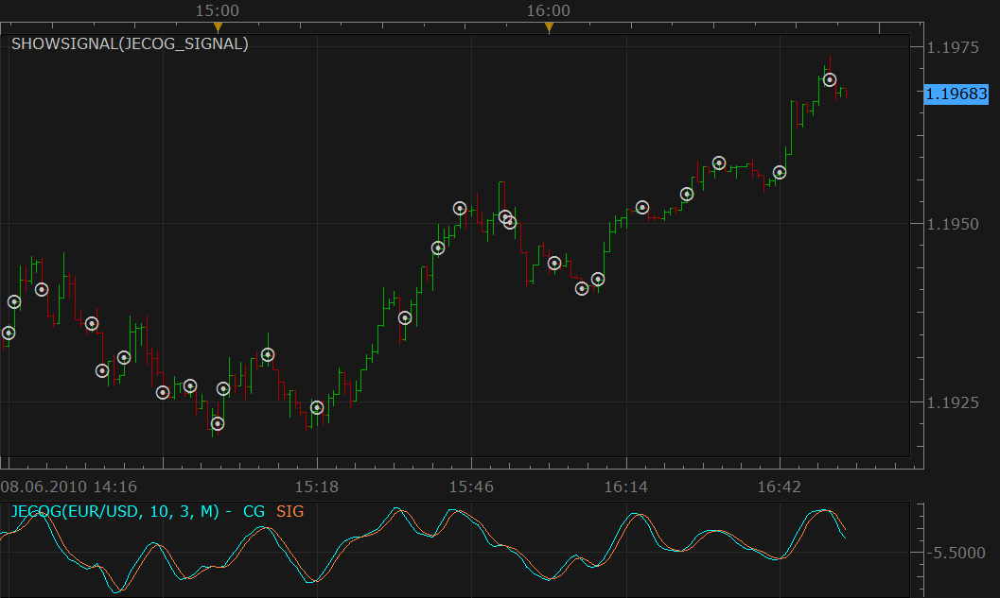

# Center Of Gravity by John Ehlers Signal

> Source: https://fxcodebase.com/code/viewtopic.php?f=29&t=1283  
> Forum: 29 · Topic 1283 · 4 post(s)

---

## Center Of Gravity by John Ehlers Signal

**Nikolay.Gekht** · Tue Jun 08, 2010 3:58 pm

The signal shows the alert when the center of gravity crosses the signal line.

 

Download:

 [JECOG_signal.lua](files/2452/JECOG_signal.lua)

The latest (Jun, 08) version of the JECOG indicator must be also installed:
[viewtopic.php?f=17&t=366&p=605](https://fxcodebase.com/code/viewtopic.php?f=17&t=366&p=605)

---

## Re: Center Of Gravity by John Ehlers Signal

**easytrading** · Mon Dec 29, 2014 4:05 pm

Hello Development team,
is it possible to show an arrow on the bars when the signal appears with direction and color maching the crossing of COG (green for up & red for down), please?

many thanks in advance.

---

## Re: Center Of Gravity by John Ehlers Signal

**Apprentice** · Fri Jan 02, 2015 2:59 am

Center Of Gravity by John Ehlers is signal.
From this signal this is not possible.
One can write indicator, with this functionality.

---

## Re: Center Of Gravity by John Ehlers Signal

**Kadivnai** · Sat Feb 07, 2015 1:10 am

5/10 EMA, RSI, stochastics is signal only.
It will not make any trades.
